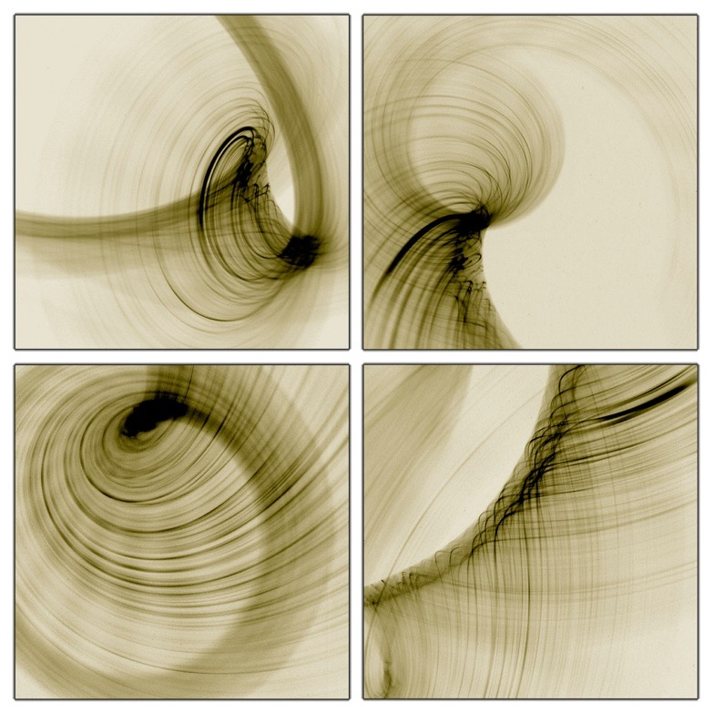

class: title, fogscreen, shelf, bottom
background-image: url(unsplash-photos-s-QNo1I-Ag0.jpg)

# Golang's Database/SQL in Action
## Baron Schwartz &bullet; October 2018

---
class: img-right-full


# Logistics

- Slides are at https://www.xaprb.com/talks/
- Ask questions anytime

---
# What's Nice About Go?

- Interfaces
- Concurrency primitives
- Syntax
- Performance
- Static Linking
- Tools

---
# What's Not As Nice?

- Hard to Google it (use "golang")
- Package versioning?
- Doesn't have generics (yet)

---
class: img-caption


# Go Database Design Patterns

---
# Things To Know

- What is database/sql?
- Where is the documentation?
- How do I create a database connection?
- How do I query a connection?
- How do I retrieve results from a query?
- What are the common operations?

---
# Overview of database/sql

- A generic, minimal interface for SQL-like databases
- Verbs and nouns:
   - Open, Prepare, Exec, Query, QueryRow, Scan, Close
   - DB, Stmt, Value, Row, Rows, Result
   - Tx, Begin, Commit, Rollback
- Docs: golang.org/pkg/database/sql/
- Tutorial: go-database-sql.org

---
class: compact

```go
package main

import (
	_ "github.com/go-sql-driver/mysql"

	"database/sql"
	"log"
)

func main() {
	db, err := sql.Open("mysql",
		"user:password@tcp(127.0.0.1:3306)/test")
	if err != nil {
		log.Println(err)
	}
	defer db.Close()

   // Do something useful here.
}
```

---
# One-Shot Query

```go
var str string
err = db.QueryRow(
	"select hello from hello.world where id = 1").Scan(&str)
if err != nil && err != sql.ErrNoRows {
	log.Println(err)
}
log.Println(str)
```

---
# Query...

```go
var id int
var str string
q := "select id, hello from hello.world where id = ?"

rows, err := db.Query(q, 1)
if err != nil {
	log.Fatal(err)
}
defer rows.Close()
```

---
# ... Then Fetch Rows

```go
for rows.Next() {
	err = rows.Scan(&id, &str)
	if err != nil {
		log.Fatal(err)
	}
	// Use the variables scanned from the row
}
if err = rows.Err(); err != nil {
	log.Fatal(err)
}
```

---
# Prepare...

```go
stmt, err := db.Prepare(
	"select id, hello from hello.world where id = ?")
if err != nil {
	log.Fatal(err)
}
defer stmt.Close()
```

---
# ... Then Execute & Fetch

```go
rows, err := stmt.Query(1)
if err != nil {
	log.Fatal(err)
}
defer rows.Close()


for rows.Next() {
	// ...
}
```

---
# Insert...

```go
stmt, err := db.Prepare(
	"insert into hello.world(hello) values(?)")
if err != nil {
	log.Fatal(err)
}
defer stmt.Close()

res, err := stmt.Exec("hello, Dolly")
if err != nil {
	log.Fatal(err)
}
```

---
# ... And Check Results

```go
lastId, err := res.LastInsertId()
if err != nil {
	log.Fatal(err)
}
rowCnt, err := res.RowsAffected()
if err != nil {
	log.Fatal(err)
}
```

---
class: img-caption


# Docs: "Pleasantly Lightweight!"

---
class: img-caption


# Connection Pooling

???

There is a built-in connection pool that keeps connections open, manages transactions, etc

---
class: img-caption


# Big Unsigned Integers

???

If the high bit is set in a uint64, you can't send it as a parameter to a query. Workaround: send it as a string, or cast it to int64 instead.

---
class: img-caption


# Unexpected Connections

???

if you use `db.Query()` and you don't assign the result to anything, it holds the connection open unless you call `rows.Close()`

If you do this in a loop, you'll open a new connection for each call to `db.Query()`

You should really never use `_, err := db.Query(...)`

What you are looking for is `_, err := db.Exec(...)`

---
# Resource Exhaustion

```go
// Don't do this!
for i := 0; i < 50; i++ {
	_, err := db.Query("DELETE FROM hello.world")
}


// Use this instead!
for i := 0; i < 50; i++ {
	_, err := db.Exec("DELETE FROM hello.world")
}
```

---
class: img-caption


### Retry. Retry. Retry. Retry. Retry. Retry. Retry. Retry. Retry. Retry.

---
class: img-caption

# Handling NULLs

???
NULL can't be scanned into ordinary values. Must use sql.NullXXX types.
Boilerplate code, limited range of values in sql.NullXXX types, doesn't feel Go-ish.

---
# Working with NULL

```go
var s sql.NullString
err := db.QueryRow(
   "SELECT name FROM foo WHERE id=?", id).Scan(&s)

if s.Valid {
   // use s.String
} else {
   // NULL value
}

// If you don't care to check whether it was NULL,
// Just use s.String without checking, it'll be ""
```

---
# NULL Makes Code Ugly

- Boilerplate code everywhere
- There's no sql.NullUint64
- Nullability is tricky, not future-proof
- It's not very Go-ish (no useful default zero-value)

---
class: img-caption

# ORMs---Not Really Suited for Go

---
class: img-caption, compact,no-footer

## Interfaces---Learn Them, Love Them

e.g. https://vividcortex.com/blog/2014/11/11/encrypting-data-in-mysql-with-go/

---
# Resources

- http://golang.org/pkg/database/sql/
- http://go-database-sql.org/ 
- https://github.com/go-sql-driver/mysql
- http://jmoiron.net/blog/

---
# Slides and Contact Information

.qrcode.db.fr.w-40pct.ml-4[]

Slides are at https://www.xaprb.com/talks/ or you can scan the QR code.

Contact: @xaprb or baron@vividcortex.com

---
# Image Credits

- http://www.flickr.com/photos/simens/6306917636/
- http://www.flickr.com/photos/dexxus/5794905716/
- http://www.flickr.com/photos/sebastian_bergmann/202396633/
- http://www.flickr.com/photos/doug88888/4794114114/
- [Pool Balls](http://www.flickr.com/photos/oatsy40/6443878013/)
- http://www.sxc.hu/photo/1160562/
- Google Maps (screenshot)
- [Tubes](http://www.flickr.com/photos/estherase/13553883/)
- [Camel](http://www.flickr.com/photos/paperpariah/4150220583/)
- http://www.flickr.com/photos/zooboing/4743616313/
- [Thinker](http://www.flickr.com/photos/dseneste/5912382808/)
- [Swirls](http://www.flickr.com/photos/clickykbd/66165381/sizes/l/)
- [Stairs](http://www.flickr.com/photos/mamnaimie/5576980406/)
- [Trees](https://www.flickr.com/photos/zachstern/87431231)
