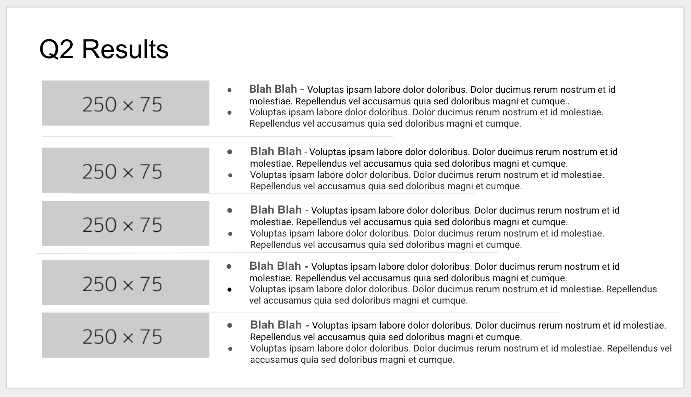

class: title,smokescreen,shelf,no-footer
background-image: url(unsplash-photos-Mye8t_m1gac.jpg)

# Building Presentations With Remark
## Baron Schwartz &bullet; January 2019

---
layout: true
name: footer

.footer[
- @xaprb
]

---
class: no-footer
# What's Wrong With This Slide?

---
class: img-right-full

# PowerPoint is Bloated

Why are presentation programs so complicated?

Why do they make it hard to get what you want, and easy to get formatting problems?

--

What if there were a simpler program, with only the features you need?

???

* The benefit-to-effort ratio is upside down
* Complexity of PPT
* Frustration of inconsistent results -> see Q2 results slide
* Value of authoring vs value of presenting
* Pareto principle; as a user I pay the cost of the bloat

---
class: img-left-full

# Why is Sharing Hard?

Why do I have to email my slides to people?

Or upload them somewhere and embed them?

Or host them in a service that someone else owns?

???
* Why make PDFs?
* Why use abandonware like Slideshare?
* Why host on third-party sites, not my own?
* Why separate sharing from presenting?

---
class: img-right-full

# Remark Is Fun And Easy!

Remark (or RemarkJS) makes slideshows fun:

- Simple, but has all you need
- Browser-based, universal
- Built with Markdown (plain text)
- Easy! Fun!

"Remark is really addictive" --- Miguel Trias

---
class: img-left-full

# Remark Features

Remark has:

* Presentation mode with notes
* Cross-browser support
* Phone/tablet support
* Slide templates/masters
* Incremental slides
* Skipped slides
* HTML/CSS classes

---
class: img-right-full

# Non-Features

Remark hasn't:

* Animations
* Drawings and boxes and arrows and diagrams
* Drag and drop editing
* Thumbnail/grid/lightbox view
* Some batteries not included

But you can add all these if you want, because browsers are amazing.

---
# Key Remark Concepts

* [Markdown](https://commonmark.org/help/)
* Separating content and presentation
* Write what you mean, don't worry about layout/design

--

Markdown is Pareto-optimal: *Just Enough* features, with a fraction of the
complexity. Works with your existing toolsets and skills (e.g. GitHub, text
editor).

---
class: center
# Remark Demo

[Clicky clicky.](https://remarkjs.com/)

---
# Hosting Slides On Your Site

Remark slideshows are easy to host on your personal site.

* Create a web page
* Link in the JavaScript file
* Write Markdown in the textarea

I've built seamless support for Remark into my [Hugo](https://gohugo.io) theme
[Story](https://story.xaprb.com).

Story's [Remark themes](https://story.xaprb.com/slides/adirondack/) extend Remark
significantly with layouts, typography, and image controls.

---
# Slides and Contact Information

.qrcode.db.fr.w-40pct.ml-4[]

Slides are at https://www.xaprb.com/talks/ or you can scan the QR code.

Contact: @xaprb, baron@vividcortex.com

