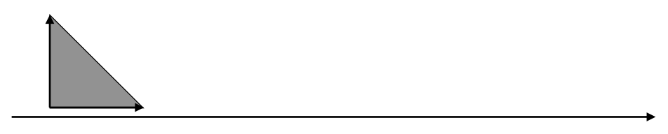
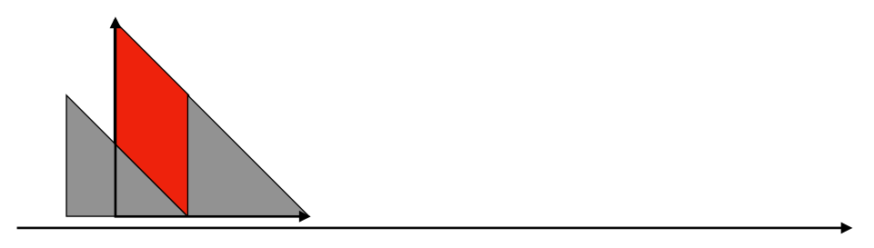
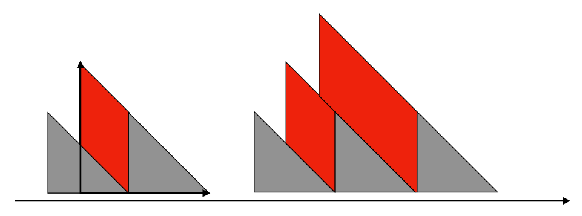
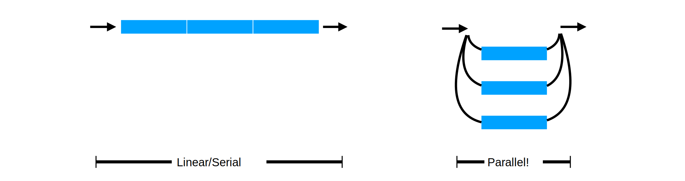
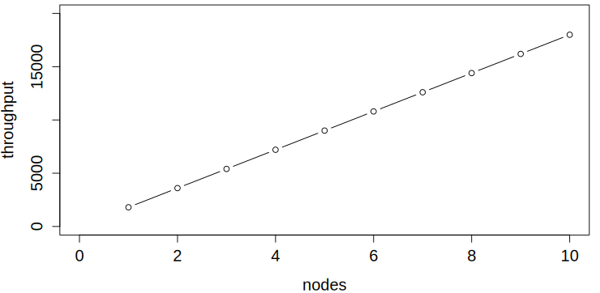
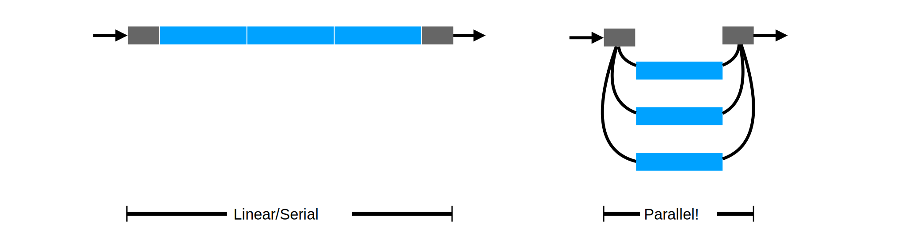
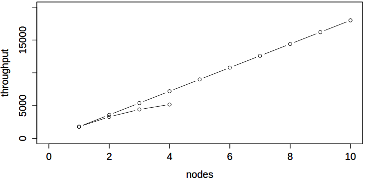
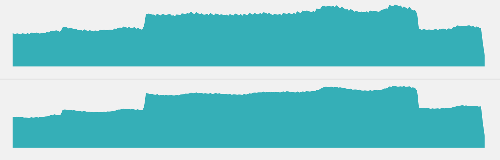
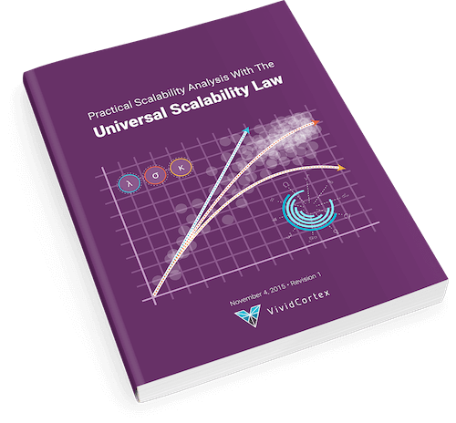

class: title, no-footer, shelf, fogscreen
background-image: url(ThinkstockPhotos-480085336.jpg)

# Quantifying Scalability with the USL
## Baron Schwartz &bullet; DataEngConf NYC 2018

---
layout: true

.footer[
- @xaprb
- 
]

---
class: img-right-full, compact
# Introduction

I've been focused on databases for about two decades, first as a developer, then
a consultant, and now a startup founder.

I've written High Performance MySQL and several other books, and created a lot of open source software, mostly focused around database monitoring, database operations, and database performance: innotop, Percona Toolkit, etc.

I welcome you to get in touch at @xaprb or baron@vividcortex.com.

---
# Agenda

How can you quantify, forecast, and reason about scalability?

1. Queueing theory.  _In which we discover load_

--
2. Amdahl's Law.  _In which we define linearity_

--
3. The Universal Scalability Law (USL).  _In which Frederick Brooks laughs last_

--
4. Application.  _In which things are even worse than we thought_

--
5. Profit???  _In which we do the impossible_

---
class: title, smokescreen, shelf, no-footer
background-image: url(unsplash-photos-F9o7u-CnDJk.jpg)

# Queueing Theory
## In Which We Discover Load

---
class: roomy
# Queueing Theory

There's a branch of operations research called queueing theory.

It analyzes the **waiting** that happens when systems get busy.

---
class: col-2, roomy
# What Causes Queueing?

Queueing happens even at low utilization:

1. Irregular arrival timings
2. Irregular job sizes
3. Lost time is lost forever

 
 
--

A queue fundamentally changes how a system works:

- Increases availability and utilization
- Increases average residence time
- Increases cost/overhead

???

Queueing happens even when there's idle capacity.

---
# Arrival Rate and Queue Delay

Eben Freeman has a great visual that explains how arrival rate \\(\lambda\\)
is related to queueing delay.

--

- A request arrives, and the server processes it until it's finished
- The height is the job size, and the width is the service time \\(S\\)
- The upper edge of the triangle is the amount of outstanding work to do

---
# Another Request Arrives

- It has to wait \\(W\\) in the queue until the first is done
- Then it has \\(S\\) service time too
- Its total residence time \\(R = W+S\\)

---
class: col-2
# An Equation For Queue Wait

Eben uses the area under the graph to relate the height of the top edge to the
width of the red wait parallelograms:

Solving this for \\(W\\) gives an equation for wait time:

\\[
W = \frac{\lambda S^2}{2(1-\lambda S)}
\\]

This creates the familiar hockey stick curve, shown here in terms of utilization \\(\rho\\).

???

- This is _not_ exactly correct for multiserver queues.
- Why is it nonlinear?  Because a request can make multiple requests wait, not just one. This makes waiting multiplicative, not additive.
- Notice that the server is never more than 100% utilized even though there's
  backlog. That's the difference between utilization and concurrency.
- Notice that the assumption of fixed service time. This isn't valid if service
  times inflate.
- Note the assumption of a stable system (the queue doesn't grow unbounded)

---
# Some Implications

One of the nice things about this form is that it lets you reason about service
time and arrival rate easily:

\\[
W = \frac{\lambda S^2}{2(1-\lambda S)}
\\]

What if you...

- _double_ the arrival rate \\(\lambda\\)
- _halve_ the service time \\(S\\)

???

This is the queue _wait_, not the residence time.

The numerator is half the size, but the denominator is the same.

So the queue wait gets cut in half.

---
# The Hockey Stick Curve

The "hockey stick" queueing curve is hard to use in practice. And the sharpness
of the "knee" is nonlinear and very hard for humans to intuit.

---
# Great Truths From Queueing Theory

1. Requests into ~any system have to queue and wait for service.
2. As the system gets busier, queueing escalates suddenly.
3. Queueing is very sensitive to service time and variability.
4. Contention over serialized resources causes nonlinear scaling.

The last point is quite a leap, but I'll explain.

---
class: title, smokescreen, shelf, no-footer
background-image: url(snow-3260088-1280.jpg)

# Amdahl's Law
## In Which We Define Scalability

---
# What is Scalability?

There's a mathematical definition of scalability **as a function of
concurrency**.

--

I'll illustrate it in terms of a **parallel processing system** that uses
concurrency to achieve speedup.

???
It's practical, easy to use, and matches the domain well.

I'll show how the equation is composed piece by piece, but don't sweat the math.

---
# Linear Scaling

Suppose a clustered system can complete \\(X\\) tasks per second with no
parallelism.

With parallelism, it completes tasks faster, e.g. higher throughput.

???
* Tasks per second is throughput.
* Throughput is a function of concurrency.

---
# Ideal Linear Scalability

Ideally, **throughput increases linearly with parallelism**.

--

For example, triple the parallelism means \\(3X\\) as much work completes.

???
* Linear scaling is the ideal.
* Another way to say this is that the system's output is a linear function of
  load.
* It is 2x, there is no room for a "constant" because that is part of X.
* If it's 1.95x then it becomes curved, not linear
* Mistaken thinking: "Linearity doesn't require a constant of 1"

---
class: img-right
# The Linear Scalability Equation

The equation of ideal linear scaling:

\\[
X(N) = \frac{\\gamma N}{1}
\\]

where the slope is \\(\\gamma=X(1)\\).

???
- X is throughput
- N is concurrency, which is the workload
- Gamma is the system's output when there's no parallelism
- Really important to note that N is the independent parameter, the driver

---
# But Our Cluster Isn't Perfect

Linear scaling comes from subdividing tasks **perfectly**.

--

What if a portion isn't subdividable?

---
class: img-right
# Amdahl's Law Describes Serialization

\\[
X(N) = \frac{\\gamma N}{1+\\sigma(N-1)}
\\]

Amdahl's Law describes throughput when
**a fraction \\(\\sigma\\) can't be
parallelized**.

--

**Serialization is queueing.**

???

* This is conceptually like the queueing hockey stick
* It's the performance penalty of waiting, mapped to a different domain

---
# Amdahl's Law Has An Asymptote

\\[
X(N) = \frac{\\gamma N}{1+\\sigma(N-1)}
\\]

Parallelism delivers speedup, but there's a limit:

\\[
\lim\_{N \to \infty}{X(N)} = \frac{1}{\sigma}
\\]

--

e.g. a 5% serialized task can't be sped up more than 20-fold.

???
If 5% of the work is serialized, infinite concurrency will still result in tasks
taking 5% as long as non-parallelized tasks.

---
class: title, smokescreen, shelf, no-footer, bottom
background-image: url(unsplash-photos-jXyKqnFnZos.jpg)
# The Universal Scalability Law (USL)
## In Which Frederick Brooks Laughs Last

---
# What If Workers Coordinate?

Suppose the parallel workers also **ask each other for things**?

--

They're making each other do extra work. As load increases, **each task's job gets harder**.

???

Note that they're not just waiting for each other, they're actually increasing
the total amount of work to be done.

---
class: center
# How Bad Is Coordination?

\\(N\\) workers = \\(N(N-1)\\) pairs of interactions, which grows fast:
\\(\mathcal{O}(n^2)\\) in \\(N\\).

---
class: img-right
# The Universal Scalability Law

\\[
X(N) = \frac{\\gamma N}{1+\\sigma(N-1)+\\kappa N(N-1)}
\\]

The USL adds a term for crosstalk, multiplied by the \\(\\kappa\\)
coefficient. 
Crosstalk is also called coordination or coherence penalty.

Now there's a **point of diminishing returns**!

---
# The USL Describes Behavior Under Load

The USL explains the **highly nonlinear behavior** we know systems exhibit near
their saturation point.
[desmos.com/calculator/3cycsgdl0b](https://www.desmos.com/calculator/3cycsgdl0b)

???
- Serialization (red) grows slowly, but crosstalk (blue) grows rapidly.
- This is why systems get so unpredictable near their limits.
- Near and above the point of diminishing returns, systems exhibit high variance and get unpredictable.

---
class: title, smokescreen, shelf, no-footer
background-image: url(gears-1236578-1280.jpg)

# Application
## In Which Things Are Even Worse Than We Thought

---
# Applying the USL to the Real World

Behold, I give you two metrics of concurrency and throughput.

What do they mean?

???
I got these from db-cust1

---
# Let's Scatterplot Concurrency vs Throughput

This is the USL's input and output. Is it linear?

---
# It Looks Highly Linear, Doesn't It?

Don't celebrate yet.

---
# Fit the USL Equation with Regression

Now the picture looks totally different!

---
# How Much Headroom Does This System Have?

Just by looking, you can tell this system has maybe 10-15% more to give.

???

* Note that if you do that, you're going to be pushing it hard, which means it's
  going to start stalling and getting highly unpredictable, so it's basically
  being run at its limit already.
* So we went from "looks linear!" to "oh, shit!" in one simple scatterplot.

---
class: title, smokescreen, no-footer, shelf
background-image: url(unsplash-photos-6tG_liBojOk.jpg)

# Profit???
## In Which We Do The Impossible

---
# What is the System's Primary Bottleneck?

The regression gives estimates of the USL parameters.

\\[
X(N) = \frac{\\gamma N}{1+\\sigma(N-1)+\\kappa N(N-1)}
\\]

The parameters have **physical meaning**.

- \\(\gamma\\) is the throughput of single-threadedness.
- \\(\sigma\\) is the fraction that's serialized/queued.
- \\(\kappa\\) is the fraction that's crosstalk/coherency.

---
class: center
# This System Is Sublinear Because Of Queueing

\\(\sigma\\) = 7.4%,  \\(\kappa\\) = 0.1%

---

---
class: roomy
# Slides and Contact Information

.qrcode.db.fr.w-40pct.ml-4[]

Slides are at https://www.xaprb.com/talks/ or you can scan the QR code.

Contact: baron@vividcortex.com, @xaprb

---
class: col-2
# Further Reading & References

- [Neil Gunther](http://www.perfdynamics.com/Manifesto/USLscalability.html), author of the USL.
- My USL [book](https://www.vividcortex.com/resources/universal-scalability-law/).
- My USL [Excel workbook](https://www.vividcortex.com/resources/usl-modeling-workbook).
- Eben Freeman's LISA17 [talk](https://www.youtube.com/watch?v=Hda5tMrLJqc) and
  [slides](https://speakerdeck.com/emfree/queueing-theory)
- Kavya Joshi's QCon [talk](https://www.youtube.com/watch?v=M5r-IVxP-WI] and
  [slides](https://speakerdeck.com/kavya719/a-practical-look-at-performance-theory)
- There are lots of good books on queueing theory and scalability from
  [Neil Gunther](https://www.amazon.com/dp/B00FC99QUO?tag=xaprb-20),
  [Mor Harchol-Balter](https://www.amazon.com/dp/1107027500?tag=xaprb-20),
  [Gross & Harris](https://www.amazon.com/dp/B014GGB2UA?tag=xaprb-20), etc

