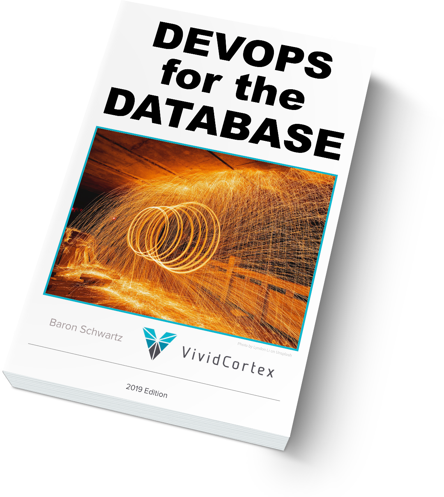

layout: true
name: section
class: title, fogscreen, no-footer

---
template: section
class: shelf
background-image: url(unsplash-photos-PPo9tjzjcPg.jpg)

# DevOps for the Database
## Baron Schwartz &bullet; DevOpsDays Chicago 2019

???
Most teams find it hard to "do DevOps" in the DB for several reasons. This talk summarizes what I've learned over the last decade, studying teams that succeeded as well as those that tried. I've distilled it all into concrete, practical steps you can take to improve.

Databases are special because they're stateful, and DevOps reflects this: in practice, databases are a lot harder to "DevOps" (as a verb) than other parts of the stack. In this talk you'll learn why Databases are "hard to DevOps," but also why it's valuable enough to keep trying‚ and smarter ways to try. There's some theory/discussion, but not much; there's more focus on case studies, commonalities between lots of teams/companies, and common approaches that I've seen work really well. In more detail,

* What research shows about DevOps, databases, and company performance
* Current and emerging trends in how we build/manage data tiers, and implications
* Elevation of the traditional dedicated DBA role and what's happening as a result
* Driving cultural change towards distributed database competency and responsibility
* Why some teams succeed in this transformation, while others fail
* How to improve your chances of succeeding (or avoiding pitfalls others have already found)

---
layout: true
name: footer

.footer[
- @xaprb
- 
]

---
class: img-right-full, roomy
# Logistics

- No need to define DevOps! ❤️
- Slides will be posted
- Resources & sources are linked/cited
- Contact me at @xaprb or baron@vividcortex.com

---
template: section
background-image: url(unsplash-photos-4GNxednQTJ4.jpg)

# That One Time I Broke The Internet

???

- Once upon a time I broke a site I was working on.
- I was impressed that the senior devs helped more than the DBAs.
- This is both a good and a bad thing.
- The VP of Engineering called me afterwards and we had a blameless
  conversation.

---
class: roomy, img-right-full
# Technology Trends

- DevOps
- Agile, Design Thinking
- Customer Experience
- Cloud
- SaaS
- Open Source
- Containers
- Microservices

---
class: img-left-full, fit-h1, roomy
# What's DevOps _For The Database_?

The usual suspects:

- Infrastructure-as-code, automation...
- Continuous delivery...
- Et cetera

--

Plus,

- Schema as code
- Automated migrations
- Developer ownership of databases
- Et cetera

---
class: roomy, fit-h1
# Why Databases are Hard to DevOps

1. We delegate state management to them
1. They're not designed for automation
1. Ops tooling isn't designed for stateful services
1. They support high-performance, critical workloads under load

???

- There's very few automation "handles" on a database
- Ops tooling has poor primitives to support complex orchestration, consistency, etc

---
class: roomy, fit-h1, img-right-full
# Signs of Non-DevOps

- You have misaligned authority and responsibility
	- DBAs are responsible for developer mistakes
	- Devs feel no pain when they hurt the DB
- Devs depend on DBAs to do things for them
- It's scary to do a schema migration

---
class: roomy, fit-h1, img-left-full
# Tooling/Automation Needs

- Schema change automation
- Deployment automation
- Monitoring tools

---
class: roomy, fit-h1, img-right-full
# Mindset/Framework Needs

- SRE-for-the-DB philosophy
	- The "golden signals" for the DB are CELT + USE
- Monitoring philosophy

---
class: roomy, fit-h1, img-right-full
# Assessing DevOps Maturity

Maturity models are problematic, but:

- Gap analysis is really helpful
- The #ASODR capabilities are useful (p31 of 2019 report)
- Dickerson's hierarchy of reliability
- Database DevOps capabilities from my book (p9-p12)

---
class: roomy, fit-h1, img-left-full
# Pitfalls To Avoid

- Reliance on brittle/inadequate/naive tooling
- Hoping to import DevOps from a vendor
- Internal resistance
- Unrealistic plans

???
- Resistance can be e.g. a DBA who views it as job security

---
class: roomy, fit-h1, img-right-full
# How To Start

- See #ASODR, p30 of 2019 report
- Start somewhere benign---no holes below the waterline
- Doing new things right is easier than rewrites
- Pay attention to culture

---
class: roomy, fit-h1, img-right-full
# Key Capabilities

1. Baseline CELT metrics per-query
2. Decouple app & code, get CD working
3. Service-aligned full-lifecycle teams

---
class: img-left-full
# The DBA's Career Path

- The DBA role is being redefined and/or obsoleted
    - But! This is an opportunity, not a threat
    - Every DBA needs to become a DBRE
- Every engineer needs to gain DB proficiency
	- Indexing
	- Query execution plans
	- Performance mindset
	- Basic query-writing skills

---
class: col-3, compact, fullbleed, no-footer
# Resources

---
class: img-right, roomy, no-footer
# Download My Book

---
class: roomy
# Questions?

.qrcode.db.fr.w-40pct.ml-4[]

Slides are at https://www.xaprb.com/talks/ or you can scan the QR code.

Contact: baron@vividcortex.com, @xaprb
