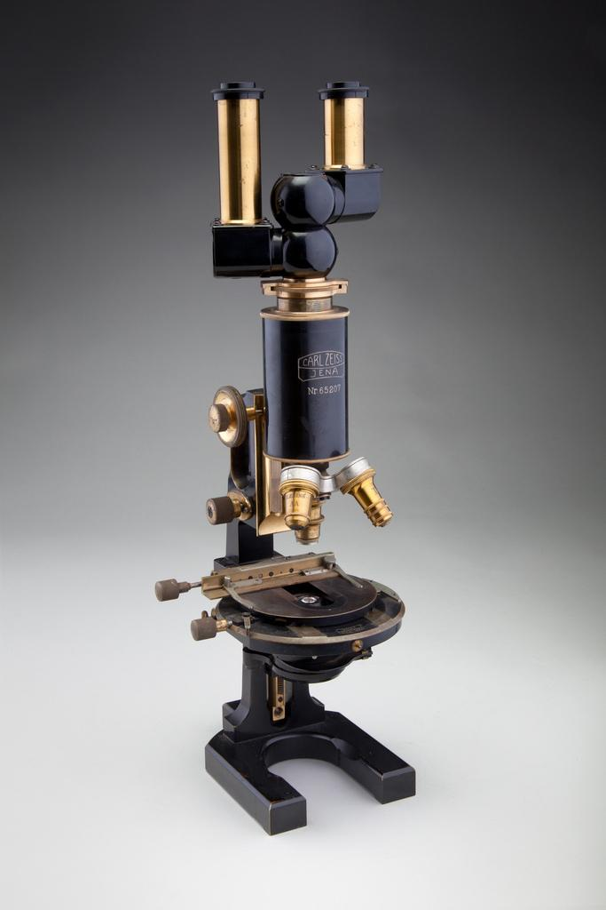
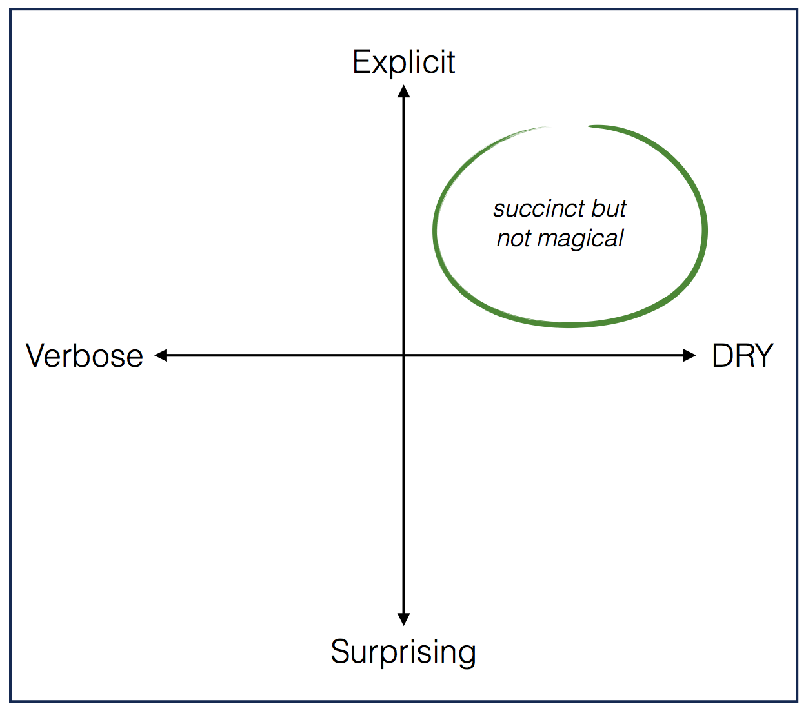
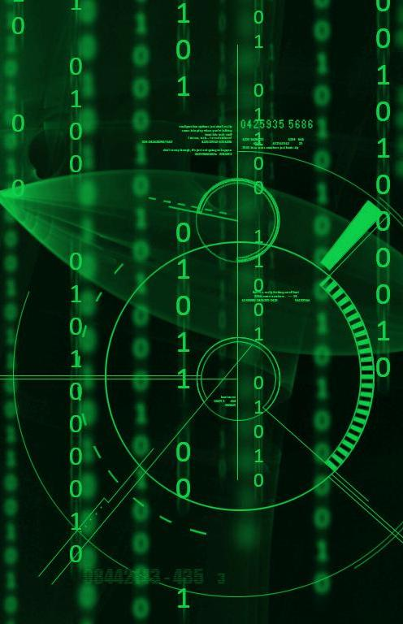
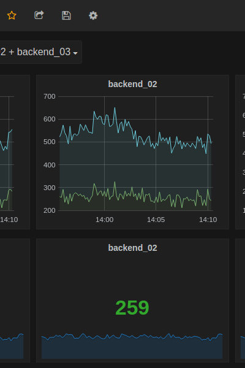
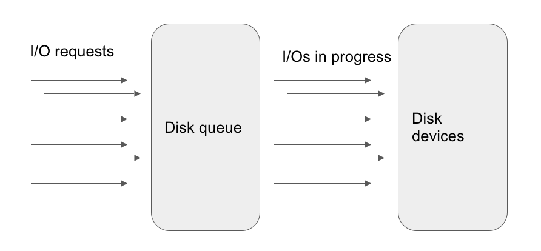
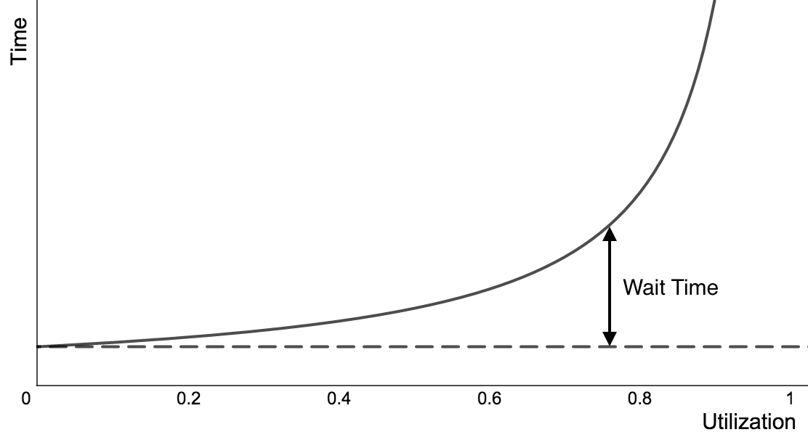
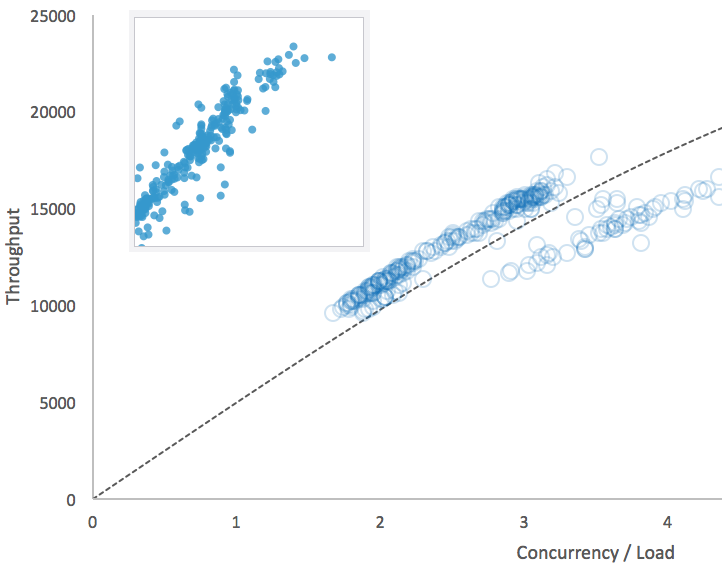
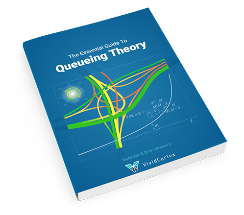
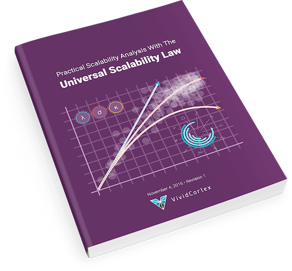
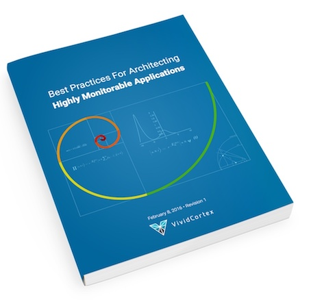

class: title, no-number
background-image: url(cover.jpg)
background-size: cover

.smokescreen[
# What is Observability?
## Baron Schwartz &bullet; May 2018
]

---
layout: true

@xaprb

---
class: img-right
# Logistics and Contact Info

.col[
- Ask questions anytime
- Write me baron@vividcortex.com
- Tweet me at @xaprb
- Slides at [xaprb.com/talks/](https://www.xaprb.com/talks/)
]

.rc[

]

---
# Introduction & Agenda

- What is observability?
- How is it different from monitoring?
- What’s the difference from metrics, telemetry...?
- What *should* you instrument?
- The 7 Golden Signals and the Zen of Performance
- The primacy of process lists
- An ode to metrics, after all; and relationships
- Conclusions and resources

---
class: img-right
# What is Observability?

.col[
What’s the relationship between these things?

- Observability
- Instrumentation
- Telemetry
- Analytics
- Monitoring

Observability is an attribute of a system, not an activity or tool.
]

.rc[

]

---
class: two-column
# Observability Isn't Monitoring

.col[
Other system properties:

- Testability
- Operability
- Maintainability
- Efficiency
- Usability
- Teachability
]

--

.col[
Those are all *adjunct nouns*.

Observability is also a noun.

Monitoring is a verb!
]

---
class: img-right
# Pillars of Observability

.col[
These should really be called pillars of _telemetry_.

- Events
- Logs
- Metrics
- Traces
]

.rc[

]

---
class: smaller

# All Telemetry Originates As Events

| Log         | Event that is written to a file                                                           |
|-------------|-------------------------------------------------------------------------------------------|
| Sample      | Event that is chosen from a population & retained                                         |
| Metric      | Timestamped value that is derived from an event or its properties, usually by aggregation |
| Span        | A timespan that is defined by two events                                                  |
| Trace       | A bunch of spans that have the same ID                                                    |
| Call Graph  | Spans that have parent/child relationships                                                |
| Flame&nbsp;Graph | Aggregations of spans                                                                     |

---
class: img-right

# Tradeoffs

.col[
- Metrics are compact, aggregated, aggregatable, efficient, but can’t be disaggregated.
- Logs/events are full fidelity but relatively expensive at full capture.
- Samples are biased and ignore/miss lots of crucial things.
]

.rc[

]

---
class: smaller, two-column

# Metrics or Events?

.col[
Many folks have love-hate relationships with metrics. Some prefer events.

- Some people log lots of things that are just “this happened” signals that are better as metrics.
- But some of the most valuable insights you can get from events require you to aggregate them into metrics first!
]

.rc[

]

---
class: two-column
# There’s A Lot To Instrument

.col[
There’s a lot to measure in a complex system. What’s important?

- It’s more important to observe the work than the service itself.
- But it’s important to observe how the service responds to the workload.

Specific types of metrics have rich meaning encoded in their nonlinear relationships with other metrics.
]

.rc[

]

---
class: smaller, two-column

# What Telemetry Should You Emit?

.col[
**Popular Systems/Methods/Blueprints**

USE Method

- Utilization, Saturation, Errors

RED Method

- Requests, Errors, Duration

SRE Book’s Four Golden Signals

- Latency, traffic, errors, and saturation
]

.rc[
**Formal Laws of Performance**

Queueing Theory

- Utilization, arrival rate, throughput, latency

Little’s Law

- Concurrency, latency, throughput

Universal Scalability Law

- Throughput, concurrency
]

---
class: smaller, two-column

# The Zen of Performance: Non-Duality

.col[

External (customer’s) view is singular:

- Request, and its latency and success.

Internal (operator’s) view is plural:

- Requests and their latency distribution, rates, and concurrency.
- System resources/components and their throughput, utilization, and backlog.
]

.rc[

]

???

The unifying concept in service observability is two perspectives on requests.

Internal view is over a population (workload).

---
class: smaller, two-column

# The Seven Golden Signals

.col[
External Perspective: Quality Of Service

- Concurrency
- Error Rate
- Latency
- Throughput

Internal Perspective: Sufficiency of Resources

- Utilization
- Saturation
- Errors
]

.rc[

]

???
- External is *workload* perspective
- Internal is *resource* perspective

---

# Begin With A Process List

It’s more valuable to focus on work than resources. Most server/service systems have a process list or table.

- UNIX: `ps` shows the process table
- Apache: ServerStatus
- MySQL: `SHOW PROCESSLIST`
- PostgreSQL: `pg_stat_activity`
- MongoDB: `db.currentOp()`

Your service can too, it’s pretty simple

---
class: smaller

# Process Lists Are Always Pretty Similar

The request itself

- SQL, commandline, etc

State of request

- Working or waiting? Where? Status/State?
- Stages of execution

Timings

- Timestamp of start; ideally stage timings too

---
class: smaller

# The Service Process List at VividCortex

At VividCortex, we baked a process list into all of our APIs. It has an HTTP API and makes it simple to see what’s in-flight across our whole infra.

The code is simple and open source: https://github.com/VividCortex/pm

It’s easy to use. Just hook it into your API framework/boilerplate, and you’ll have a process list for free in all your APIs. You can optionally do extra stuff like setting status of requests. Easy.

https://www.vividcortex.com/blog/2014/11/06/inside-distributed-architecture/

---
class: smaller

# The Process List Is Foundational

If you believe in instrumenting the _work_ your systems are doing, the process list is the central place to start.

- The process list itself is the current state of the work.
- The simplest implementation is really easy: just instrument begin/end.
- State changes to individual processes are events.
- These events can be sent as messages to be logged or turned into metrics.
- Observers can subscribe to events/messages.
- You can poll the list and generate historical metrics.

You can make this more sophisticated (instrument function enter/exit, etc)...

---
class: two-column

# Instrumenting Code Can Be A Drag

.col[
Code shouldn’t look like you pair-programmed with an APM vendor.

Runtimes and instrumented kernels are awesome.

Maybe you should just buy Dynatrace?
]

.rc[

]

---
class: img-right

.col[
# Instrumentation Isn't Answers

You still need to turn the telemetry into actionable insights. Analytics is hard.
]

.rc[

]

---
class: img-right, two-column

# Metrics Can Be Powerful

.col[
The ROI on metrics can be surprisingly high.

Aggregation into specific, carefully chosen metrics can give powerful insights.
]

.rc[

]

---

# Example: Linux’s /proc/diskstats

The data source for iostat. Docs: https://www.mjmwired.net/kernel/Documentation/iostats.txt

- IOPS completed
- Total non-idle time (“# of milliseconds spent doing I/Os”)
- Sum of all ops’ latencies (“weighted time”)

What can we get from this? A LOT.

---

# Linux Disk I/O Is A Queueing System

---
class: two-column, smaller

# Derived Insights From Diskstats

.col[
Concurrency (avgqu-sz)

- Weighted time / interval

Throughput

- I/Os completed / interval

Utilization (%util)

- Total non-idle time / interval

]

.rc[
Latency (await) (including queue time)

- Weighted time / completions

Service time (svctm)

- Utilization / completions

(The utilization law is just Little’s Law, 𝜌 = 𝜆S)
]

---
class: img-right

# Imitation = Flattery

.col[
If you want the most value for the least effort, a simplified clone of /proc/diskstats isn’t the worst thing to build.
]

.rc[

]

.footnote[
See https://www.xaprb.com/blog/2011/10/06/fundamental-performance-and-scalability-instrumentation/
]

---
class: two-column

# More Powerful Metrics Relationships

.col[
Queueing theory explains what happens as utilization increases.

The relationship between utilization and response time is decidedly nonlinear!
]

.rc[

]

---
class: two-column,smaller

# Even More

.col[
The Universal Scalability Law explains the relationship between concurrency, throughput, and expansion of service time.

It’s easy to see when you’re approaching the point of diminishing returns! Just plot concurrency vs throughput.

The USL explains why and what to fix.

The USL, queueing theory, etc give you a deeper understanding of how your systems react to the workload you give them.
]

.rc[

]

---

# Conclusions

- Highly observable systems help you understand their behavior.
- Monitoring the work is more important than the resources.
- Every service should ideally have a process list. It’s pretty easy.
- Beyond real-time monitoring, the process list can emit events.
- Getting trustworthy answers from giant collections of events is hard.
- Metrics are aggregations of events, and they can be awesome too.
- Focus on the most valuable, cheapest, easiest stuff.

---
class: three-column, smaller

# If You Like To Nerd Out...

.col[

]
.col[

]
.col[

]

Your artisanal hand-brewed free copy is waiting at https://vividcortex.com/resources

---
class: two-column
# Slides and Contact Information

.col[
Slides are at [xaprb.com/talks/](https://www.xaprb.com/talks/), or scan the QR
code.

Contact:

- @xaprb on Twitter
- baron@vividcortex.com
]

.col[

]
