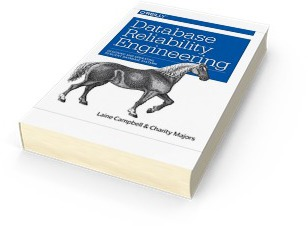

class: title, no-number
background-image: url(da-vinci.jpg)
background-size: cover

.smokescreen[
# Engineering The Application/Database Boundary 
## Baron Schwartz &bullet; Percona Live 2018
]

---
layout: true

@xaprb

---
class: img-right
# Logistics and Stuff
.col[
- Ask questions anytime
- Write me baron@vividcortex.com
- Tweet me at @xaprb
- Slides at [xaprb.com/talks/](https://www.xaprb.com/talks/)
]
.rc[

]

---
class: img-right
.col[
# Introduction and Agenda
* Why this talk?
* The boundary region
* Ephemeral vs persistent
* Atoms and molecules
* Who builds that code?
* The declarative zone
* Specialization
* Challenges and solutions
]
.rc[

]

---
class: title
background-image: url(velazquez.jpg)
background-size: cover
.smokescreen[
# Motivations
]

---
class: img-right
.col[
# Who Are You And Whatcha Want?
* You probably aren’t appreciated fully
* Do people even know what you do??
]
.rc[

]
???
* I used to have a neighbor who answered the phone this way
* A step back to gain perspective
* As Kenny Chesney says, "I've been there, that's why I'm here"

---
class: title
background-image: url(schloss.jpg)
background-size: cover

<h1>You Tend The Gardens and Courts</h1>

???
* You don’t guard the moat
* You help people find their way through the thorns they don’t see
---
class: title
background-image: url(sabine.jpg)
background-size: cover

<h1>The Application/Database Boundary</h1>

---
class: img-right
.col[
# A Region, Not A Crisp Line
* More like a zone than a boundary
* Permits adaptation and coupling
* Sort of like a demilitarized zone, but not
]
.rc[

]
???
* Where impedance mismatches crossfade
* Where dreams have to be interpreted
* Opposite of DMZ: it’s where we agree to put the bad stuff
---
class: img-right
.col[
# Ephemeral vs Persistent
* Stateless above, stateful below
* Statefulness is contained
* Stateless systems are more manageable
]
.rc[

]
???
* The DMZ lets us build stateless tiers
* The web and services tiers are two good examples
---
class: img-right
.col[
# Atoms And Molecules
* Below the boundary is hardened primitives
* Databases, filesystems, drivers, kernels...
]
.rc[

]
???
* These simple primitives enable rich business logic
* Below: atoms. Boundary: molecules. Above: algae.
---
class: img-right
.col[
# Who Builds That Code?
* Above the boundary is mostly custom code
* Above is Turing-complete
* Below is sealed boxes: voids the warranty
* The area in between is kind of hybrid
]
.rc[

]
???
* We don’t run much custom code for bits-on-disk
* Above we build, below we configure
* Above is art, below is science
---
class: img-right
.col[
# The Zone of Declarative
* This is where iptables config lives
* This is where schema and indexes live
* This is where SQL runs
]
.rc[

]
???
* The boundary zone is partially sealed, partially customizable
* This is where we design, model, and structure
* Where we give simple instructions to systems that interpret them in complex ways
---
class: img-right
.col[
# Why We Specialize
* Enables expertise and productivity
* Limits the problem/solution space
* Creates coupling and dependency
* A tradeoff best made intentionally
]
.rc[

]
???
* For as long as we’ve had hard jobs, we’ve specialized
* We specialize both our tools and our skills
* Specialized work is hard work: consistency, durability, persistence, performance
* But it helps us make our problems more tractable
* Divide and conquer
---
class: title
background-image: url(damned.jpg)
background-size: cover
.smokescreen[
# Challenges
]
---
class: img-right
.col[
# Performance
* Database performance problems are common
* And often hard to diagnose and solve
]
.rc[

]
???
* The other tradeoffs naturally lead to database performance issues
---
class: img-right
.col[
# Specialization
* Dependency for flow of work
* Gatekeeper for knowledge and expertise
* Data inertia
* Single points of failure
]
.rc[

]
???
* We end up createing bottlenecks in systems
* and in teams
* and in mutating our systems
* and in fixing them
---
class: img-right
.col[
# Rigidity
* It’s hard to fine-tune something without making it inflexible
* *Why* is that config option set to a nondefault value?
]
.rc[

]
---
class: img-right
.col[
# Observability
* Highly optimized systems are built for speed, not observability
* Paradoxically, observability is the single best optimization
]
.rc[

]
---
class: img-right
.col[
# Absorption In The System
* You can focus on the system until you forget who it’s for
* It’s a slippery slope from there to superstition and vanity metrics
]
.rc[

]
???
* If you want to know about the commute measure the traffic, not the road
---
class: title
background-image: url(cabrera.jpg)
background-size: cover
.smokescreen[
# Conclusions
]
---
class: img-right
.col[
# Keep It Simple
]
.rc[

]

---
class: img-right
.col[
# Share The Load
]
.rc[

]

???
- Don't let the database problems be just your problems.
- Make everyone responsible for database health and performance
- That requires shared visibility and observability

---
class: img-right
.col[
# Choose Your Battles
]
.rc[

]

---
class: img-right
.col[
# You're Awesome
]
.rc[

]

---
class: three-column
# Resources

.col[

]
.col[

]
.col[

]

---
class: two-column
# Slides and Contact Information

.col[
Slides are at https://www.xaprb.com/talks/ or you can scan the QR code. To export as PDF, print with Chrome.

License: [CC BY-SA 4.0](https://creativecommons.org/licenses/by-sa/4.0/)

Contact: @xaprb and baron@vividcortex.com
]

.col[

]
