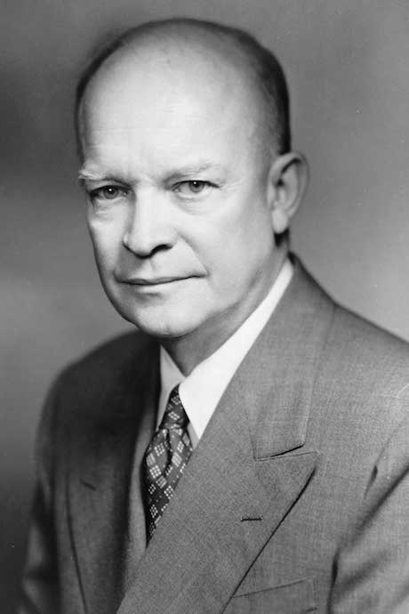

class: title
background-image: url(will-turner-508747-unsplash.jpg)
background-size: cover

.smokescreen[
# Future Perfect
## Thoughts on Open-Source Data Culture
### Baron Schwartz &bullet; Percona Live 2018
]

???

I’m very glad to be here. I won’t spend time on myself. I’m here to talk about the future, which is hard. As someone famously said, it’s difficult to make predictions, especially about the future. But I am not easily discouraged, so I have some predictions, which I am certain are true. The first is that what lies before us… is the future. My second prediction is that someday, many years in the past, President Eisenhower will steal that quote from me.

Most of us are here today because of our shared love of data and databases. The rest of us have a shared hatred of them.

---
layout: true

@xaprb

---
class: title
background-image: url(julian-mora-141924-unsplash.jpg)
background-size: cover
.smokescreen[
# This is a culture talk
]

???

I’m supposed to talk to you about current topics in data and data infrastructure. Someone proposed a talk abstract for me that included, and I’m not kidding, the following buzzwords: cloud, microservices, containers, serverless computing, blockchain, and several others. 

I’ve been reflecting since then and I’ve decided I really don’t want to do a technical keynote. I want to do a cultural keynote. While I was collecting my thoughts for this talk, I spent a lot of time reflecting on the things that have meant the most to me during the last decade or so, and where I would like to see us go as open source database communities.

---
class: title
background-image: url(hugo-jehanne-543575-unsplash.jpg)
background-size: cover
.smokescreen[
# Cultures produce technologies
]

???

The interesting thing is the technical and social aspects are deeply interlinked. If we talk about the buzzwords without thinking about the culture that gave rise to them, we miss the point. And if we talk about the culture that produced Docker and microservices and the like, we’re talking about the technologies too. You can’t separate them without robbing them of their meaning and context.

What do I mean by that? I mean Conway’s Law isn’t dead. We’re building systems with properties such as decentralization, distribution, asynchronicity, and scale. We’re building communities with exactly the same characteristics. In fact, I think that a decentralized community probably has the best chance at building a great decentralized database.

---
class: title
background-image: url(leo-serrat-533922-unsplash.jpg)
background-size: cover
.smokescreen[
# Environment shapes culture
]

???

This is the environment within which we create. The environment also has pressures: cost, speed, risk, reliability among others. And the people exert competing pressures based on their own interests: demands for connectedness, convenience, enjoyment, security, verifiability and so forth. These competing forces create questions about things like who owns and controls our data, and whether we can trust them.

These conditions shape our communities and therefore what we create. One easy
example is the rise of open source and the reinvention of software development.

---
class: title
background-image: url(tom-barrett-364228-unsplash.jpg)
background-size: cover
.smokescreen[
# Did the cloud come from open source?
]

???

Another example is cloud computing, which uses open source as a strategic cornerstone. It’s free, so it’s cheap to provide in a value-added form, which is how a cloud acquires customers. Then, after customers migrate to the cloud, they want them to use at least some of their proprietary technology, which is how they keep customers.

Anytime there’s a very profitable business model there’s the risk of a monopoly, and we’ve seen it before in many forms: rail, steel, oil, telecom, operating systems, web browsers. And now we’re witnessing the rise of data monopolies.

Open source databases play a key role in this. It’s both technical and social. And that’s what I really want to talk to you about today. So let’s unpack that a bit.

---
class: title
background-image: url(nasa-53884-unsplash.jpg)
background-size: cover
.smokescreen[
# Open source values and behaviors
]

???

Let’s start by examining open source database communities. There are many of them, but we share many values. For example, we value open source. We value sharing what we do so others can both benefit from it and help us build it. We value collaboration. We value progress. We want to get better every day, and we want our work to grow and spread.

We have a lot to be proud of. Open source is more than source code, it is a set of shared beliefs and behaviors. In open source, we work in a distributed fashion, and often control and power are decentralized. At first people were skeptical that this could work, but we now know that it actually works better. It was pretty unthinkable when I was in college, but nearly every new database is open source these days, and most new proprietary databases struggle. Cloud databases that provide open source are the fastest-growing.  

---
class: title
background-image: url(mike-labrum-151765-unsplash.jpg)
background-size: cover
.smokescreen[
# Open source should be welcoming
]

???

Beyond technology alone, the philosophy of open source holds the promise that it’s egalitarian and open to all, creating the conditions to enable everyone to contribute the best of their individual potential and talents. 

---
class: title
background-image: url(william-felker-38344-unsplash.jpg)
background-size: cover
.smokescreen[
# Internal challenges
]

???

But not everything is rainbows and kittens. We’ve got room to improve how we behave as communities, for one thing. For example, some open source communities aren’t all that friendly towards others. Very few are really inclusive even amongst their own ranks. There’s too many examples of toxic masculinity in open source. Just like tech in general, a lot of women and nonbinary folks find open source pretty hostile. The result is that we lack diversity, which is proven to lead to better outcomes, and far less than half of our potential contributors are actually engaged and empowered. It’s a serious problem.

---
class: title
background-image: url(the-nature-is-stronger.jpg)
background-size: cover
.smokescreen[
# Business constraints
]

???

Open source is hard work too. Building a business to sustain it is hard; Paul Dix gave a keynote about that last year. And we’re solving hard problems. Writing a database is a really hard, specialized work. And there’s constant challenges with security, licensing, patents, and many other things to think about.

---
class: title
background-image: url(luke-michael-275911-unsplash.jpg)
background-size: cover
.smokescreen[
# Ethical constraints
]

???

And there’s ethical challenges. Open source isn’t just pragmatic, it’s a moral choice, and nowhere is that more true than in open source database communities. Data is our most valuable asset as societies and businesses. It carries implications for individuals, and their security and welfare. It also impacts entire groups, and governments, and even humanity as a whole. We are not close to solving many challenges such as sovereignty, privacy, safety, and security.

---
class: title
background-image: url(wim-arys-523715-unsplash.jpg)
background-size: cover
.smokescreen[
# Moral and practical choices
]

???
In the face of these internal, external, and ethical challenges, how do we make the right moral and practical choices? There’s no exact recipe, but we do have templates and we know what works. We have codified and internalized our operating principles and values. So we can look to each other.

---
class: title
background-image: url(krista-mangulsone-53122-unsplash.jpg)
background-size: cover
.smokescreen[
# We are not alone
]

???

But these principles are not unique to us in open source, and there are also examples of other communities who govern themselves successfully through challenges such as those we face. There’s the Apache Software Foundation, Electronic Frontier Foundation, the ACLU, and others like them who have set precedents. We can take inspiration from the success of projects like Creative Commons. We can examine the principles of grassroots movements like DevOps. None of these is perfect, but they’re making progress. All of them struggle against the same forces we do.

---
class: title, img-300h
background-image: url(smartmockups_jge7y9oo.jpg)
background-size: contain
.smokescreen[
# Lessons from business
]

.footnote[
[Accelerate: The Science of Lean Software and DevOps](https://www.amazon.com/Accelerate-Software-Performing-Technology-Organizations/dp/1942788339?tag=xaprb-20)
]

???

Crucially, all of them recognize that business is not an enemy of community, but a necessary ingredient in the community’s success.

That’s key because the principles that lead to healthy communities are the same as those that create high-performing companies. It’s not obscure. We know a lot about this. One of the best and most recent examples is the science of DevOps that was just published in Accelerate. Yes, it’s real, legit science now: we know which capabilities and characteristics drive high performance.

---
class: title
background-image: url(unsplash-photos-PC_lbSSxCZE.jpg)
background-size: cover
.smokescreen[
# Trust accelerates innovation
]

???

We also know that it’s all built on a foundation of trust and psychological safety.

What is psychological safety? It’s a term that came from internal studies at Google. It’s about feeling safe making mistakes and being vulnerable in front of other people. This is the basis for taking risks that lead to progress. What creates a climate that encourages risk-taking? Colleagues who act out three simple things:

1. I hear you
2. I care
3. I’ve got your back

It’s difficult but it’s simple. It takes effort, but it isn’t confusing.

---
class: title
background-image: url(unsplash-photos-05A-kdOH6Hw.jpg)
background-size: cover
.smokescreen[
# There’s no isolated solution
]

???

So if there’s a recipe for the sustained success and innovation of open source databases, what would it be? I would argue that the constraints we face are like a system of equations. We can’t solve any single problem in isolation. We have to find the solution to all of them at once so all of our communities can thrive. I believe the solution will optimize for many of the things I mentioned previously: transparency, fairness, inclusion, decentralization, commercialization.

---
class: title
background-image: url(unsplash-photos-oMpAz-DN-9I.jpg)
background-size: cover
.smokescreen[
# We’re all growing
]

???

I’ll give an example. I am involved in many open source database communities, and in every one of them I hear people expressing a belief that theirs is growing at the expense of others. “The other DB is in decline; I constantly see people migrating from the other DB to the one I like.”

This is a mistaken belief. It’s a local view from within a system that is growing rapidly overall. In astronomy we know better than to be fooled by this. Every direction we look, the stars are moving away from us. But we know that’s because the universe as a whole is expanding; at every point in the universe we’d see the same thing.

---
class: title
background-image: url(unsplash-photos--l1_DNSrnuE.jpg)
background-size: cover
.smokescreen[
# We’re not growing at anyone’s expense
]

???

We know we aren’t in the center of the universe, but in open source databases we think we are. We see so much expansion and migration that we think our community is overtaking the others. This is regrettable. It leads to a lot of condescending thoughts about “the others,” and that leads to hostile behavior.

This is not a jab at any specific database community. We’re all guilty of doing things like this to some extent.

---
class: title
background-image: url(unsplash-photos-lROtSV-7dWc.jpg)
background-size: cover
.smokescreen[
# The bar is higher now
]

???

Another problem we face is complacency. Most open source database communities compare themselves to commercial databases. But we should be measuring ourselves against CosmosDB and Spanner, not Oracle and Sybase. We’re still trying to figure out how to build reliable clusters, and the bar has gotten higher: we should be architecting a planetary-scale, always-on, elastic, high-performance, ACID transactional, multi-model data fabric.

This is hard stuff. There are no easy answers.  We’re going to have to get out of our comfort zone. Maybe some PostgreSQL core contributors can reach out to MongoDB and ask them to host a mix-and-mingle day with their core engineers, I don’t know. I’ve got my own set of priorities, all I’m doing is encouraging you to set aside personal things and think about the real enemy, which is that complacency.

---
class: title
background-image: url(unsplash-photos-FM20hriDBEQ.jpg)
background-size: cover
.smokescreen[
# Challenge, impact, and great people
]

???

And we need to do this, because the mission is bigger than any of our egos. 

In my life I look for three things: challenge, impact, and good people. This is how I recruit, too. I want to find people who want to get better every day. I want to see their hunger to make the world better. And I want to work with delightful people.

---
class: title
background-image: url(riley-mccullough-165568-unsplash.jpg)
background-size: cover
.smokescreen[
# Impact matters most
]

???

The impact is what gets me out of bed every day and makes me excited for what I work on at VividCortex. I see the impact our product has on our customers and I want to do much more of that. I’m not just talking about improvement in their business KPIs. I could talk to you about our customers’ operating efficiency, gross margins, mean time to repair and a bunch of other stuff. I could talk to you about the cost savings and revenue acceleration of removing hidden dependencies in shipping product to market.

But what really gets me excited is the impact on the people. Do you know how awesome it is to work in a team where every engineer can ship code to production at any time with confidence, and get instant confirmation on the expected changes to data tier performance and impact, with no need to ask help from a DBA with special knowledge?  That’s how I get my kicks.

---
class: title
background-image: url(unsplash-photos-AWYI4-h3VnM.jpg)
background-size: cover
.smokescreen[
# Success motivates more success
]

???

And when I see that at an individual level, I want to see it at a societal level. I don’t want to just see devs and ops working together,  I want to see open source communities working together. We’re either going to figure out how to work together to build technologies and communities that contribute to a secure, just, equal, prosperous, free human society and a healthy planet, or we’re not.

---
class: title
background-image: url(unsplash-photos-yEDhhN5zP4o.jpg)
background-size: cover
.smokescreen[
# We create what we value
]

???

Everything we build will outlast what we were thinking about when we designed it. So the big technical challenges that face us are things like: how can we find ways to build things that endure and have desirable properties? How can we build things that will be secure by design? How can we build things to be interoperable? How can we make our systems transparent and observable? How can we make them extensible?

The answer is to build communities that value all those same things: security, collaboration, transparency, accountability, inclusiveness. What they value will manifest in the outcomes of what they build.

---
class: title
background-image: url(unsplash-photos-Z2ImfOCafFk.jpg)
background-size: cover
.smokescreen[
# We should include everyone
]

???

You’ve heard that the future is here but it’s just unequally distributed. That is so, so true. And although the work of Hans Rosling and others has shown that on balance the rising tide is lifting all boats rapidly, not all boats are being lifted equally. The gaps between the extremes of society are widening, and privilege is more concentrated than ever before.

We have to make progress on these issues, because there’s too much at stake not to. The pace of progress is dizzying. The technical advances we’ll see in the next five years will eclipse what we saw in the last 15. We can’t afford not to empower the majority of humanity to participate fully.

---
class: title
background-image: url(aleksandr-ledogorov-310150-unsplash.jpg)
background-size: cover
.smokescreen[
# There’s a lot at stake
]

???

What’s at stake is things like whether lies drown out the truth, and therefore what policies and laws get written and funded. What hangs in the balance is things like climate science, personal freedom, who gets the benefits of society, and who gets a high-quality and truthful education.

---
class: title
background-image: url(unsplash-photos-ddawgJ7eGDA.jpg)
background-size: cover
.smokescreen[
# An enduring legacy of open source
]

???

If we can do it together, we have a chance to create three big outcomes:

1. Build compelling data tier technologies that will meet business needs and create sustainable investment in free and open source software, far into the the future.

---
class: title
background-image: url(unsplash-photos-sEApBUS4fIk.jpg)
background-size: cover
.smokescreen[
# Opportunity for generations to come
]

???

2. Create opportunities for generations to come to put their talents to work on the challenges that matter the most, regardless of things like their heritage, their nationality, their gender, their religion, or the color of their skin.

---
class: title
background-image: url(unsplash-photos-OOE4xAnBhKo.jpg)
background-size: cover
.smokescreen[
# A better world
]

???

3. Make our world a better place to live.

---
class: img-right, center, middle
.col[
## A people that values its privileges above its principles soon loses both.

— Dwight D. Eisenhower
]
.rc[

]

???
In conclusion, I’m going to return to President Eisenhower for another quote. Thank you very much and enjoy the rest of the conference.
