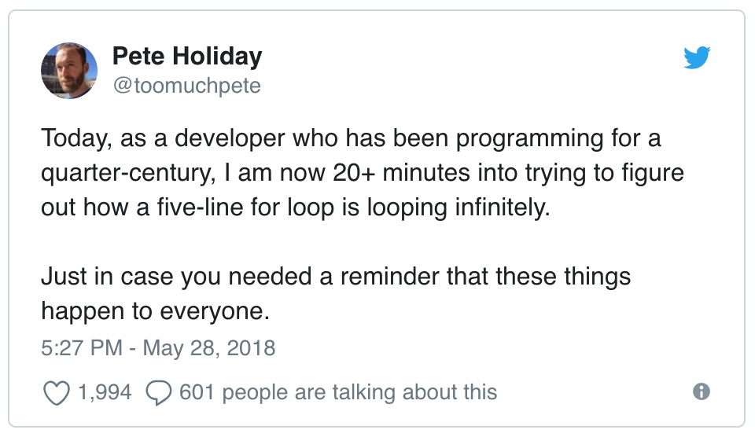

class: title,no-number
background-image: url(cover.jpg)
background-size: cover

.smokescreen[
# How to Monitor Your Database 
## Baron Schwartz &bullet; May 2018
]

---
layout: true

@xaprb

---
class: img-right
# Logistics and Contact Info

.col[
- Ask questions anytime
- Write me baron@vividcortex.com
- Tweet me at @xaprb
- Slides at [xaprb.com/talks/](https://www.xaprb.com/talks/)
]

.rc[

]

---
class: img-right
.col[
# Introduction & Agenda

- What is QoS and Why Does it Matter?
- The 4 Golden Signals of QoS
- The 3 Golden Signals of Resource Sufficiency
- The Zen of Performance
- The 3 Types of Performance Problems
- How To Diagnose Performance Problems
- Don't Get Cut On Sharp Edges
- Conclusions and Resources
]

.rc[]

---
class: title
background-image: url(unsplash-photos-5AiWn2U10cw.jpg)
background-size: cover

.smokescreen[
# Quality of Service
]

---
# Why Quality of Service Matters

* QoS is the most important thing to monitor about your database.
* Your database exists to a) store data b) answer questions.
* So you should measure *request* performance above all.
* *To know if there's a problem, measure work-getting-done.*

---
# What is Quality of Service?

Approach performance from the *user's* perspective:

> “I sent a request. I want a correct reply, fast.”

Users care about *request* performance.
The definition is *latency* in units of seconds per request.

---
class: img-right

.col[
# You Must Care About All Requests

Users care about their own requests, but you have to make sure the
**population** of requests is getting good QoS.

This is **workload QoS**.
]

.rc[]

---
# The 4 Golden Signals of QoS

The **CELT metrics** reveal everything about workload QoS.

1. **Concurrency** is the number of simultaneous requests \\(N\\)
2. **Error Rate** is what it sounds like
3. **Latency** is response time, as previously defined \\(R\\)
4. **Throughput** is requests per second \\(X\\)

These can all be calculated as average (or p99) during intervals or as they
apply to individual requests (except for Throughput).

---
# Aside: Concurrency, The Magic Metric

Concurrency is the single best metric of **demand** or load. (Throughput isn't a
very good load metric.)

By Little's Law, \\(N=XR\\), average concurrency during a time interval \\(T\\) is
also

\\[
N = \frac{\sum_{}^{}{R}}{T}
\\]

---
# What About CPU Utilization?

To be clear: performance is **how well users are being served**.

But CPU utilization, network saturation, etc aren't useless, either.

Isn't high CPU utilization a performance problem?

---
# These Are Resource Metrics

The **workload** places **demand** on **resources**.

The way resources respond to demand often explains performance.

There are **four key resources**:

1. CPU cycles
2. Memory
3. Storage
4. Network

---
# The Three Golden Signals of Resource Sufficiency

The three golden signals are [Brendan Gregg's USE
method](http://www.brendangregg.com/usemethod.html):

* Utilization
* Saturation
* Errors

---
class: smaller, two-column

# The Zen of Performance: Non-Duality
.col[

External (customer’s) view is singular:

* Request, and its latency and success.

Internal (operator’s) view is plural:

* Requests and their latency distribution, rates, and concurrency.
* System resources/components and their throughput, utilization, and backlog.
* Errors.
]

.rc[

]

---
class: two-column

# CELT + USE Together

.col[
The CELT and USE metrics are the **seven golden signals** of overall *system*
health and performance, unifying the external (customer, workload) and internal
(resource) perspectives.
]

.col[

]

---
class: title
background-image: url(unsplash-photos-iuqxv7kFj64.jpg)
background-size: cover

.smokescreen[
# Your Mental Models Are Wrong
]

---
# System As Imagined, System As Existing

As we build and operate systems, we form **mental models** of them.

These help us conceptualize and predict system behavior.

But **the map is not the territory**. Mental models are always wrong.

---
class: img-450h
# Pete's Mental Model

---
# Your Mental Model Of Your Databases

* The purge cron job runs at 4am once a day for 2-3 minutes
* There's an add-to-cart query that precedes read-from-cart queries
* Users constantly check for messages from users they follow
* Our most expensive query is the leaderboard
* The most frequent queries come from the product listings page

---
# What's Isn't Measured... Is Imagined

If you haven't measured your application/database interaction, **you will be
surprised.**

--

Just like Pete's `for` loop, the gap between your mental models and reality is
real, and measuring (or using the debugger) will show you what you're imagining
wrong.

---
# Are You Monitoring Workload QoS?

You probably have good resource monitoring, but poor (or no) workload
monitoring.

---
class: smaller, img-right

.col[
## How To Measure Workload

There are three primary ways to measure requests (workload):

1. Turn on full query logging
   1. Pros: it works, it's widely supported
	2. Cons: often severe performance overhead
2. Use internal statistics tables/views, if they exist
	1. Pros: built in/native; moderate impact
	2. Cons: often doesn't exist; only gives aggregate data
3. Sniff network traffic
	1. Pros: near-zero load added, super-detailed
	2. Cons: technically hard; doesn't measure internals
]

.rc[]

---
class: title
background-image: url(unsplash-photos-t7YycgAoVSw.jpg)
background-size: cover

.smokescreen[
# Fixing Performance Problems
]

---
# The Three Performance Problems

1. Latency too high
2. Resource usage too high
3. Collateral damage / noisy neighbor problems

---
# Causes of Performance Problems

- Needless requests
- Too-frequent requests
- Too-slow requests
- Resource starvation or stalls

---
class: two-column
# The Performance Swiss-Army Knife

.col[

A **profile** is an all-purpose tool for finding signal in the noise.

1. Group related requests together
2. Rank them by a metric
3. Look at the top items
]

.col[

]

---
# Finding Performance Problems

- Finding needless and too-frequent requests
	- Profile by frequency (throughput), ranking by `SUM(count)`
	- Are they useless, e.g. driver look-before-leap `ping` queries?
- Finding too-slow requests
	- Profile by `SUM(latency)`, then look at outliers
	- Profile by `P99(latency)`

---
class: img-right

.col[
# Prioritizing What You Find

How do you know whether “optimizing” a query is worth it?

Rule of thumb:
* To conserve resources / reduce collateral damage, look at % of total
* To make customers happy, look at p99 latency
]

.rc[]

---
class: img-right, smaller

.col[
# Inspecting Individual Requests

You don't learn much from aggregate data.

There's no "average" request.

You need to drill into individual examples (individual log lines or samples).

You also need to look at the *distribution* of request latencies.
]

.rc[]

---
# How To Fix A “Bad” Query

If a query is too slow, why?

- Is it slower than it *should* be?
- What is it *doing*? Working, waiting?
- There's only three possible solutions: eliminate work, reduce work, or work
  faster

---
# Technology Sharp Edges

Every database technology has its Kryptonite.

* MySQL: the query cache, replication, the buffer pool...
* PostgreSQL: VACUUM, connection overhead, shared buffers...
* MongoDB: missing indexes, lock contention...

---
# Technology-Specific Resources

Many of the “sharp edges” are special resources.

* Connection pools: fixed # of connections is a fixed resource.
* Buffer pools / caches: finite size to hold the working set.
* Etc.

Usually only a few things matter much. (But it depends.)

---
# Conclusions

- Monitor workload, not just resources
- Measure what matters: work getting done, customer experience
- Focus on the 7 Golden Signals (CELT + USE)
- Profile to focus, triage, and prioritize
- Drill down to individual request details
- Cover the basics of your technology's “sharp edges”

---
# Related: What Should I Monitor?

... and how should I do it?

<iframe width="621" height="350" src="https://www.youtube.com/embed/zLjhFrUhqxg" frameborder="0" allowfullscreen></iframe>

---
class: three-column, smaller

# Resources: Free EBooks

.col[

]
.col[

]
.col[

]

Your artisanal hand-brewed free copy is waiting at https://vividcortex.com/resources

---
class: two-column
# Slides and Contact Information

.col[
Slides are at https://www.xaprb.com/talks/ or you can scan the QR code.

Contact: @xaprb or baron@vividcortex.com

]

.col[

]
