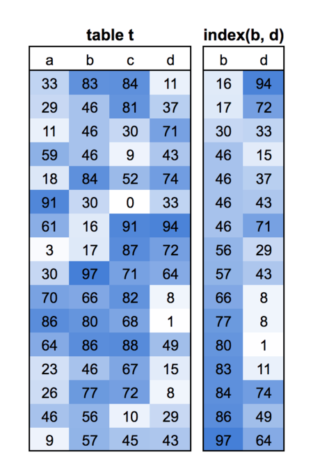
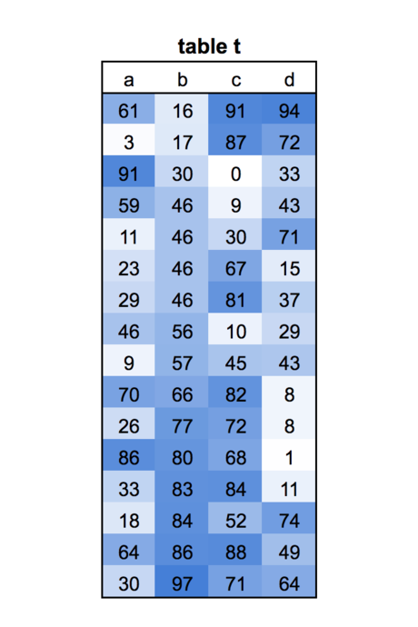

class: title, center
background-image: url(cover.jpg)
background-size: cover

.smokescreen[
# How To Index Your Database
## Baron Schwartz &bullet; PostgresConf 2018 
]

---
layout: true

@xaprb

---
class: img-right
# Logistics and Stuff

.col[
- Ask questions anytime
- Write me baron@vividcortex.com
- Tweet me at @xaprb
- Slides at [xaprb.com/talks/](https://www.xaprb.com/talks/)
]

.rc[

]

---
# Introduction and Agenda

The purpose of this talk is to organize and understand the principles
of database indexing.

- What are indexes?
- What kinds are there?
- How do they work?
- What are the three purposes of an index?
- What are the six ways to best design and use indexes?

---
class: title
background-image: url(sanwal-deen-93466-unsplash.jpg)
background-size: cover

.smokescreen[
# What Are Indexes?
]

---
# Indexes Help Find Data

Indexes are fast-lookup structures for the data in a table.

They essentially do two things with the data:

1. Maintain a **search-optimized copy** of the data.
--

2. Point to the data’s **original location**.

---
class: img-right
.col[
# How A Query Finds Rows In A Table

`SELECT c FROM t WHERE b < 70;`

This query must **examine every row** to find the right ones.
]

.rc[

]

---
class: img-right
.col[
# How A Query Finds Rows With An Index

Indexes **help find rows** without full-scans.

* This is an index of columns (b, d).
* The index is a **sorted copy of those columns**.
* The query scans the index until `b >= 70`.
]

.rc[

]

---
class: img-right
.col[
# How A Query Finds Rows With An Index

Indexes **help find rows** without full-scans.

* This is an index of columns (b, d).
* The index is a **sorted copy of those columns**.
* The query scans the index until `b >= 70`.
* The index has **pointers to the rows.**
]

.rc[

]

---
# What About Starting From 70?

The index is more than a plain copy. It’s organized in **seekable
ranges.**

--

That lets the database **seek to a starting point** in the
index.

---
# That’s All You Need To Know

Just remember an index is a **sorted, searchable** copy of data.

--

* You don’t need to know about **B-Tree Algorithms**.
* You don’t need to know **data structures**.
* You don’t need to understand \\( O(\log_{\frac{b}{k}}(n)) \\).

---
class: img-right

.col[
# B-Trees For The Curious

Most databases default to B-tree indexes.  
B-trees have sorted leaf nodes. They let the database:

* Find single rows
* Find ranges of rows
* Retrieve rows in sort order.
]

.rc[

]

---
class: img-right
.col[
# Other Kinds Of Indexes

There are special-purpose indexes for special purposes. Study them when you need
them.

* Hash indexes
* Log-Structured Merge indexes
* Full-text search (inverted) indexes
* Geospatial indexes
* Block-range indexes
* Bitmap indexes
]

.rc[

]

---
class: img-right

.col[
# Data Access Rules

1. Reading a range of data in order is fast.
2. Reading a range out of order is slow.
3. A single-row retrieval or lookup is slow.
]

.rc[

]

---
class: img-right

.col[
# Data Access Rules

1. Reading a range of data in order is fast.
   * Scanning the index for `b < 70` is a range.
2. Reading a range out of order is slow.
3. A single-row retrieval or lookup is slow.
   * Finding each row in the table is a lookup.
]

.rc[

]

---
class: title
background-image: url(elena-taranenko-541565-unsplash.jpg)
background-size: cover

.smokescreen[
# Three Purposes Of An Index
]

---
class: img-right
.col[
# How Do Indexes Help?

1. Read less data.
2. Read data in bulk.
3. Read data presorted.
]

.rc[

]

---
class: img-right
.col[
# 1. Read Less Data

`SELECT c FROM t WHERE b > 70;`

Without an index, this is a full table scan that reads **all rows and all
columns**.
]

.rc[

]

---
class: img-right
.col[
# 1. Read Less Data

`SELECT c FROM t WHERE b > 70;`

With an index, it reads only matching rows.
**Three inefficiencies**:

- It reads extra columns
- It reads from the table in random order
- It reads from the table row-by-row
]

.rc[

]

---
class: img-right

.col[
# 1. Read Less Data

Create an index with **all columns mentioned**: `index(b,c)`

`SELECT c FROM t WHERE b > 70;`

Now the index “covers” the query and it **doesn’t access** the table at all!

- No row-by-row lookups
- No randomly ordered access
]

.rc[

]

---
class: img-right

.col[
# 2. Read Data In Bulk

Indexes are sorted, so logically nearby rows are physically nearby.

Range queries will read pages that are **densely packed** with desired rows.

Densely packed pages let the database:
- Read fewer pages (goal #1)
- Read pages in sequential order, avoiding random reads
]

.rc[

]

---
class: img-right

.col[
# 2. Read Data In Bulk

To achieve this you can use *index-organized tables* or *clustered indexes*.

- The table itself is **sorted** in physical order
- The search-and-seek structures are built on the table, not separately
]

.rc[

]

---
class: img-right

.col[
# 2. Read Data In Bulk

`SELECT c FROM t WHERE b > 70;`

The query scans a range from the table only.

- Bulk access
- Ordered access
- Some superfluous columns
]

.rc[

]

---
class: img-right

.col[
# 3. Read Data Presorted

Indexes are sorted, so the database doesn’t need to sort.

This helps optimize queries such as:

- `ORDER BY`
- `GROUP BY`
- `DISTINCT`
- `MIN` and `MAX`
]

.rc[

]

---
class: img-right

.col[
# The Three-Star System

Grade an index with three stars, one for each:

- A star if the rows are densely packed.
- A star if the rows are sorted.
- A star if the query doesn’t access the table.

The **third star** is often much more important!
]

.rc[

]

---
class: title
background-image: url(denisse-leon-395932-unsplash.jpg)
background-size: cover

.smokescreen[
# Six Ways To Optimize Index Usage
]

---
class: img-right

.col[
# 1. Don’t Defeat Indexes

This query **defeats** an index on column `a`:

`... WHERE NOW() > a + INTERVAL 30 DAY;`

This query can use the index:

`... WHERE a > NOW() - INTERVAL 30 DAY;`

You can seek/search for a value in an index, but not an expression.
]

.rc[

]

---
class: img-right

.col[
# 2. The Left-Prefix Rule

Multi-column indexes are sorted by column 1, then column 2, etc.

- Queries can use a **prefix of an index**.
- They generally **can’t use a suffix**.

`WHERE c < 70` won’t work, it will be a full index scan.
]

.rc[

]

---
class: img-right

.col[
# 2. The Left-Prefix Rule

A prefix specifies a range up to and including the **first inequality**.

`WHERE b < 70 AND c < 50`

Anything past the first inequality is sub-filtering the range: no longer bulk access.

* Place equalities first, ranges last
* Try supplying missing equalities or converting ranges to lists of values
]

.rc[

]

---
# 3. Exploit Index-Only Queries

Create *covering indexes* for important queries (index-only queries).

Remember: it works only if the index has **all** the columns the query mentions.

It’s often possible to union the indexes needed by several important queries.

---
# 4. Exploit Clustered Indexes

The benefit of a clustered index is the table is physically organized in PK order.

* Supported in Oracle, MySQL, SQL Server
* Not supported in PostgreSQL, despite `CLUSTER` command (~ `DEFRAG`)

You can only have one clustering index per table.

---
# 5. Consider Column Selectivity And Order

Column order in compound indexes matters a lot!

* For queries:
	* The leftmost prefix rule applies
	* Makes indexes useful for queries, or not
* For data characteristics:
	* Organize by most-selective or least-selective
   * The best order depends on use-case: least for bulk reads, most for single-rows.

---
class: img-right

.col[
# 6. Avoid Over-Indexing...

Indexes add cost to writes and complicate the planner’s job

* Avoid duplicates
* Analyze redundant indexes with a common prefix
* Analyze unused indexes 
]

.rc[

]

---
class: img-right

.col[
# 6. But Don’t Fear Indexes

Caution: &ldquo;unused&rdquo; indexes often really aren’t!

Indexes are a lot less expensive than you’d guess. Cost/benefit tradeoffs
usually weigh in favor of indexes.

For a rigorous analysis, see Lahdenmaki and Leach’s book.
]

.rc[

]

---
class: three-column
# Resources

.col[

]
.col[

]
.col[

]

---
class: two-column
# Slides and Contact Information

.col[
Slides are at https://www.xaprb.com/talks/ or you can scan the QR code.

Contact: @xaprb and baron@vividcortex.com
]

.col[

]

---
# Photo Credits

* [Dragon’s Blood Tree](https://www.flickr.com/photos/rod_waddington/10941931846/)
* [Keys](https://www.flickr.com/photos/popilop/331357312/)
