class: title, shelf, fogscreen
background-image: url(unsplash-photos-YyWu19ab4_M.jpg)

# System Performance Theory
## MongoDB Tech Talks 2018

---
class: roomy
# Logistics

.qrcode.db.fr.w-40pct.ml-4[]

Slides are at https://www.xaprb.com/talks/

You can download them as PDF by printing with Chrome.

---
# Aspirations, Motivations

Here's a few things I hope to illuminate a little bit:

- The mechanics of requests
- The consequences
- A starting point for Googling

This won't be comprehensive, or even entirely correct.

???

There's lots still being discovered about this field.

---
# A Request/Query/etc

Here's a box (request) arriving at a scanner.

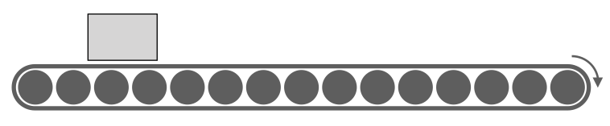

This box is going to be scanned as it moves along the conveyor.

---
# The Scanner's Max Capacity

How many requests per amount of time \\(T\\) can the scanner process?

--

The scanner is maxed out when there's no space between boxes.

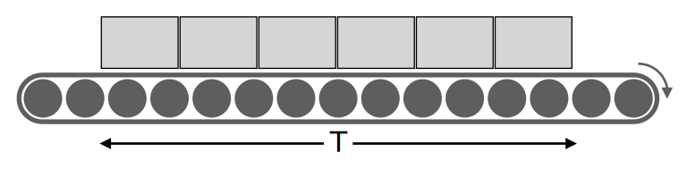

The box-scanning rate is throughput, \\(X\\). It's a rate per time interval
\\(T\\).

\\[
X = \frac{\text{number of boxes}}{T}
\\]

---
# How Long Does Each Box Take?

--

Each box is in the scanner for residence time \\(R\\).
When the boxes are end-to-end without space, it's intuitive that this is:

\\[
R = \frac{1}{X}
\\]

Notice that the \\(T\\) is hidden inside the definition of \\(X\\).

---
# Unequal Boxes

Question: what if the boxes are different lengths?

\\[
R = \frac{1}{X}
\\]

--

In this case we don't know how long any individual box takes, but the
relationship is still valid on average.

So a correct way to read it is "if throughput is \\(X\\) during time interval \\(T\\),
the average box length is \\(R\\)."

---
# Spaced-Out Boxes

Question: what if the boxes aren't end-to-end? What if there are gaps?

\\[
R = \frac{1}{X}
\\]

--

The relationship isn't true anymore. Why not?

--

"Because sometimes there's no box in process."

So the 1 in the numerator has some meaning! It's not "just a 1." It's the
average number of boxes in process and it's important.

---
# Little's Law

We've derived Little's Law (non-rigorously). Written two ways:

\\[
R = \frac{N}{X}
\\]

\\[
N = XR
\\]

--

Abandoning the box/scanner terminology,

- N is average number of requests in residence
- R is average residence time
- X is average requests per interval T

---
# What if a Box Arrives Too Early?

If a box arrives while the scanner is busy, it has to wait.

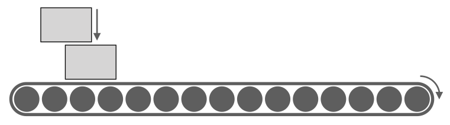

How does Little's Law change as a result?

---
# Little's Law with Queueing

Little's Law still works, but our view of the _system_ needs to be more nuanced.
Residence time has two parts: queue time and service time.

\\[
R = W + S
\\]

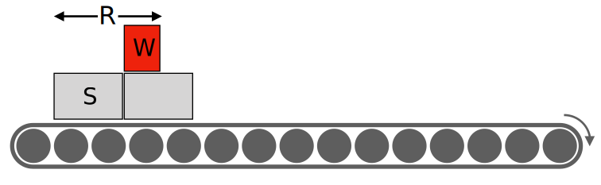

Queueing terminology: the conveyor is the _queue_, the scanner is the _server_.

???

The conveyor is the queue, but I didn't actually draw the server. The
illustration doesn't work perfectly: it can get a little confusing to think
about the flow of time and the movement of boxes.

---
# Requests Resident and Utilization

What's the difference between number of requests in residence and utilization?

--

- Number of requests in residence is boxes being scanned, plus boxes on the
  conveyor
- Utilization is how much of the time the scanner is busy vs. idle

---
# Requests Resident = Concurrency

Concurrency \\(N)\\) is the number of requests resident in the _system as
a whole_, including requests queued.

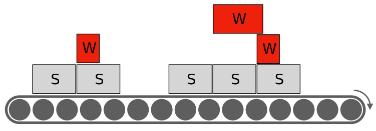

---
# Properties of Concurrency

- Concurrency is dimensionless: the time units in \\(N=XR\\) cancel.
- Concurrency has both instantaneous and average definitions.
- Concurrency can be more than 1:
	- Instantaneously if requests arrive when the server is busy
	- On average if the arrival rate \\(\lambda\\) is higher than throughput

---
# Utilization

Utilization \\(\rho\\) is the average fraction of time the server is busy.

- It doesn't include the queue (conveyor).
- It can't exceed 100%.

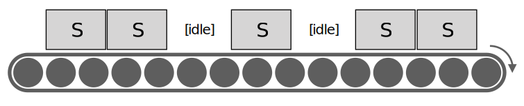

There's a _utilization law_ which is just Little's Law applied only to the
server, ignoring the queue: \\(\rho = XS\\)

???

Utilization doesn't have a fractional instantaneous definition. At any instant, the server
is either busy or idle, it can't be partially utilized.

What this means is that average utilization (busyness) of the server is the same
as the average number of requests in service.

---
class: col-2, roomy
# What Causes Queueing?

Queueing happens even at low utilization:

1. Irregular arrival timings
2. Irregular job sizes
3. Lost time is lost forever

 
 
A queue fundamentally changes how a system works:

- Increases availability and utilization
- Increases average residence time
- Increases cost/overhead

???

Queueing happens even when there's idle capacity.

---
# Arrival Rate and Queue Delay

Eben Freeman has a great visual that explains how arrival rate \\(\lambda\\)
is related to queueing delay.

- A request arrives, and the server processes it until it's finished
- The height is the job size, and the width is the service time \\(S\\)
- The upper edge of the triangle is the amount of outstanding work to do

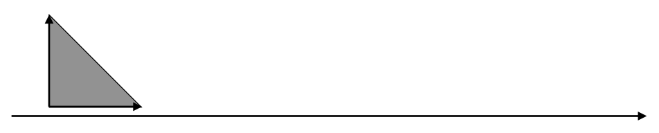

---
# Another Request Arrives

- It has to wait \\(W\\) in the queue until the first is done
- Then it has \\(S\\) service time too
- Its total residence time \\(R = W+S\\)

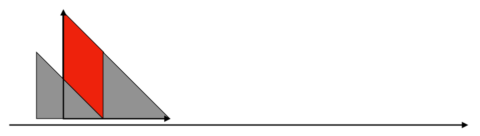

---
class: col-2
# An Equation For Queue Wait

Eben uses the area under the graph to relate the height of the top edge to the
width of the red wait parallelograms:

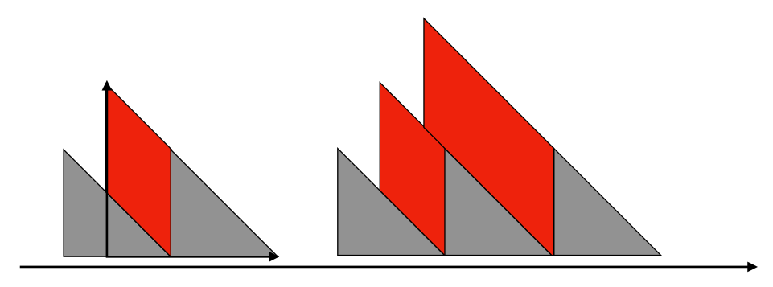

Solving this for \\(W\\) gives an equation for wait time:

\\[
W = \frac{\lambda S^2}{2(1-\lambda S)}
\\]

This creates the familiar hockey stick curve, shown here in terms of \\(\rho\\).

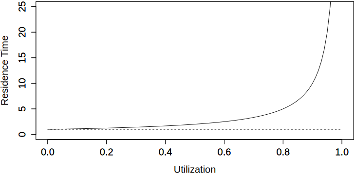

???

- This is _not_ exactly correct for multiserver queues.
- Why is it nonlinear?  Because a request can make multiple requests wait, not just one. This makes waiting multiplicative, not additive.
- Notice that the server is never more than 100% utilized even though there's
  backlog. That's the difference between utilization and concurrency.
- Notice that the assumption of fixed service time. This isn't valid if service
  times inflate.
- Note the assumption of a stable system (the queue doesn't grow unbounded)

---
# Some Implications

One of the nice things about this form is that it lets you reason about service
time and arrival rate easily:

\\[
W = \frac{\lambda S^2}{2(1-\lambda S)}
\\]

What if you...

- _double_ the arrival rate
- _halve_ the service time

---
# Residence Time as a Function of Utilization

Caveats:

- Plotting throughput vs latency is hazardous. It's better to use utilization.
- The equation is only valid for 1-server queueing systems.

\\[
R = \frac{S}{1-\rho}
\\]

An approximation to some types of queueing systems with \\(m\\) servers is

\\[
R = \frac{S}{1-\rho^m}
\\]

---
# Further Study

There are lots of different types of queueing systems (open closed, multi-queue,
multi-server...) and they all have different behaviors.

The material in the preceding slides is oversimplified and incorrect, depending
on the context.

The general truths:

- Service time influences utilization linearly, which increases queue time nonlinearly.
- Job size variability increases queueing linearly.
- Arrival rate variability increases queueing nonlinearly.

---
class: title, smokescreen
background-image: url(gears-1236578-1280.jpg)

# Concurrency, Load, and Scalability

---
# Utilization And Service Time Are Hard

It's often really complicated to apply queueing theory in the real world.

But concurrency and throughput are really easy to measure and very powerful.

We'll begin by looking at **load**.

---

# What Is The Definition Of Load?

There's no one right answer to this question, but there's a **useful answer**
for this discussion.

--

Load is the quantity of work a system does during an interval of time.

--

Load is the **sum of residence times** during an observation interval
\\(T\\).  This is equivalent to average **concurrency** of tasks queued or in
service:

\\[
N = \frac{\sum_{}^{}{R}}{T}
\\]

You can prove this with Little's Law.

---
# Load in the Real World

Load (concurrency) is a dimensionless measure of how much work is taking place in a system.

You're familiar with it and/or its cousins:

- Average Active Sessions
- Threads running
- Load average
- Queue depth
- Backlog
- globalLock.activeReaders + activeWriters

---
# What's the Definition of Scalability?

There's a mathematical definition of scalability **as a function of
concurrency**.

--

I'll illustrate it in terms of a **parallel processing system** that uses
concurrency to achieve speedup.

???
It's practical, easy to use, and matches the domain well.

I'll show how the equation is composed piece by piece, but don't sweat the math.

---
# Linear Scaling

Suppose a clustered system can complete **X tasks per second** with no
parallelism.

--

With parallelism, it divides tasks and executes subtasks
concurrently, **completing tasks faster**.

--

Faster completion also means **increased throughput.**

???
* Tasks per second is throughput.
* Throughput is a function of concurrency.

---
# Linear Scaling

Ideally, **throughput increases linearly with concurrency**.

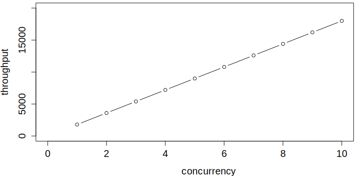

???
* Linear scaling is the ideal.
* Another way to say this is that the system's output is a linear function of
  load.

---
class: img-right
# The Linear Scalability Equation

The equation that describes ideal scaling is

\\[
X(N) = \frac{\\gamma N}{1}
\\]

where the slope is \\(\\gamma=X(1)\\).

???
- X is throughput
- N is concurrency, which is the workload
- Gamma is the system's output when there's no parallelism
- Really important to note that N is the independent parameter, the driver

---
# But Our Cluster Isn't Perfect

Linear scaling comes from subdividing tasks **perfectly**.

--

What if a portion isn't subdividable?

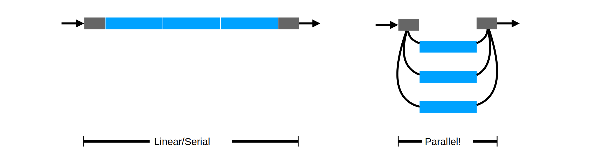

---
class: img-right
# Amdahl's Law Describes Serialization

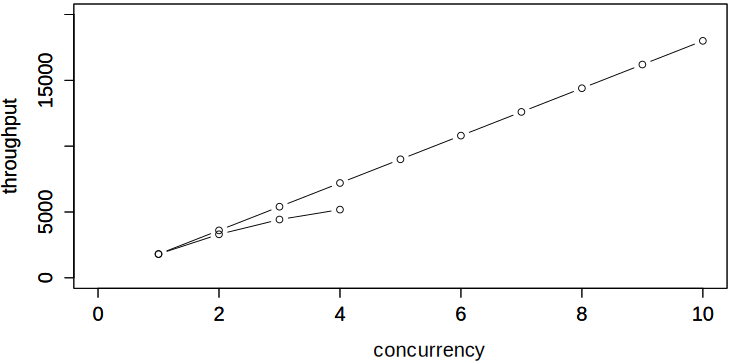

\\[
X(N) = \frac{\\gamma N}{1+\\sigma(N-1)}
\\]

Amdahl's Law describes throughput when
**a fraction \\(\\sigma\\) can't be
parallelized**.

---
# Amdahl's Law Has An Asymptote

\\[
X(N) = \frac{\\gamma N}{1+\\sigma(N-1)}
\\]

Parallelism delivers speedup, but there's a limit:

\\[
\lim\_{N \to \infty}{X(N)} = \frac{1}{\sigma}
\\]

--

e.g. a 5% serialized task can't be sped up more than 20-fold.

???
If 5% of the work is serialized, infinite concurrency will still result in tasks
taking 5% as long as non-parallelized tasks.

---
# What If Workers Coordinate?

Suppose the parallel workers **also have dependencies** on each other?

--

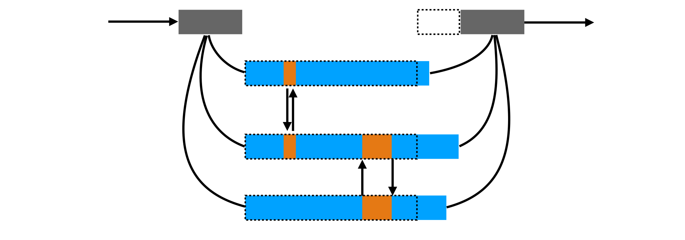

---
class: col-2
# How Bad Is Coordination?

\\(N\\) workers = \\(N(N-1)\\) pairs of interactions, which is
\\(\mathcal{O}(n^2)\\) in \\(N\\).

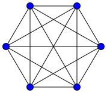

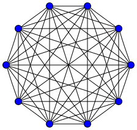

---
class: col-2
# The Universal Scalability Law

\\[
X(N) = \frac{\\gamma N}{1+\\sigma(N-1)+\\kappa N(N-1)}
\\]

The USL adds a term for crosstalk, multiplied by the \\(\\kappa\\)
coefficient.

Now there's a **point of diminishing returns**!

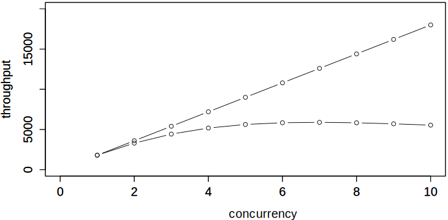

Crosstalk is also called coordination or coherence.

---
# You Already Know This

You've seen lots of benchmarks with diminishing returns.

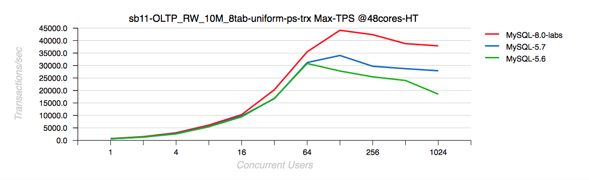

Source: http://dimitrik.free.fr/blog/

???
By the way, pay attention to the axis scale, it's log-scaled by powers of two.
If you scale the X-axis linearly you'll get the shape of the curve on the
previous slide.

---
# The USL Describes Behavior Under Load

The USL explains the **highly nonlinear behavior** we know systems exhibit near
their saturation point.
[desmos.com/calculator/3cycsgdl0b](https://www.desmos.com/calculator/3cycsgdl0b)

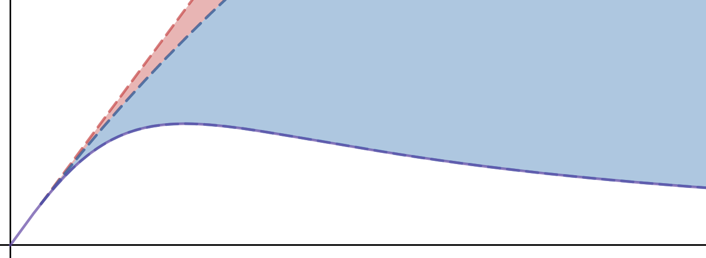

???
- Serialization (red) grows slowly, but crosstalk (blue) grows rapidly.
- This is why systems get so unpredictable near their limits.
- Near and above the point of diminishing returns, systems exhibit high variance
  and get unpredictable.

---
# A Summary Of The USL

The Universal Scalability Law defines **throughput as a function of concurrency** (load).

It explains how and why **systems don't scale linearly with load**.

---
class: roomy
# What is the USL Good For?

Armed with the USL, you are ready to:

- Measure and model nonlinear behavior.
- Predict the onset of nonlinearity.
- Design better systems.

It's easy. Let's see how!

---
class: title, smokescreen
background-image: url(compass-2946958\_1280.jpg)

# How To Measure, Model, And Predict

---
# What To Measure

You can't measure serialization & crosstalk directly.

--

Instead, measure **throughput** and **concurrency**.

--

Then **fit the USL model to the data** to estimate the parameters.

---
.ba.br-3.pa-1.w-2-12th.h-1-12th[ Throughput ]

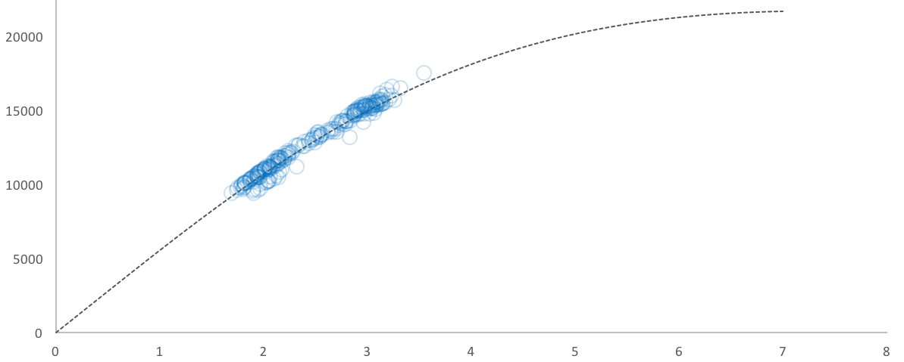

.ba.br-3.pa-1.absolute.l-5-12th.w-2-12th.h-1-12th[ Concurrency ]

???
Throughput is so trivially easy to measure in most systems that I won't talk
about it. But there's two easy ways to measure concurrency.

---
# How To Measure Concurrency, Pt. 1

Many systems have a metric of concurrency already.
Look for a metric of **things actively working**.

- MySQL: `SHOW STATUS LIKE 'Threads_running'`
- Apache: active worker count

--

It works well to **poll this e.g. 1x/sec**, then average these into 1- or
3-minute averages.

---
# How To Measure Concurrency, Pt. 2

If there's no metric of concurrency, you can **sum up latencies and divide by
the duration**.

\\[
N = \frac{\sum_{}^{}{R}}{T}
\\]

???
- Again, in my experience it's good to use averages over a moderately long window like 1-5 minutes.
- You want to end up with dozens to hundreds of data points.

---
# Plot Your Data

Simply **scatterplot your data** and eyeball it for sanity.

???
Source data in "row16.csv" file. If you're reading this note and you're not a
VividCortex employee, sorry, I can't give you access to this data.

---
# Plug The Data Into The Model

Paste the data into the [Excel
model](https://www.vividcortex.com/resources/usl-modeling-workbook) I built.

???
You can do it in R, or gnuplot, or even with JavaScript in Plotly. Lots of
options. This is an easy one.

---
# Interpreting The Results

What does the output mean?

- Shows whether your system has **more serialization or crosstalk**.

--
- Shows the **estimated max load** where it'll stop scaling.

--
- Helps you **predict nonlinearity**.

---
# Paypal's NodeJS vs Java Benchmarks

Paypal's [NodeJS vs Java benchmarks](https://www.vividcortex.com/blog/2013/12/09/analysis-of-paypals-node-vs-java-benchmarks/)  are a good example!

---
# You Don't Need To Do Any Modeling!

Let's take another look at this data. What jumps out?

---
class: img-right
# What If You Had Only The First Part?

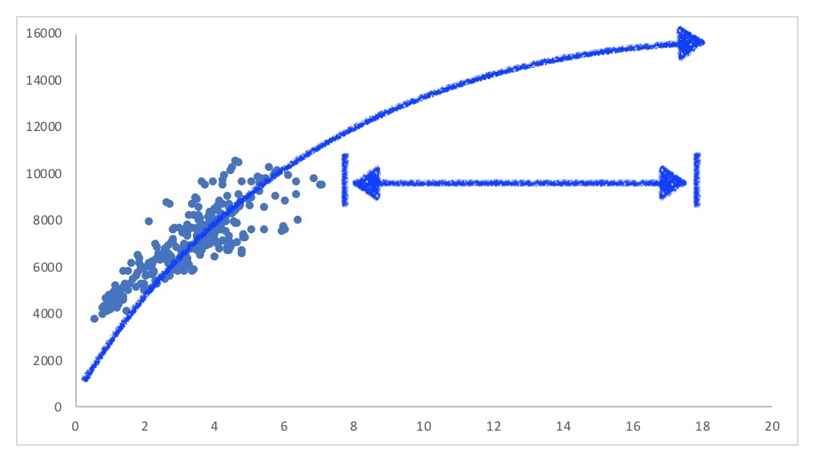

- I would model and project out to the right.
- I'd see "hmm, it's **leveling off**."
- I'd say "don't count on much more than you see now."

---
class: img-right
# The Meaning of Outlying Points

- Given all the data, I mentally cluster it into two parts.
- If the high-end outliers deviate, **it's nonlinear already.**
- Those points are evidence that the system is struggling there.
- You don't need to model anything to see that.

---
# What Can You Do About Nonlinearity?

A lot of system performance problems are "hard" to solve.

Eben Freeman's talk has some good discussion of this, e.g. 

- **Serialization penalty:** the "reduce" step in map-reduce can be a
  bottleneck; build a tree of aggregators (e.g. Facebook's SCUBA)
- **Crosstalk penalty:** optimal assignment is hard. Instead of making an
  optimal routing choice, pick the best of two random options.

---
class: col-2
# Some Resources

[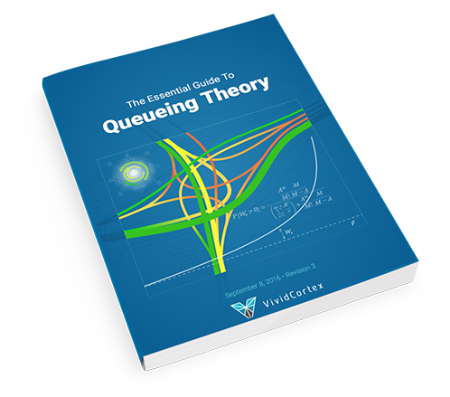](https://www.vividcortex.com/resources/queueing-theory)

---
class: roomy
# More Resources/References

- Eben Freeman's LISA17 [talk](https://www.youtube.com/watch?v=Hda5tMrLJqc) and
  [slides](https://speakerdeck.com/emfree/queueing-theory)
- Kavya Joshi's QCon [talk](https://www.youtube.com/watch?v=M5r-IVxP-WI] and
  [slides](https://speakerdeck.com/kavya719/a-practical-look-at-performance-theory)
- [Neil Gunther](http://www.perfdynamics.com/Manifesto/USLscalability.html), author of the USL
- There are lots of good books on queueing theory and scalability from
  [Neil Gunther](https://www.amazon.com/dp/B00FC99QUO?tag=xaprb-20),
  [Mor Harchol-Balter](https://www.amazon.com/dp/1107027500?tag=xaprb-20),
  [Gross & Harris](https://www.amazon.com/dp/B014GGB2UA?tag=xaprb-20), etc
