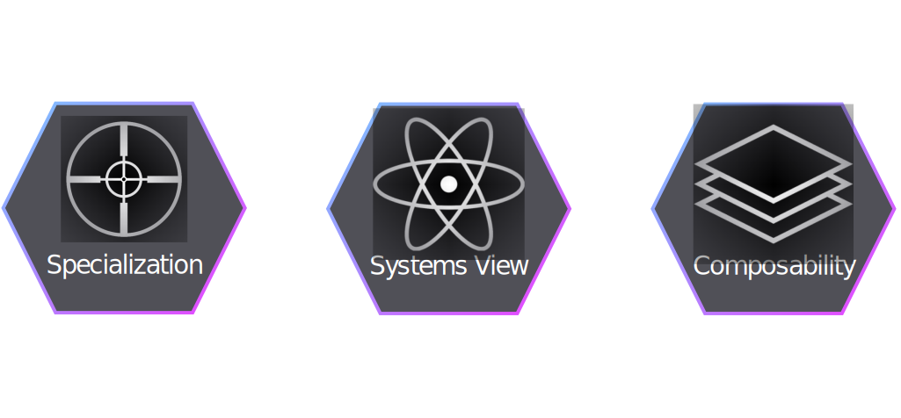

class: title, shelf, bottom, no-footer, fogscreen
background-image: url(cover.jpg)

## The Future of Monitoring is Distributed  Baron Schwartz &bullet; Percona Live 2017

---
layout: true
class: no-footer, top, smokescreen, title

---
background-image: url(wave.jpg)
# Databases, But What About Data?

???

* What is Data For
* Tour Two Things: Data Change Business
* How World Distributed -> How we’ll consume and operate

---
background-image: url(train-tracks.jpg)
# The Future Is Happening Now

???

* We’re at a decisive moment
* Radically different future is happening now
* Change happening fast, look back to understand

---
background-image: url(legos.jpg)
# Digital Transformation

???

- We used to GTM differently
- Lego – I had thousands, cheap secondhand
- Kids were changing, I had no TV
- Lego struggled, then transformed to apps and movies

---
background-image: url(coffee.jpg)
# Data Is The Sustainable Innovation

???

- Starbucks has loyalty
- Member rewards gives them data to learn
- Good for drinkers, great for Starbucks
- Commodity industry, data is a barrier

---
background-image: url(lattice.jpg)
# Answers At The Speed Of Questions

???

- Computers = cheap, fast data at the speed of customers
- Stop focus on what they’re selling, focus on what customers want

---

???

- B2B too. Media analytics.
- Measures engagement, captures intention/desire.
- “What do my audiences want to read?”

---
background-image: url(puzzle.jpg)
# It’s Harder Than It Looks

???

- We want this. The catch is, it’s hard.
- We spend our time serving the data instead of data serving us.
- Critical turning point: press on, or fall back to surrogates?
- It gets harder before easier.
- Feels like working IN business instead of ON.

---
background-image: url(motorcycle.jpg)
# Speed Is Your Only Advantage

???

- Results are predictable.
- Clarity, efficiency, speed, better faster stronger

---
background-image: url(gears.jpg)
# Business Operations, Not Just Customers

???

- From understanding customers to operations
- In engineering, apply to how we run systems

---
background-image: url(microscope.jpg)
# Observability

???
- Observability is system property
- It’s culture like DevOps
- Observability is the slide, not the microscope

---
background-image: url(cockpit.jpg)
# Moving Faster, With Clarity

???
- Benefits of observability
- Everyone gets excited and it catches fire

---
background-image: url(fog.jpg)
# Poor Observability = Predictable Problems

???

- Worst problems hide where least visibility
- Data tier is a gap, perfect storm
- VividCortex

---
background-image: url(earth.jpg)
# Our Distributed Future

???

- Databases for data, Data for answers, answers for advantage
- At VividCortex our mission is to help our customers gain an enduring advantage by achieving data fluency, unlocking the potential of their data platforms, and understanding how their complex systems behave.
- Increasingly distributed, challenging

---
background-image: url(rocks.jpg)
# SaaS Changes The Game

???

- From code to platforms and SaaS
- Foolish to BYO, but SaaS = dependency
- Cantrill: production, abstractions, high/low, distributed

---
background-image: url(spiderweb.jpg)
# New Dependencies = New Failures

???

- SaaS world = distributed and dependent
- Compiled in, like library
- Not observable
- SaaS = good, just new failure modes

---
background-image: url(pen.jpg)
# Monitoring Is Performance Analytics

???

- We’re not ready.
- Silos = bigger silos
- Monitoring is analytics DB, distribute right

---
layout: false
class: center, no-footer
# Three Distributed Monitoring Capabilities

???

- Be “best of breed” in a specific domain.
- Systems are more than their parts
- Act as a leaf node in an observability tree

- Netdata
- Prometheus
- ElasticSearch
- OpenTrace

---
class: center, no-footer
### Visit Our Booth For A Demo, Or Start A Free Trial Online!

.center[

]

???
- In closing, part of community
- Business / FOSS need each other
- Exciting set of challenges
