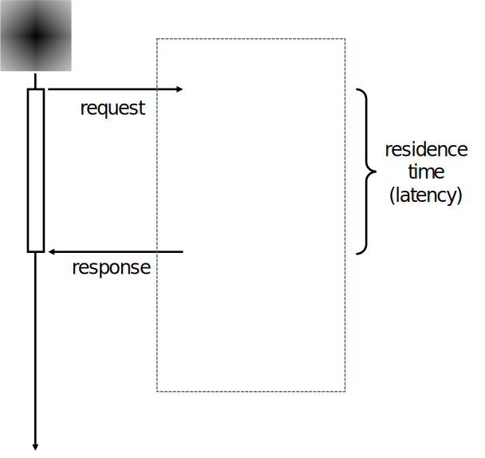
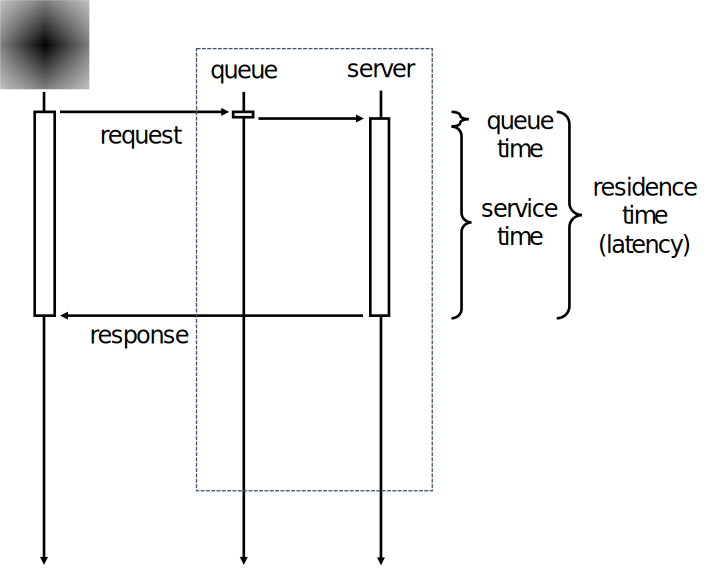
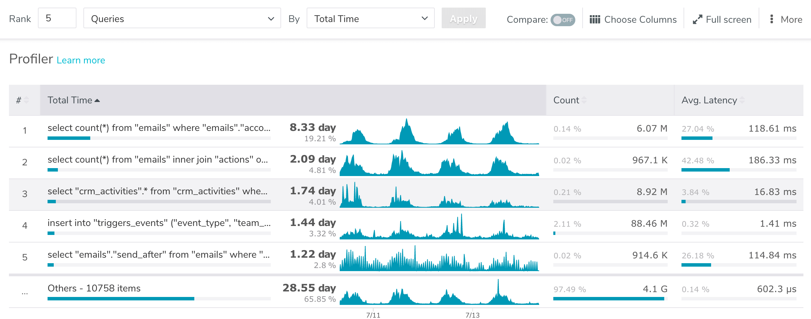

class: title, shelf, smokescreen, no-footer
background-image: url(unsplash-photos-z77FVd3_xGI.jpg)

# PostgreSQL Performance Theory
## Baron Schwartz &bullet; PGConf Philly 2017


---
layout: true
name: section
class: title, fogscreen, no-footer
background-image: url(section.jpg)

---
layout: true

.footer[
- @xaprb
- 
]


---
class: img-right-full

#Introduction

- Email me at baron@vividcortex.com
- Tweet me @xaprb

---
#What You'll Learn From This Talk
- A clear definition of performance
- How to measure and analyze performance with profiles
- Types of performance problems and their solutions
- Key Postgres performance instrumentation

---
template: section
#What is Performance?

---
#What is Performance?
There are two perspectives on performance.
- Users care about request performance.
- Service owners care about serving the load with minimal
resources.

---
#The Zen of Performance
The Zen of Performance says you can't understand user or server
performance in isolation.

- User behavior influences the servers
- Users affect other users
- The server and resource behavior affects users

The *system* is more than the service/servers. Users are part of it.

---
#Learning By Testing Assumptions
- From a partial view of the system, you can often *calculate* the rest.
- When you *measure* it instead, you find reconciliation errors.
- You can learn a lot from this.

---
template: section
#The User's Perspective

---
#What Do Users Want?

Users care about *request* performance.

- "I want my answer, and I want it fast."

How to measure it: *latency*

- Also called *response time* and *residence time*
- Users care about each individual request's latency.
- They care if latency is *consistent*.

---
class: img-left
#The User's View Of A Request



Measure *latency*

---
#Users Care About Their Own Performance
Performance, from the user's point of view, is singular.
- Users make one request at a time.

Users don't care about other users.
- They don't know about other users!
- They don't care about other users' performance!

They don't care about the server!
- To the user, the server/service is a black box that's supposed to just work.

---
template: section
#The Service Owner's Perspective

---
#What Does the Service Owner Want?
Understanding server performance is harder than understanding request performance.
- We can't think about performance of requests in isolation.
- We have to consider a system of requests and resources, and how they interact.

Requests influence each other through contention for shared resources.
- The resulting behavior is complex, not simple.

---
class: img-left
#The Secret Life Of A Request


Measure latency, queue time, service time

---
#The Secret Life Of Many Requests


---
template: section
#How To Think About Performance

---
class: compact
#What is Performance? (Cont'd)
Performance is the interaction of two parts of an intricate system.
- User's perspective: request-focused.
    - Requests are the *unit of wor*k.
    - Definition: request latency, with units of seconds/request.

- Service owner's perspective: resource-focused.
    - Resources are *what does the work*.
    - Definition: system throughput, with units of requests/second.

Performance is both, simultaneously.
- Notice that the definitions are inverses.

---
#Many Things Aren't Really Performance

Performance is NOT what you've probably been told!

- It isn't CPU utilization. CPU is a resource, meant to be utilized!
- It isn't cache hit ratio.
- It isn't seq_scans or temp_files
- It isn't load average.
- It isn't the number of backends connected or deadlocks or...
- It isn't anything else, other than request latency or throughput.

---
class: compact, img-right
#A Clear Performance Definition Solves Problem #1


The first challenge in solving performance problems is clearly identifying the problem.

- By understanding performance in terms of latency and throughput, you are already winning.
- Cache ratios, utilization, etc are all causes or effects of performance/behavior.
    - They *might* be a symptoms of a performance problem.
    - But the symptom isn't the problem itself.
    - Treating it as such causes false correlations and other mistakes.

---
#What's a Performance Problem?
A performance problem is when...

1. A request has high latency
2. A service/server uses too many resources to produce throughput

That is literally it. Everything is one of these two.

---
#How Can You Measure Performance?

You cannot improve what you cannot measure.

- As engineers, we must measure all requests, so every user has a good experience.
- The challenge is that we cannot inspect every request individually, so we need to examine them in aggregates.

We can find poor performance by looking at these aggregates in the right ways.

---
class: img-left
#Aggregating Requests


At request completion, record every
fact we know about the request:
timestamp T, count 1, latency N,
queue time N, service time N, and
other information (user, type, host...)

Aggregate these into a log.

---
template: section
#Analyzing Performance With Profiles

---
#Use Profiles To Analyze Requests
- Profiling is the most important performance analysis tool.
- Profiling enables slice-and-dice drilldown into system behavior.
- Profiling is ideally interactive and multi-dimensional.
- As we'll see later, I advocate profiling the server by queries.
- Then, after identifying a query, profiling that query to figure out where it
spends its time.

---
#A Profile Subdivides And Sorts The Whole

| Name       | Rank | Aggregate Time | Aggregate Count |
|------------|-----:|---------------:|----------------:|
| Sub-Item 1 |    1 |          932.1 |             401 |
| Sub-Item 2 |    2 |           67.8 |             892 |
| Sub-Item 3 |    3 |           32.0 |              11 |
| (Others)   |      |          612.9 |            1837 |

---
template: section
#How To Detect And Diagnose Performance Problems

---
#Common Causes of Performance Problems
Performance problems happen because:

1. A request executes slowly
2. A system receives too many requests
3. An app/user makes useless requests

Each of these is easy to see if you're measuring requests (queries).

---
class: no-footer
#Performance Troubleshooting Flowchart


---
class: compact
#Problem #1: Request Too Slow
Requests that are too slow are spending too much time.
The solution is to measure where they spend their time.
- It could be working (service time). What are the stages and timings?
- Or it could be waiting (queue time)
- You need to sub-profile the query to find out!

This sounds too simple and obvious, but it's rarely done.
- Instead, people often jump to Google and "tuning the config..."

If you know a request is slow but don't have deep profiling?
- You'll have to use profiling tools that show a deeper level of visibility
- Or you can guess, and either be lucky or wrong---which do you prefer?

---
class: compact
#Solution #1: Profile By Sum of Latency
Profile requests to find the most time-consuming ones.
Rank by sum of latency.
- This finds very fast but frequent ones, not just slow ones!

Then sort by average latency.
- This finds the slowest time-consuming queries
- These are often the easiest to fix! (it's harder to optimize fast ones)

You'll usually find queries with obvious problems:
- queries that are missing indexes
- queries that are spending time locked
- queries that are doing complex computation

---
class: compact
#Problem #2: Too Many Requests
A frequent anti-pattern is shipping lots of data over the network.

The N+1 pattern is an example:

- Do 1 query to find something out
- Do N queries to fetch N tuples matching the 1
- Do the calculations in the app
- It's better to do a query in the DB instead!

Other examples:
- Cacheable queries (repetitive, redundant)
- Another is check, recheck, recheck...

"Running queries in the app" is usually better left to the DB.

---
#Solution #2: Profile by Sum of Count
This will rank the most frequent queries to the top.

- As a second step, sort within these, by sum of latency.

This will rank the slowest ones (the worst frequent queries) first.

The problem and solution are usually app-dependent and obvious.

---
#Problem #3: Useless Requests
Lots of useless requests happen in database drivers and ORMs

Examples:

- Prepare a statement, but never execute it
- Ping before every query (look-before-you-leap pattern)
- Update data that might not exist, "just in case"
- Reset connection settings constantly, or set to defaults

These are obvious if you sort and rank by SUM(count).

---
template: section
#Learning The Postgres Performance Instrumentation

---
#PostgreSQL's Performance Instrumentation
- The PostgreSQL slow query log
- pg_stat_database and pg_stat_all_tables
- pg_stat_activity
- pg_stat_statements
- Externally captured performance measurements

---
#PostgreSQL's Slow Query Log
- PostgreSQL logs slow queries to the server log.
- "Slow" is defined by log_min_duration_statement.
- I don't like slow query log analysis. It ends badly.

---
# Benefits of the Slow Query Log

- It's built-in and already available.
- Log analysis plays well with lots of existing tools.

---
# Drawbacks of the Slow Query Log

- Doesn't capture fast-but-frequent queries that add a lot of load.
- Adds overhead to the server and latency to queries.
- The log is mixed, not dedicated, and is not really machine-friendly.
- Log analysis quickly becomes a manual, labor-intensive process.

---
#Enabling PostgreSQL's Slow Query Log
Logging slow queries is off by default, so you have to enable it.
- log_min_duration_statement = 0
- log_duration = true
- log_statement = all

Whether to leave it enabled all the time is up for debate.
- Enabling the log turns reads into writes.
- Not enabling it allows you to develop performance problems you have no capacity to diagnose.

---
# Analyzing the Query Log
The "standard" solution today is pgBadger.

- Aggregates a log, produces a report on lots of stuff.
- See a sample report at http://dalibo.github.io/pgbadger/samplev7.html

Older tools include:

- pgFouine: slow, messy to install, clunky to use
- mk-query-digest: specifically focused on query profiling, fast, lean, no dependencies

---
# Cultural Considerations of Query Logging

- Modern teams are rapidly abandoning the old-skool DBA culture.
- If you're turning on logging, SCP'ing logs somewhere, analyzing them, and emailing out the report... you're  probably going to be replaced by RDS.
- Treat servers like cattle, not pets.
- How can you run a platform, as an internal service, not babysit a bunch of servers?
- How can you enable developers to be more productive themselves?
- If you can do this, and transition from "DBA" to "data engineer" you will have a great career forever.

---
#PostgreSQL's pg_stat_activity

This is a built-in, enabled-by-default aggregate of current connections and their activity.

It really has no "performance" data per se, other than current state and how long since the last state change (state_change, wait_event_type, wait_event, state).

---
# Benefits of pg_stat_activity

- It's built-in. 
- Given enough "samples" from it, you can guess at what statements spend some of their time doing 

---
# Drawbacks of pg_stat_activity

- Instantaneous, not cumulative
- Like slow logs, polling/sampling ends badly.
- Doesn't give accurate profiles.
- Misses fast operations.

---
class: compact
#The pg_stat_bgwriter and pg_stat_database views

- Built-in, enabled-by-default aggregates, similar to pg_stat_activity
- Similarly, very little *performance* data.
    - checkpoint_write/sync_time---but that's for background activity
    - blk_read_time and blk_write_time---good, but what statements/queries cause those activities?

---
class: compact
# Benefits of pg_stat_bgwriter and pg_stat_database

- They're built-in.
- There's timing and count data.

---
class: compact
# Drawbacks of pg_stat_bgwriter and pg_stat_database

- Coarse granularity doesn't lead you to a diagnosis of workload from user requests.

---
class: compact
#The pg_stat_all_tables and pg_statio_all_tables views

These are built-in, enabled-by-default aggregates.

There's no real *performance* data.

- seq_scan---but "seq_scan is bad" is superstition and only sometimes leads to an accurate diagnosis, like "temp files are bad."
- idx_blks_read, ditto. "find indexes with most blocks read" isn't the same as "find out where all the time is being spent and what's causing the load."
- False correlations are dangerous!

---
#Most PostgreSQL stats views are vanity metrics

There is a lot of valuable information in the pg_stat_XXX views, but:

- *Most of it is not performance data*.
- I've seen *months* wasted looking at the wrong data just because "it's the data I have available."
- It's easy to measure the right data instead.

---
#The pg_stat_statements extension

An optional extension you have to install and enable.

To install & enable requires superuser or rds_superuser for Amazon RDS.

```
shared_preload_libraries  = pg_stat_statements
track_activity_query_size = 2048
pg_stat_statements.track  = ALL
```

---
# Benefits of pg_stat_statements

- It's built-in.
- Has timing data!
- Is query/statement scoped!

---
# Drawbacks of pg_stat_statements

- Only aggregate data
- Statement "digest" is not ideal (queryid)
- Adds some overhead
- Limited size, can ignore statements

---
#Enable track_io_timing

pg_stat_statements doesn't track IO timing by default.

- To get some level of sub-profiling detail, enable track_io_timing
- You'll then get coarse-grained detail: where did the statement spend its time? (reading/writing)
- See blk_read_time and blk_write_time in pg_stat_statements

---
#Warnings

Ignore Fast Queries At Your Own Risk

- The default behavior of only measuring slow queries is risky.
- It ignores early warning signs of soon-to-be-serious problems.
- By the time a frequent, bad query exceeds 100ms you're in trouble.

Fall In Love With Vanity Metrics At Your Own Risk

- "This counter is large, what does it mean, could it be a problem?"
- (Googles)
- "Hmm, maybe I need to increase the widget cache size"
- (Weeks Pass)
- Remember the finger pointing at the moon!

---
template: section
#Summary of Profiling in PostgreSQL

---
class: compact
# Remember: Ideally Profile By Task, Then Drill Down

The ideal top-level method of profiling is a query profile

- Aggregates per-queryid and ranks "hot spot" at top

Once you've identified queries of interest, then drill in

- Use track_io_timing to get finer detail in pg_stat_statements
- As a fall-back, look for operations that are typically expensive (i.e. blks_hit, etc). But be very careful of false correlations and guesses.

---
#PostgreSQL Has Limited Support For Profiling

- The server's job is to serve requests, so ideally we measure them and profile them.
- Happily, query profiling is possible in PostgreSQL via pg_stat_statements.
- You'll have to install and enable the extension, and you should.

---
class: fullbleed, center



#A Sample Query-Level Profile

---
class: compact
#External Profiling Options

In addition to getting performance data from inside the server, you can measure it externally.

TCP packet capture and inspection is best. Two options:

- VividCortex's [free sniffer tool](https://www.vividcortex.com/resources/topic/free-tools)
- VividCortex's commercial product https://vividcortex.com

Disadvantages:

- Lacks some visibility into server internals that you get with pg_stat_statements.
- The corresponding advantage is that you can see individual statement performance data, not just aggregate.

---
#What About Application or Cluster Profiling?

In real applications, you need to understand the *entire* data tier.

- This is infeasible with manual, server-by-server inspection
- One option is APM tools, or application-level instrumentation
    - The problem is you get a visibility gap.
    - What the app thinks the database is doing is usually badly wrong.
    - "Out-of-band" traffic to the database is vital to measure.
    - (Think Tableau, manual/adhoc queries, backups, cron jobs...)
- Most databases add more instrumentation as they mature; PostgreSQL is no exception. This is getting easier over time.

---
template: section
#Conclusions

---
#Conclusions
- Your servers are for doing useful work (requests), so measure it!
- Performance is best defined in terms of requests and resources
    - Performance is about latency and throughput
    - Utilization, backlog, etc are second-order, derived metrics
    - Other things may be "vanity metrics" unless there's a specific use.
- Get the full picture, but start with throughput and latency
- Measure every single request, if you can; sampling = bias = trouble
    - Measure every one, but analyze aggregates / populations
- Profiling (aggregating, ranking, drilling down) is essential
    - Profiling by *time* is 90% of what's needed 90% of the time
    - There's some support for this in PostgreSQL, but not complete
    - Don't fall in love with the data you have; get the data you *need*.

---
class: img-right-full


#Thanks!
Email me anytime baron@vividcortex.com
Hit me up @xaprb or linkedin.com/in/xaprb


My ebooks ^^^^ on performance theory:
[vividcortex.com/resources](https://www.vividcortex.com/resources)
