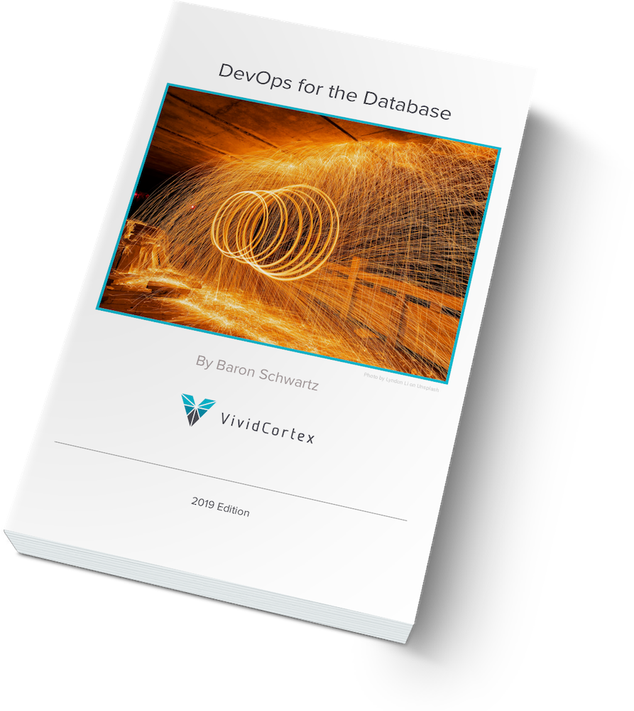
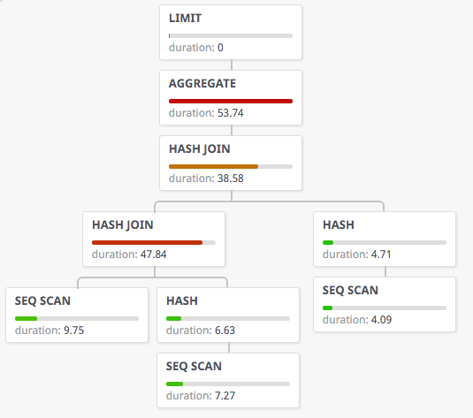
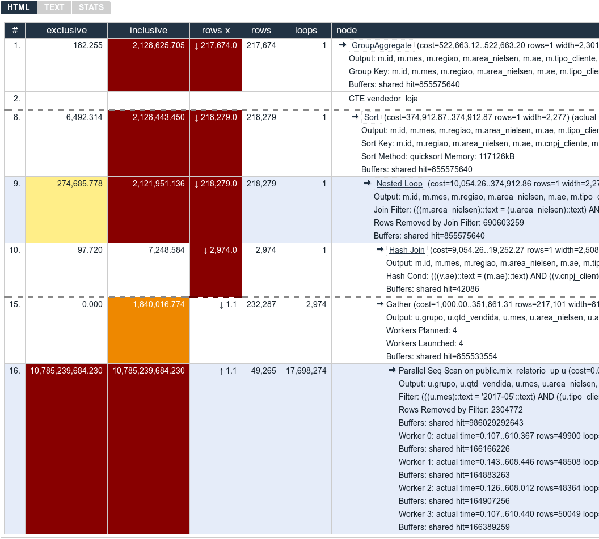
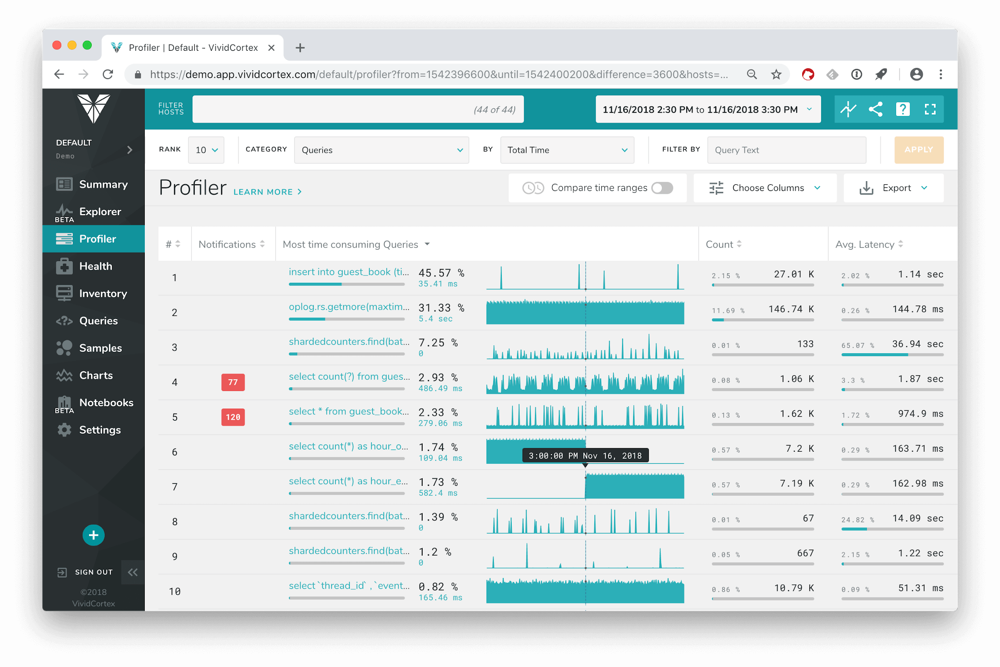

layout: true
name: section
class: title, fogscreen, no-footer
background-image: url(unsplash-photos-S_eu4NqJt5Y.jpg)

---
layout: true
name: footer

.footer[
- @xaprb
- 
]

---
class: title, no-footer, fogscreen, shelf
background-image: url(unsplash-photos-S_eu4NqJt5Y.jpg)

# Everything You Need To Know About PostgreSQL EXPLAIN
## <br><br>Baron Schwartz &bullet; March 2019


---
class: img-right-full



# DevOps for the Database

I wrote a [new ebook](https://www.vividcortex.com/resources/devops-for-the-database-ebook)! 65 pages of peer wisdom.

---
class: roomy
# Agenda

- Who is this talk for?
- What is EXPLAIN?
- Why do I need it?
- What does the output mean?
- What matters most?
- What tools can help me?
- Where can I learn more?

---
template: section
# Who Is This Talk For?

---
class: img-right

# People Who Want To Use Postgres Well


- It's hard to write good queries.
- EXPLAIN is a key tool to get better at it.
- But EXPLAIN is hard to use, too!

---
class: img-right

# Goal: Just Enough Knowledge


- There are many detailed EXPLAIN how-tos.
- My goal today is "just enough" so you don't have to study multiple in-depth sources to get started.
- You should be able to use EXPLAIN, but it's not necessary to be a human query planner.
- I'll give references where you can study details as you need them.

???
- Too many detailed, low-level sources of info adds to your work. I'm trying to fix that.
- This talk isn't authoritative or complete. Given an EXPLAIN, I'd like you to be able to figure out what it means.
- You don't need to be able to correctly predict how the optimizer will plan a query, though.
---
template: section
# What is EXPLAIN?

---
class: img-right

# There's Many Ways To Run A Query


The database has many choices:

- Join order
- Join type
- Access type
- Index choice
- Algorithms

Relational databases are supposed to figure out *how* so you can say *what*.
---
class: img-right

# Plans and the Planner


- Each possible way to run a query is called a plan.
- The planner tries to find the fastest plan.
- EXPLAIN shows the plan it chose.

---
# What Actually Is EXPLAIN?

You EXPLAIN a statement by putting `EXPLAIN` in front of it.

```sql
EXPLAIN SELECT *
FROM tenk1 t1, tenk2 t2
WHERE t1.unique1 < 100 AND t1.unique2 = t2.unique2;
```

This doesn't run the query, it just plans it and outputs the query plan.

---
class: compact
# An Example EXPLAIN

```
EXPLAIN SELECT *
FROM tenk1 t1, tenk2 t2
WHERE t1.unique1 < 100 AND t1.unique2 = t2.unique2;
                                        QUERY PLAN
------------------------------------------------------------------------------------------
 Hash Join  (cost=230.47..713.98 rows=101 width=488)
   Hash Cond: (t2.unique2 = t1.unique2)
   ->  Seq Scan on tenk2 t2  (cost=0.00..445.00 rows=10000 width=244)
   ->  Hash  (cost=229.20..229.20 rows=101 width=244)
         ->  Bitmap Heap Scan on tenk1 t1  (cost=5.07..229.20 rows=101 width=244)
               Recheck Cond: (unique1 < 100)
               ->  Bitmap Index Scan on tenk1_unique1  (cost=0.00..5.04 rows=101 width=0)
                     Index Cond: (unique1 < 100)
```

---
class: img-right, compact
# Variations/Options to EXPLAIN


- EXPLAIN has a few different options such as output format and instructions to change how it works.
- The main one you need to know is ANALYZE. This *actually runs* the query.
  - `EXPLAIN (ANALYZE) SELECT * FROM...`
- You can also explain other kinds of statements such as UPDATE, DELETE, etc.
  - If you ANALYZE a statement that changes data, do it in a transaction and roll it back.

---
template: section
# Why Do I Need EXPLAIN?

---
class: img-right
# You're Not Supposed To Need EXPLAIN


- In a perfect world, the database would just magically work and be fast.
- But sometimes queries aren't fast.
- EXPLAIN helps you figure out what to do.

---
class: img-right
# EXPLAIN Helps You Improve Queries


- Audit what the planner does
- Find schema/indexing problems
- Dry-run before actually running

---
template: section
# What Does EXPLAIN Output Mean?

---
class: img-right
# EXPLAIN is A Pretty-Printed Plan


- A query plan is composed of execution primitives: fetch rows, sort, filter, join, and so on.
- These are linked together into a tree-like data structure that the database uses to run the query.
- The EXPLAIN output is just a textual version of the plan.
- Key concepts to know: terminology, join types, access types.

---
class: fullbleed

```
EXPLAIN SELECT *
FROM tenk1 t1, tenk2 t2
WHERE t1.unique1 < 100 AND t1.unique2 = t2.unique2;

                                        QUERY PLAN
------------------------------------------------------------------------------------------
 Hash Join  ...
   ...
   ->  Seq Scan on tenk2 t2  ...
   ->  Hash  ...
         ->  Bitmap Heap Scan on tenk1 t1  ...
               ...
               ->  Bitmap Index Scan on tenk1_unique1  ...
                     ...
```

???

I've removed a lot of the detail. What's left is the plan operations, what the documentation calls nodes.

Child nodes are indented. Execution goes deepest-first: children before parents. When two nodes are at the same indentation, they're both inputs to their parent. In joins, outer table is above, inner table is below.

---
class: fullbleed

```
EXPLAIN SELECT *
FROM tenk1 t1, tenk2 t2
WHERE t1.unique1 < 100 AND t1.unique2 = t2.unique2;

                                        QUERY PLAN
------------------------------------------------------------------------------------------
 Hash Join  (cost=230.47..713.98 rows=101 width=488)
   ...
   ->  Seq Scan on tenk2 t2  (cost=0.00..445.00 rows=10000 width=244)
   ->  Hash  (cost=229.20..229.20 rows=101 width=244)
         ->  Bitmap Heap Scan on tenk1 t1  (cost=5.07..229.20 rows=101 width=244)
               ...
               ->  Bitmap Index Scan on tenk1_unique1  (cost=0.00..5.04 rows=101 width=0)
                     ...
```

???

- Each node has estimated costs, planner minimizes root
- Parent costs are sum of children
- Cost is ~time, in a more or less arbitrary unit, several kinds
- Cost is a range from pre-output of first row to last row. Note the Hash step does most of its work in startup
- Rows is an estimate of rows returned
- Width is average row width in bytes

---
class: fullbleed

```
EXPLAIN SELECT *
FROM tenk1 t1, tenk2 t2
WHERE t1.unique1 < 100 AND t1.unique2 = t2.unique2;

                                        QUERY PLAN
------------------------------------------------------------------------------------------
 Hash Join  (cost=230.47..713.98 rows=101 width=488)
   Hash Cond: (t2.unique2 = t1.unique2)
   ->  Seq Scan on tenk2 t2  (cost=0.00..445.00 rows=10000 width=244)
   ->  Hash  (cost=229.20..229.20 rows=101 width=244)
         ->  Bitmap Heap Scan on tenk1 t1  (cost=5.07..229.20 rows=101 width=244)
               Recheck Cond: (unique1 < 100)
               ->  Bitmap Index Scan on tenk1_unique1  (cost=0.00..5.04 rows=101 width=0)
                     Index Cond: (unique1 < 100)
```

???

Extra lines just show additional information about other operations the node does.

---
class: fullbleed

```
EXPLAIN ANALYZE SELECT *
FROM tenk1 t1, tenk2 t2
WHERE t1.unique1 < 10 AND t1.unique2 = t2.unique2;

                                                           QUERY PLAN
---------------------------------------------------------------------------------------------------------------------------------
 Nested Loop  (cost=4.65..118.62 rows=10 width=488) (actual time=0.128..0.377 rows=10 loops=1)
   ->  Bitmap Heap Scan on tenk1 t1  (cost=4.36..39.47 rows=10 width=244) (actual time=0.057..0.121 rows=10 loops=1)
         Recheck Cond: (unique1 < 10)
         ->  Bitmap Index Scan on tenk1_unique1  (cost=0.00..4.36 rows=10 width=0) (actual time=0.024..0.024 rows=10 loops=1)
               Index Cond: (unique1 < 10)
   ->  Index Scan using tenk2_unique2 on tenk2 t2  (cost=0.29..7.91 rows=1 width=244) (actual time=0.021..0.022 rows=1 loops=10)
         Index Cond: (unique2 = t1.unique2)
 Planning time: 0.181 ms
 Execution time: 0.501 ms
```

???

- With ANALYZE, you get actual timings and actual rows.
- Timings are in milliseconds, averaged per-loop.

---
class: img-right
# Join Type: Nested Loop


- Scan through the rows in the outer table
- For each row, scan for matching rows in the inner table
- Fast to start, best for small tables
---
class: img-right
# Join Type: Merge Join


- Performs a "zipper" operation over two sorted sets.
- Each input needs to be a) an index scan in order or b) presorted with a Sort
- Good for large tables, but has high startup cost if a sort is required

---
class: img-right
# Join Type: Hash


- Builds a hash of the inner table
- Scans rows from the outer table and looks them up for a match in the hash
- Only usable for equality conditions
- High startup cost, needs memory, fast execution

---
class: roomy
# Access Types

| Access Type |  Meaning |
|-------------|----------|
| Seq Scan | Sequential scan of all rows (table scan) |
| Index Scan | Scan of some/all rows in an index, lookup rows in the heap *in random order* |
| Index Only Scan | Ditto, but no table lookup |
| Bitmap Index Scan | Fetch row pointers from index, sort by physical location, lookup rows in the heap |

???

- Index Only Scan is huge performance boost
- Bitmap Index Scan has startup cost but avoids random I/O
- Index-Only Scan won't have Filter. Index Scan with Filter means it's looking up rows in the heap and then filtering them.

---
template: section
# What Matters Most?

---
class: img-right, compact
# Does It Scale?


Examine the rows estimates.

- If rows = number of rows in the table, the query will get worse as the table grows.
- If rows is small but, with ANALYZE you see a high "Rows Removed By Filter", you also have a problem.
  - This is one of the only ways you can tell the difference between a WHERE clause that's used to narrow the range of index values considered for scanning, versus filtering rows after they're scanned.

---
class: img-right
# Seq Scan


- Seq Scan is a full table scan. This is a potential red flag.
- It might mean you need an index to find rows more efficiently.

---
class: img-right
# Index-Only Scan is Excellent


- Index-only scans are *covering indexes* or *index-covered queries* which is a hugely important query optimization.
- See my indexing talk, [How to Index Your Database](/slides)

---
class: img-right, compact
# Sorting Can Be Expensive


- Sorting comes from ORDER BY or operations that need sorted data (merge joins, some GROUP BY, etc...)
- Sorting small amounts of data is fine.
- Sorting large amounts, or sorting by writing data to disk and reading it back (external sort), can be slow.
- Sorting can be avoided with indexes (see my indexing talk) or made faster by giving sort buffers enough memory to avoid spilling to disk.
- Sorting with LIMIT is an anti-pattern unless there's an index to avoid a Sort operation.

---
class: img-right
# Counting Can Be Slow


A query of the following form can access a lot of rows, even if it outputs only a small number.

```
SELECT COUNT(...) FROM ...
```

---
class: img-right, compact
# The Planner Can Get It Wrong


Compare the actual row counts to the estimates to see if the planner was making decisions with incorrect data.

If so, then statistics can be inaccurate.

- Usually fix with either ANALYZE or autovacuum.
- Correlated columns can be a problem too, and there's recent support for this.
- Or empty tables.
- Or dead tuples. VACUUM again.

---
class: img-right
# Failure To Use An Index


- Is there actually a useful index?
- Are you sure it's useful?
- Is your query defeating it with a calculation?
- Are you using LIKE? Is collation an issue?
- Are there foreign keys, and the foreign table lacks an index to help lookup the values?
- See my indexing talk for more.
 
---
class: img-right
# Forcing / Hinting


- Postgres doesn't let you add "hints" or force particular query plans.
- But you can kinda do this by messing with cost parameters or enable/disable particular access types with parameters.
- More information is an exercise for the reader. Be sure you read the PG philosophy on why this isn't a great idea.
---
class: img-right
# Default Parameters


- A few default parameters need to be set to appropriate values for your server to make good planning decisions.
- `work_mem` for example.
- See the Postgres performance wiki.

---
class: img-right, compact
# Confusing Stuff


- "never executed" means what it says.
- LIMIT can cause child nodes to terminate work prior to accumulating the total (max) estimated cost.
- Merge joins can also show confusing plan info with ANALYZE, due to rewinding and rereading data.
- The planner usually chooses to minimize the total (max) cost estimate, but in cases like a single-row subquery in an EXISTS, it'll choose to minimize the startup cost.

---
template: section
# What Tools Can Help Me?
---
class: img-right
# Postgres Explain Visualizer



- Browser-based tool to visualize plans
- Open source, you can run your own
- http://tatiyants.com/pev/

---
class: img-right
# Depesz EXPLAIN



- Web-based tool for visualizing EXPLAIN
- Lets you share your queries and plans
- https://explain.depesz.com/

---
class: img-right
# Other Tools To Know About



- VividCortex, but of course!
- pgMustard, a new one
- Perfalytics, another new one
- pgAdmin's visual explain, an old one

---
template: section
# Where Can I Learn More?

---
class: img-right
# Reference Material


Official Docs

- Docs: [Using EXPLAIN](https://www.postgresql.org/docs/current/using-explain.html)
- Docs: [EXPLAIN](https://www.postgresql.org/docs/current/sql-explain.html)
- [explain.c source code](https://github.com/postgres/postgres/blob/master/src/backend/commands/explain.c)

Presentations

- [Guillaume Lelarge's Understanding EXPLAIN](https://www.dalibo.org/_media/understanding_explain.pdf)
- [Bruce Momjian's performance presentations](https://momjian.us/main/presentations/performance.html)

---
class: img-right
# Reference: Books


- Gregory Smith, PostgreSQL 9.0 High Performance
- Markus Winands, SQL Performance Explained

---
class: roomy
# Slides and Contact Information

.qrcode.db.fr.w-40pct.ml-4[]

Slides are at https://www.xaprb.com/talks/ or you can scan the QR code. You can print these slides to PDF with Chrome.

Contact: baron@vividcortex.com, @xaprb
