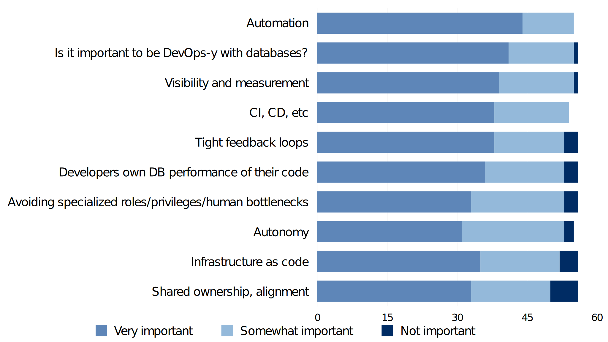
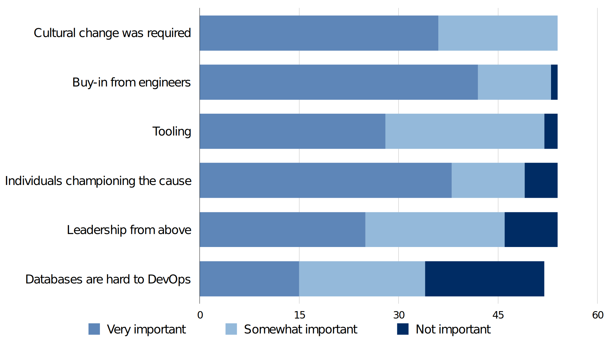

class: title
background-image: url(unsplash-photos-oyXis2kALVg.jpg)

# DevOps for the Database
## Baron Schwartz &bullet; QConSF 2018

???
Why is it hard to apply DevOps principles and practices to databases, and how can we get better at it? This talk explores real-life stories that answer these two questions, through the perspectives of teams that have changed the entrenched culture, processes, and tooling—and those who’ve tried. Along the way, we’ll cover topics including:
* What the research shows about DevOps, databases, and company performance
* Current and emerging trends in how we build and manage data tiers, and implications
* The traditional dedicated DBA role, and what has happened as a result
* What it takes to change from a DBA-centric culture, to one where database-related competencies and responsibilities are more distributed
* Why some teams succeed in this transformation, while others fail
We can apply DevOps principles to the database, and our work will be better for it. This talk will show you how.

---

# Introduction

Agenda

???

* This is opinion, not research
* This is my personal experience
* I haven't gotten all this right yet

---
# Three Database DevOps Stories

1. One DBA, Hundreds of Developers
2. One DBA, from 20 to 100 Developers
3. Two Database Ops Folks, Seventeen Developers

???
The Golden Motion
---
# Benefits of Database DevOps

DevOps brings the same benefits to the database as everywhere else.

For software delivery performance in particular:

* Faster, better, AND cheaper---pick all three
* speed -> stability -> speed

???

Ultimately this lets you work _on_ the system, not _in_ the system.

---
# Detriments of Lacking DevOps

Without DevOps, speed and quality suffer:

* Mismatched responsibility and authority
* Overburdened database operations personnel
* Broken feedback loops from production
* Reduced developer productivity

???

* The DBA is responsible for code they can't control
* That leads to them trying to control it, which creates a dependency for devs
* This offloads developer work to the DBA, diverting them from more strategic activities
* That's a shame, because DBAs are often highly skilled and knowledgeable
* So engineering doesn't get the benefit of their input into design, architecture, etc
* Ultimately there's a human in the feedback loop from production to development
* That limits how fast we can learn, fix, and improve
* Developer productivity declines; dependent on DBA to debug

---
# What Is Database DevOps?

Some key attributes I've seen in companies that apply DevOps to their database:

* Developers own database schema, workload, and performance
* Developers debug, troubleshoot, and repair their own outages
* Schema and data model as code
* A single fully-automated deployment pipeline
* App deployment includes automated schema migrations
* Automated pre-production refresh from production
* Automation of database operations, to an RDS-like level

???

* DBaaS-like automation: provision, backup/restore/test, auth and access, upgrade, scaling...
* Pick any of these. Not all companies do all of these.
* Developers owning database behavior in prod is a big one.
* Charity Majors: the first age of DevOps vs the 2nd age.

---
# From the 2018 DORA Report

> Database changes are often a major source of risk and delay when performing deployments… integrating database work into the software delivery process positively contributed to continuous delivery… good communication and comprehensive configuration management that includes the database matter. Teams that do well at continuous delivery store database changes as scripts in version control and manage these changes in the same way as production application changes… when changes to the application require database changes, these teams discuss them with the people responsible for the production database

The 2018 DORA report, p57

---
# Bringing DevOps to the Database
## Pathways To Success

---
# Core Elements

1. People
2. Culture
3. Structure and Process
4. Tooling

???

* You actually need to start with the people.
* But to understand what that should look like, let's first talk about how their work needs to change.

---

# Tooling: Deploy/Release

* You need frequent, automated deploys
* Eliminate manual work (toil)
* Continuous integration and deployment

???

* Don't build a new toolchain for the DB, add to existing tools dev/ops built
* Frequent deploys

# Tooling: Monitoring and Observability

* Instrumentation, telemetry, analytics, monitoring, observability
* Monitoring: the Seven Golden Signals (CELT + USE)
* Observability

???

# Tooling: Shared Knowledge and Process

* DBRE processes, mentality
* Deploy confidence procedures
* Documentation to share SME experience & skill
* Notifications should link to runbooks

???
	* The DBRE mentality: active measurement of availability and latency, and a strategy to manage them.
	* Documentation to share knowledge, it’s not just visibility. Runbooks, notebooks, deploy confidence wiki (e.g. GitHub, Etsy). Linking alerts to runbooks.

---
# Team Structure

Teams work best when they:

* Are service- or product-oriented
* Are loosely coupled, autonomous
* Are highly aligned and trusted
* Own what they build

???
* Align teams around services and products, not their work or technology.

---
# Process: First, Do No Harm

* Stabilize the patient, _then_ transport
* Protect production (no holes below the waterline)

???

* Don't automate outages; automation can be weaponized

---
# Process: Plan And Roadmap

* Work is work---maintain a single backlog
* Embrace DevOps in small chunks and build on success
* Lay out the progression in stages

???

* Present the transformation as small, iterative, prudent
* Have a clear long-term direction to go, to build credibility and buy-in
* This will help get leadership on board too

---
# Process: Getting Started

Pick a place to start.

* One team
* One app, service, or product
* First new, then established/legacy

???

* Remember, you can start small and add more good over time
* This is key to getting buy-in and continuation
* Change is stressful; emphasize continuity not just change

---
# Culture: Creating Change

* Culture is emergent; you can't operate on it directly
* Create a new path of least resistance
* Don't shield people from consequences or benefits

???
* Work on incentives, not culture.

---
# Culture: Leadership Support

* Exec mandate seems to work; so does attraction
* Starving the old way is a common theme
* You need champions at all levels
* Persevere

???

* Leadership support is required: behavior, not just words.
* "Burn the boats" can work
* Refuse to enable regression to old habits

---
# Culture: Communication and Trust

* Align around a North Star: a simple, compelling _why_
* Customer-centric culture, customer empathy
* Psychological safety enables risk-taking

???

* Trust is earned over time by keeping promises
* Strong product team culture; trust; communication
* Inclusion; share the pain

---

# People: You Need Experts

* You do need database expertise
* You do not need a database caretaker
* Engineers can learn database competency

???

* Redefine DBA, or NoDBA
* Education is important, your people are smart but that's not sufficient

---
# Pathways To Failure

---
# Tooling FAIL

* Fragile, too-eager, or too-ambitious automation
* Lack of automation; accepting manual toil
* Two routes to production, for code vs DB

???

* You do need good tooling
* Poor tooling just causes more problems

---
# Culture FAIL

* Clinging to legacy DBA roles and duties
* Relying on a vendor to bring culture
* Insisting on adherence to One True Way
* Any friction in the way of change
* Failure to create incentives to change

---

> In a traditional sense, the job of the DBA means she is the only person with access to the servers that host the data, the go-to person to create new database cluster for new features, the person to design new schemas, and the only person to contact when anything database related breaks in a production environment.” - Silvia Botros, SendGrid

???
Change from DBA to DBRE instead. The database “subject matter expert,” rather than the database babysitter.

---
# Leadership FAIL

* Underinvesting in experience and skill
* Lack of management support
* Micromanagement
* Failure to manage up

---
# Planning FAIL

* All-or-nothing
* Too much too fast
* Velocity over resilience

---
# What's The Hardest Part?

---
# Challenge: Politics

* Selling DevOps to the DBA
* Selling DevOps to leadership
* Creating culture change

---
# Challenge: Tooling

* Legacy databases aren't cloud-native
* Data tier ops tooling isn't as mature
* Schema changes
* Integration with e.g. canary deploys, feature flags

---
# Challenge: HA, Scale, Performance

* Failover and recovery
* Locking/blocking
* Nonblocking schema changes at scale

---
# Whither The DBA?

* Become a DBRE instead of a DBA
* Focus on data platform and architecture
* Be the subject matter expert supporting product teams

---
# The Payoff

* The outcomes
* The process itself
* Individual benefits

???

* DraftKings.
* At the “end,” but also: the process itself
* As a team: better DB awareness, more tooling
* Individuals get broader skills and ability to be more valuable
* As an org, you get flexibility, reduced potholes and bottlenecks.
* Even small steps are improvements.
* Common theme of DevOps, Agile etc you don’t have to do all of it, do what parts make sense. “just get started” tone; don’t fear the database

---
class: col-2
# Slides and Contact Information

Slides are at https://www.xaprb.com/talks/ or you can scan the QR code.

Contact: baron@vividcortex.com, @xaprb

Thanks to Jessica Kerr, Silvia Botros, Charity Majors, Laine Campbell, many VividCortex customers and friends, and the 50+ survey respondents.

.qrcode.db.fr.w-40pct.ml-4[]

---
# Survey Results
How important are each of the following in your view of "Database DevOps"?

# Survey Results Cont'd
How do you rate the importance of these factors in making progress?

---
* Resources
	* Phoenix Project
	* DBRE book
	* Strategic DBA ebook
	* [2018 State of DevOps Report](https://cloudplatformonline.com/2018-state-of-devops.html)
	* Datical, Liquibase, Skeema, Orchestrator, Vitess, gh-ost
	* Silvia’s article https://sendgrid.com/blog/dbas-a-priesthood-no-more/
	* [The DataOps Manifesto](http://dataopsmanifesto.org/)
    * Thich Nhat Hanh, Real Love