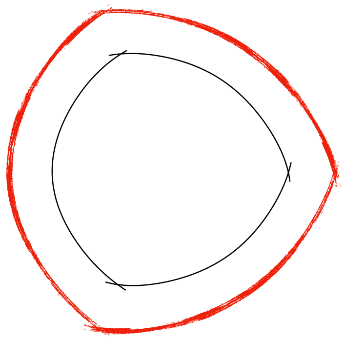
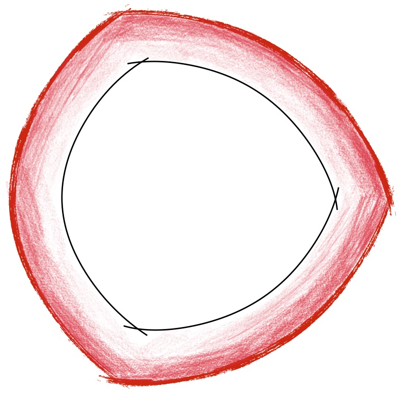

layout: true

@xaprb

---
class: title, no-number
background-image: url(action-balance-fun-305250.jpg)
background-size: cover

<h2>Approaching the Unacceptable Workload Boundary
<h3>Baron Schwartz &bullet; SREcon18 Americas

---
class: img-right
# Logistics & Stuff

.col[
Slides are at [xaprb.com/talks/](https://www.xaprb.com/talks/).

Ask questions anytime.

Please get in touch: [@xaprb](https://twitter.com/xaprb) or baron@vividcortex.com.
]

.rc[

]

---
# Introduction

What happens as systems get bigger and more heavily loaded?

--
* What is a system’s operating domain?

--
* How is load defined?

--
* Where is the load limit? How can you see it coming?

--
* How does the system behave near this limit?

--
* Can you measure and model this behavior?

---
background-image: url(nature-3258924-1280.jpg)
class: title

.smokescreen[
# The Operating Domain
]

---
class: center, img-300h
# Operating Domain and Failure Boundaries

Rasmussen’s model describes an **operating domain** bounded by economic risk, effort, and
safety. The system’s **operating state** is a point within the domain, always moving
around.

---

background-image: url(rasmussens-model.jpg)

---
class: img-450h, center
# The Actual Boundaries Are Unknown

---
class: img-450h, center
# We Draw Limits Where We Think It’s Safe

Margin of Error

Overdraft Protection

Overprovisioning

---
class: img-450h, center, two-column
# The Buffer Zone Is Nonlinear

.col[

]

--

.col[
We think the gradient looks like this.

It really looks more like this.

]

---
# Complex Systems Run In Degraded Mode

Richard Cook lists 18 precepts of system failure in [How Complex Systems
Fail](http://web.mit.edu/2.75/resources/random/How Complex Systems Fail.pdf).
Precepts 4) and 5) are especially relevant.

--

> **4) Complex systems contain changing mixtures of failures latent within them.**
> The complexity of these systems makes it impossible for them to run without
> multiple flaws being present.
> 
> **5) Complex systems run in degraded mode.**
> A corollary to the preceding point is that complex systems run as broken systems.

???

Systems can and do function beyond their load limits.

---
class: title
background-image: url(gears-1236578-1280.jpg)

.smokescreen[
# System Load
]

---

# What Is The Definition Of Load?

There’s no one right answer to this question, but there’s a **useful answer**
for this discussion.

--

Load is the **sum of task residence times** during an observation interval
\\(T\\).  This is equivalent to average **concurrency** of tasks queued or in
service:

\\[
N = \frac{\sum_{}^{}{R}}{T}
\\]

.footnote[
You can prove this with Little’s Law.
]

---
# Load, Utilization, And Queueing

Load (concurrency) is related to **utilization and queue length**, but it’s not
the same.

--
* Concurrency is the number of requests in process simultaneously.

--
* Average concurrency is an average over an observation interval \\(T\\).

--
* Utilization is the fraction of \\(T\\) that was busy.

--
* Queue length is the instantaneous or time-averaged number of tasks waiting
  to be serviced.

---
# Utilization, Queue Length, & Concurrency

By Little’s Law, utilization and queue length are **types of concurrency**.

  * Utilization is the concurrency of in-service tasks.

--
  * Queue length is the concurrency of queued tasks.

---
class: two-column
# What Is The Load Limit?

If the load limit were defined in terms of utilization, queueing theory could
tell us where the **load limit** will be.

--
But it can’t: load can be infinite, utilization ranges 0-1.

.col[
Plus it’s impractical:
* The “hockey stick” queueing curve is hard to use
* The “knee” is unintuitive
]

.col[

]

???
This is appealing because utilization has a clear limit: it can’t be more than
100%.

So we need to translate the problem to a different domain, where the units
match. Scalability is the answer.

---
class: title
background-image: url(snow-3260088-1280.jpg)

.smokescreen[
# Scalability
]

---
# What’s the Definition of Scalability?

There’s a mathematical definition of scalability **as a function of
concurrency**.

--

I’ll illustrate it in terms of a **parallel processing system** that uses
concurrency to achieve speedup.

???
It’s practical, easy to use, and matches the domain well.

I’ll show how the equation is composed piece by piece, but don’t sweat the math.

---
class: img-center
# Linear Scaling

Suppose a clustered system can complete **X tasks per second** with no
parallelism.

--

With parallelism, it divides tasks and executes subtasks
concurrently, **completing tasks faster**.

--

Faster completion also means **increased throughput.**

???
* Tasks per second is throughput.
* Throughput is a function of concurrency.

---
class: img-center
# Linear Scaling

Ideally, **throughput increases linearly with concurrency**.

???
* Linear scaling is the ideal.
* Another way to say this is that the system’s output is a linear function of
  load.

---
class: two-column
# The Linear Scalability Equation

.col[
The equation that describes ideal scaling is

\\[
X(N) = \frac{\\lambda N}{1}
\\]

where the slope is \\(\\lambda=X(1)\\).
]

.col[

]

???
- X is throughput
- N is concurrency, which is the workload
- Lambda is the system’s output when there’s no parallelism
- Really important to note that N is the independent parameter, the driver

---
class: center
# But Our Cluster Isn’t Perfect

Linear scaling comes from subdividing tasks **perfectly**.

--

What if a portion isn’t subdividable?

---
class: two-column
# Amdahl’s Law Describes Serialization

\\[
X(N) = \frac{\\lambda N}{1+\\sigma(N-1)}
\\]

.col[
Amdahl’s Law describes throughput when
**a fraction \\(\\sigma\\) can’t be
parallelized**.
]

.col[

]

---
# Amdahl’s Law Has An Asymptote

\\[
X(N) = \frac{\\lambda N}{1+\\sigma(N-1)}
\\]

Parallelism delivers speedup, but there’s a limit:

\\[
\lim\_{N \to \infty}{X(N)} = \frac{1}{\sigma}
\\]

--

e.g. a 5% serialized task can’t be sped up more than 20-fold.

???
If 5% of the work is serialized, infinite concurrency will still result in tasks
taking 5% as long as non-parallelized tasks.

---
class: img-center
# What If Workers Coordinate?

Suppose the parallel workers **also have dependencies** on each other?

--

---
class: two-column, img-center, img-300h
# How Bad Is Coordination?

\\(N\\) workers = \\(N(N-1)\\) pairs of interactions, which is
\\(\mathcal{O}(n^2)\\) in \\(N\\).

.col[

]

.col[

]

---
class: two-column
# The Universal Scalability Law

\\[
X(N) = \frac{\\lambda N}{1+\\sigma(N-1)+\\kappa N(N-1)}
\\]

.col[
The USL adds a term for crosstalk, multiplied by the \\(\\kappa\\)
coefficient.

Now there’s a **point of diminishing returns**!
]

.col[

]

.footnote[
Crosstalk is also called coordination or coherence.
]

---
class: img-center
# You Already Know This

You’ve seen lots of benchmarks with diminishing returns.

.footnote[
Source: http://dimitrik.free.fr/blog/
]

???
By the way, pay attention to the axis scale, it’s log-scaled by powers of two.
If you scale the X-axis linearly you’ll get the shape of the curve on the
previous slide.

---
class: img-center, img-300h
# The USL Describes Behavior Under Load

The USL explains the **highly nonlinear behavior** we know systems exhibit near
their saturation point.
[desmos.com/calculator/3cycsgdl0b](https://www.desmos.com/calculator/3cycsgdl0b)

???
- Serialization (red) grows slowly, but crosstalk (blue) grows rapidly.
- This is why systems get so unpredictable near their limits.
- Near and above the point of diminishing returns, systems exhibit high variance
  and get unpredictable.

---
# A Summary Of The USL

The Universal Scalability Law defines **throughput as a function of concurrency**.

It explains how and why **systems don’t scale linearly with load**.

---
# What is the USL Good For?

Armed with the USL, you are ready to:

- Measure and model nonlinear behavior.
- Predict the onset of nonlinearity.
- Design better systems.

It’s easy. Let’s see how!

---
class: title
background-image: url(compass-2946958\_1280.jpg)

.smokescreen[
# How To Measure, Model, And Predict
]

---
# What To Measure

You can’t measure serialization & crosstalk directly.

--

Instead, measure **throughput** and **concurrency**.

--

Then **fit the USL model to the data** to estimate the parameters.

---
class: center, middle

Throughput

Concurrency

???
Throughput is so trivially easy to measure in most systems that I won’t talk
about it. But there’s two easy ways to measure concurrency.

---
# How To Measure Concurrency, Pt. 1

Many systems have a metric of concurrency already.
Look for a metric of **things actively working**.

- MySQL: `SHOW STATUS LIKE 'Threads_running'`
- Apache: active worker count

--

It works well to **poll this e.g. 1x/sec**, then average these into 1- or
3-minute averages.

---
# How To Measure Concurrency, Pt. 2

If there’s no metric of concurrency, you can **sum up latencies and divide by
the duration**.

\\[
N = \frac{\sum_{}^{}{R}}{T}
\\]

???
- Again, in my experience it’s good to use averages over a moderately long window like 1-5 minutes.
- You want to end up with dozens to hundreds of data points.

---
class: img-center, img-450h
# Plot Your Data

Simply **scatterplot your data** and eyeball it for sanity.

???
Source data in "row16.csv" file. If you’re reading this note and you’re not a
VividCortex employee, sorry, I can’t give you access to this data.

---
class: img-450h
# Plug The Data Into The Model

Paste the data into the [Excel
model](https://www.vividcortex.com/resources/usl-modeling-workbook) I built.

???
You can do it in R, or gnuplot, or even with JavaScript in Plotly. Lots of
options. This is an easy one.

---
# Interpreting The Results

What does the output mean?

- Shows whether your system has **more serialization or crosstalk**.

--
- Shows the **estimated max load** where it’ll stop scaling.

--
- Helps you **predict nonlinearity**.

---
class: img-center
# Paypal’s NodeJS vs Java Benchmarks

Paypal’s [NodeJS vs Java benchmarks](https://www.vividcortex.com/blog/2013/12/09/analysis-of-paypals-node-vs-java-benchmarks/)  are a good example!

---
class: img-300h, img-center
# Bringing It Back To The Operating Domain

The USL is one way to understand **what happens near this boundary**.

---
class: two-column
# What Happens Here?

.col[
- When the system approaches **workload limits** it gets twitchy.
- You may be able to **see this approaching** before it gets bad.
- Simply scatterplotting **throughput vs concurrency** is super useful!
]

.col[

]

---
class: two-column
# You Don’t Need To Do Any Modeling!

.col[
Let’s take another look at this data. What jumps out?
]

.col[

]

---
class: two-column
# What If You Had Only The First Part?

.col[
- I would model and project out to the right.
- I’d see “hmm, it’s **leveling off**.”
- I’d say “don’t count on much more than you see now.”
]

.col[

]

---
class: two-column
# Think Differently About Outlying Points

.col[
- Given all the data, I mentally cluster it into two parts.
- If the high-end outliers deviate, **it’s nonlinear already.**
- Those points are evidence that the system is struggling there.
- You don’t need to model anything to see that.
]

.col[

]

---
class: two-column, smaller

.col[
# Some Resources

- My USL [ebook](https://www.vividcortex.com/resources/universal-scalability-law/).
- My USL [Excel workbook](https://www.vividcortex.com/resources/usl-modeling-workbook).
- [Rasmussen’s Model](http://sunnyday.mit.edu/16.863/rasmussen-safetyscience.pdf).
- Richard Cook’s talk about [Resilience in Complex Adaptive Systems](https://youtu.be/PGLYEDpNu60).
]

.col[

]

---
class: two-column
# Slides and Contact Information

.col[
Slides are at [xaprb.com/talks/](https://www.xaprb.com/talks/), or scan the QR
code.

Contact:

- @xaprb on Twitter
- baron@vividcortex.com
]

.col[

]
