layout: true

@xaprb

---
class: title, no-number
background-image: url(cover.jpg)
background-size: cover

.smokescreen[
## Why Nobody Cares About
 Your Anomaly Detection
### Baron Schwartz - March 2018
]

---
class: img-right
# Logistics & Stuff

.col[
Slides will be posted. Ask questions anytime.

Founder of VividCortex. Author of High Performance MySQL.

Love to hear from you: [@xaprb](https://twitter.com/xaprb) and
baron@vividcortex.com

[xaprb.com](https://www.xaprb.com/)
]

.rc[

]

---
class: img-450h, img-center, smaller

# Skepticism From John Allspaw
“... your attempts to detect anomalies perfectly, at the right time, **is not possible**...”
([source](https://www.kitchensoap.com/2015/05/01/openlettertomonitoringproducts/))

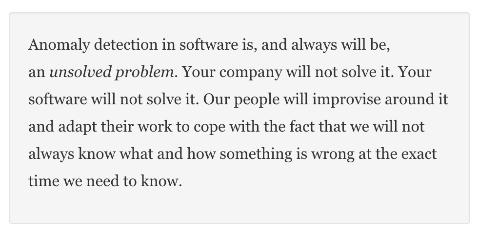

---

# ...And Ewaschuk and Beyer

“In general, Google has trended toward simpler and faster monitoring systems, with better tools for post hoc analysis. We avoid ‘magic’ systems that try to learn thresholds or automatically detect causality.”

— The Google SRE book: *Monitoring Distributed Systems Chapter*

---
class: img-center

# ... But Not This Vendor

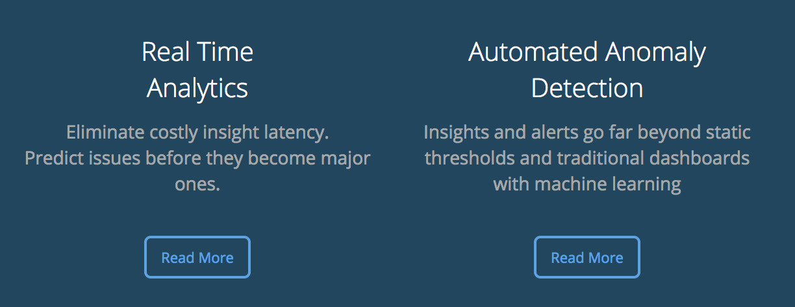

---
# What Good Is Anomaly Detection?

- How does it work?
- Why is it so hard?
- What’s it good for anyway?

---
class: two-column
# A Rose By Any Other Name

.col[
- “Machine Learning”
- “Dynamic Baselining”
- “Automatic Thresholds”
- “Adaptive Self-Learning Serverless IoT Big Data Blockchain”
]

.col[

]

---
# How Anomaly Detection Works

- An anomaly is usually defined as “something abnormal.”
- Normal is usually defined by a mathematical model.
- Anomaly detection, in this sense, is really prediction/forecasting.

---
# What’s Normal?

- Most people answer this question reflexively, with lots of unconscious biases.
- The answer is usually “if a measurement is ± two standard deviations...”
- What’s implicit/assumed is:
  - What’s the model that produces the forecast?
  - What assumptions does it make about the data?
  - What’s the cost/benefit of correct/incorrect predictions?

---
class: center
# The Ad Nauseum Anomaly Picture

Pretty pictures with shaded bands! :-)

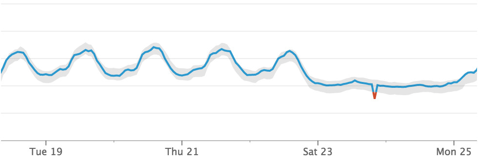

---
class: center
# A More Useful Definition of Anomaly

An anomaly is an event that has impact greater than the cost of remediation, and which is actionable by a person.

Restated: people always *think* they want to know what’s abnormal/weird, but they really want to know what’s wrong and what to fix.

They don’t realize this till they experience being notified of abnormalities.

---
class: center, middle

# Why Is It Hard?

---
# #1: Real-Time Often Isn’t

- We often assume anomaly detection “in real time” is possible/desirable.
- But what does that _mean_? People’s definitions vary wildly.

“_Why checking your KPI **several times a day**? To detect problems as fast as possible_.”

---
class: two-column

# #2: Real-Time Data Is Noisy

The beautiful charts always seem to come from long timescales, on the order of days or weeks. At the 1-second time scale, systems are incredibly noisy.

.col[

]

.col[
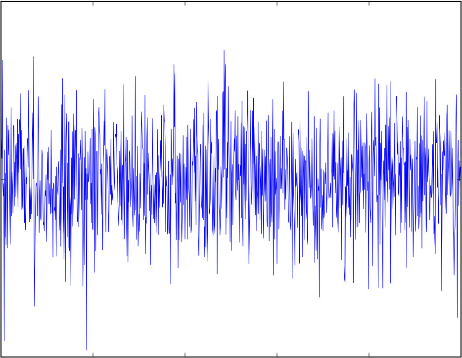
]

---
# #3: Cost/Benefit Asymmetry

- What’s the benefit of a true positive or true negative? What’s the cost?
- The [sensitivity/specificity tradeoff](https://blog.danslimmon.com/2012/11/02/car-alarms-and-smoke-alarms-the-tradeoff-between-sensitivity-and-specificity/) is very unbalanced.
- And because your systems are much noisier than you think, you’re probably wrong about the number of false positives/negatives you’ll get.
- The signal-to-noise ratio turns out to be really poor.
- Even if the anomaly detection isn’t wrong, if it’s not actionable, it’s still damaging.

---
 #4: Results Aren’t Interpretable

- Most anomaly detection techniques use complex models that are black boxes combining many moving pieces, many of which are nondeterministic.
- It’s often nearly impossible to agree or disagree with the outcome.
- Even a *simple exponential moving average* can be hard to audit.

---

# #5: High Cognitive Load

- Systems that abstract/process data and present black-box outcomes are difficult for engineering teams to act on.
- In firefights, uncertainty, stress, time pressure, and consequences are all at very high levels.
- Engineers generally will work to reduce these factors, which means they ignore abstract, non-auditable conclusions they aren’t sure whether to trust.
- Engineers usually want interpretable, raw data.

---
# #6: Highly Dynamic Systems

- Most systems exhibit trainable periodicity on the scale of weeks, but many such systems have useful lifetimes in the order of hours or days before the underlying model disappears or changes.
- This means a lot of anomaly detection techniques are obsolete before they’re even usable.

---
# #7: Stored Baselines

- If a product calculates “baselines,” should it store them or calculate on- the-fly?
- If stored, they become obsolete if the system’s parameters/model changes, or if the algorithm is upgraded.
- If derived, they’re often not practically computable, or unavailable for use in many popular tools that can only read “real” metrics from storage.

---

# #8: Anomalies Skew Forecasts

- Most feasible models predict things like trend and seasonality.
- Anomalies will perturb these models and cause them to forecast repeated anomalies.
- Compensating for these factors makes the models a lot less feasible and understandable.

---

# #9: Vendor Hype

When the vendor obviously uses Holt-Winters Forecasting, but calls it “machine learning” (presumably ML is used to choose params?)...

When a familiar technique like K-Means Clustering is called Artificial Intelligence...

... we all lose confidence and credibility in the eyes of users.

... and our users have expectations we can’t realistically meet.

---
class: img-450h, img-center

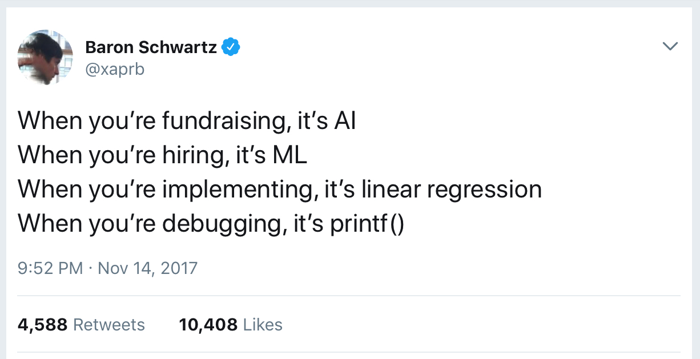

---
class: title
background-image: url(hammer.jpg)
background-size: cover

.smokescreen[
# What’s It Good For?
]

---

# First - Why Do People Want It?

1. They’ve got a LOT of metrics and can’t look at it all.
1. Vendors and conference thought-leaders told them anomaly detection worked well.
1. They’ve had problems, noticed a metric spiking, and thought “if only we’d known sooner about that.”
1. They’re engineers, so they think “this has to be a solvable problem.”

---
# #1: Very Specific, Targeted Uses

- You have an absolutely critical, sensitive high-level KPI like pageviews.
- Fast-moving data that’s extremely predictable and consistent.
- You have validated the exact behavior and expect it to be immortal.

---
class: three-column, smaller

# #2: Capacity Planning

This is *forecasting*, not anomaly detection. This is an important use case for Netflix, Twitter, and others.

.col[
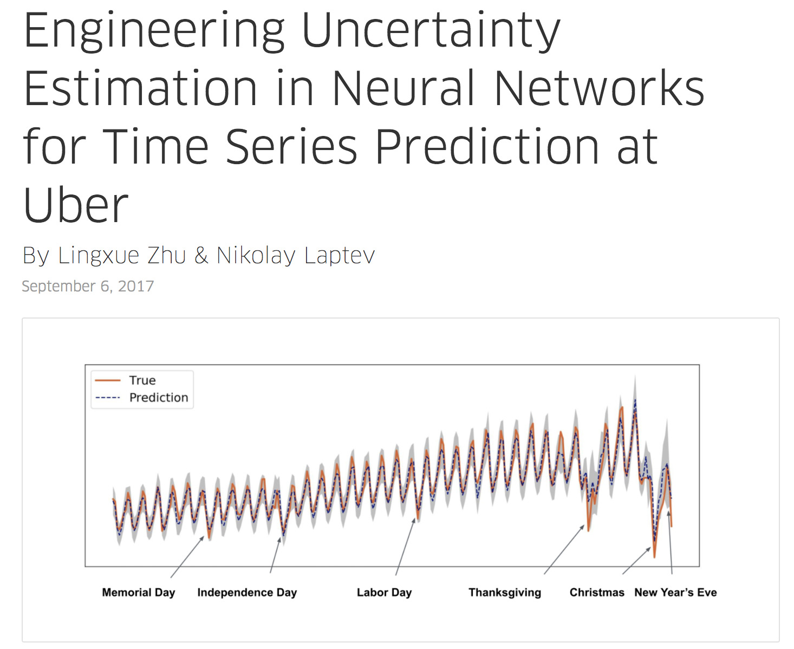
]
.col[
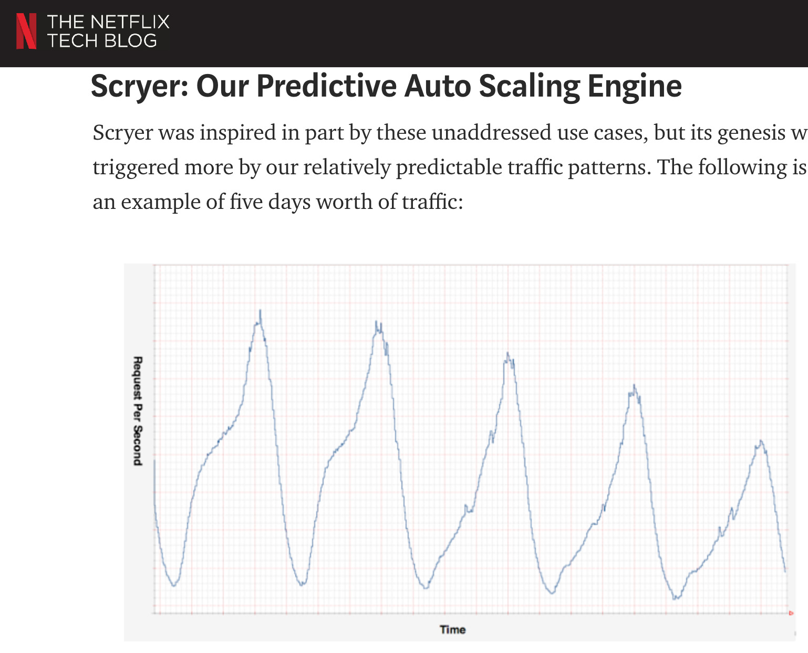
]
.col[
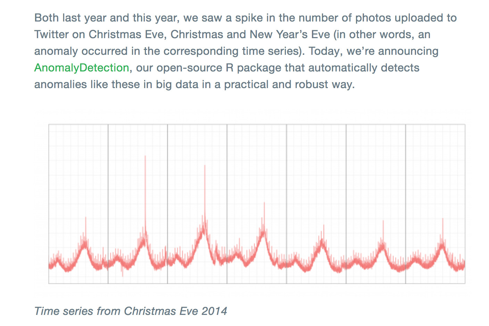
]

.footnote[
Question: is a Christmas
 spike an anomaly?
]

---
# #3: You Have A Team Of Data Scientists

It’s not a coincidence that many of the anomaly detection success stories have dedicated, full time data science teams. With PhDs.

---
# #4: Context, Not Detection

- When you’re troubleshooting an incident, and you see a spike in a metric, a great question is “what does this metric normally do?”
- On-the-fly calculation and visualization of that answer can be helpful.
- The mistake is to take it one step too far and think “I wish I could set an alert on this...”

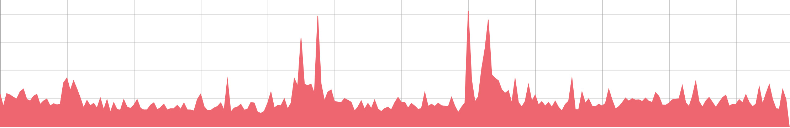

---
class: center, smaller

# “What Does This Metric Normally Do?”

1 Hour

12 Hours

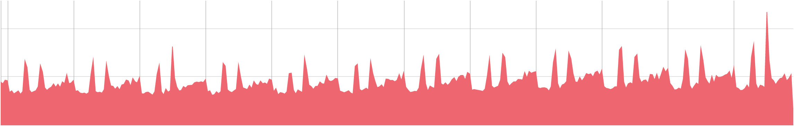

---
# #5: You Have A Specific Question

In my experience, a lot of the ills have come from thinking anomaly detection is an answer, when the question/problem isn’t clear yet.

---
class: smaller
# #6: If You Can’t Get It Any Other Way

Are you sure you need anomaly detection?

- Scenario: “Our rate of new-account signups per minute is a business KPI, and we want to know if it’s broken for any reason. It’s highly cyclical and predictable.”
- Solution 1: “This sounds ideal for time-series prediction, maybe with Holt- Winters, and anomaly detection when there’s a deviation from the prediction.”
- Solution 2: “Calculate the pageview:signup conversion rate by dividing two series, and alert if it drops, using a static threshold.” (See also next page)

---
class: two-column, center, img-300h
# Ask A 2-Dimensional Question

Instead of “what’s this metric’s behavior?” you’re asking
 “what’s this metric’s relationship to another?”
([source](https://www.vividcortex.com/blog/correlating-metrics))

.col[
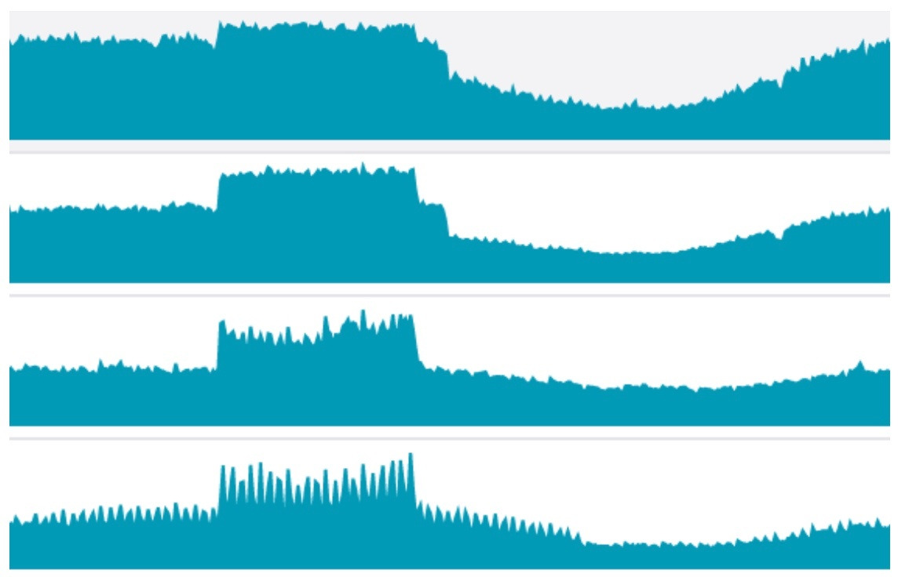
]
.col[
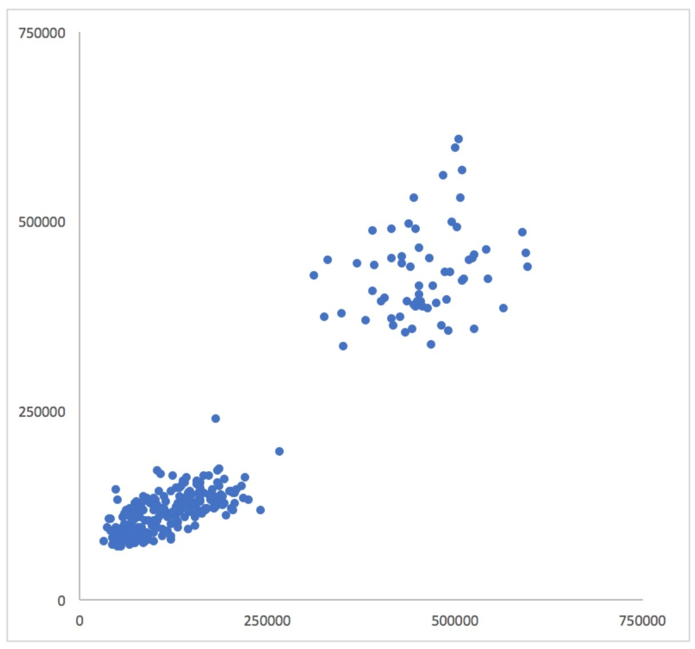
]

---
class: center
# Perl^WMonitoring Problems

$problems =~ s/regular expressions?/anomaly detection/gi

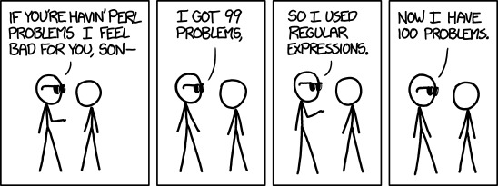

.footnote[
https://xkcd.com/1171/
]

---
class: smaller
# A War Story

At VividCortex, we have (had) two kinds of anomaly detection.

- First, we built adaptive fault detection. It applies anomaly detection to a model based on Little’s Law and queueing theory. It assigns _specific_ meaning to a few _specific_ metrics that have an underlying physical basis.
- The outcome has a well defined meaning too: “work is queueing up.”
- It turned out to be really hard to get the false positive rate down, even in this well- controlled setting. It requires machine learning (!!).
- The result is still more difficult for customers to interpret than we’d like. “Can I set my own threshold? What does it mean for this one to be bigger than that one? What does the score really mean? What should I do about these? Can’t you just...”

---
class: smaller
# Traditional Dynamic Baselines

At VividCortex we also built limited “dynamic baselining” on top of modified Holt-Winters prediction.

- We baselined latency and error rate of the most frequent and time-consuming queries in the system.
- Customers don’t use it, even though it remains a constant hypothetical request (“I’d like to be alerted when important queries have significant latency spikes.”)
- This is probably a case of customers asking for a faster horse. It’s also possible that we just didn’t implement it well enough.

---

# Okay, There Was A Third...

- The brilliant CEO built “Baggins” anomaly detection, then turned it off in horror at the spam it generated.
- The cleverest thing about it was the name.

---
class: three-column, img-450h

# Some Books

.col[
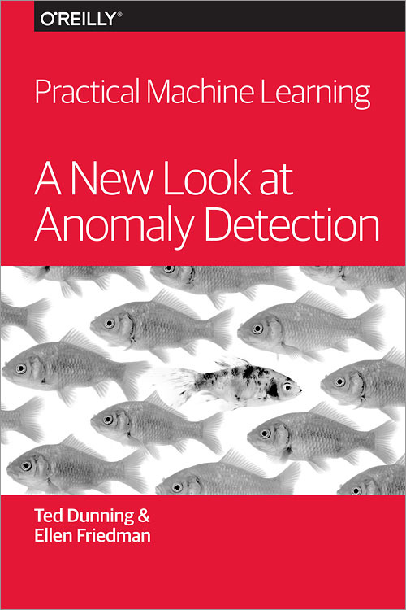
]

.col[
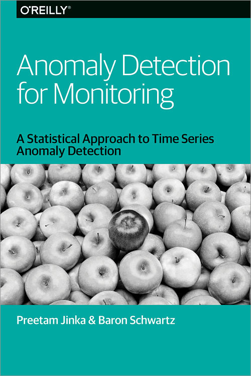
]

.col[
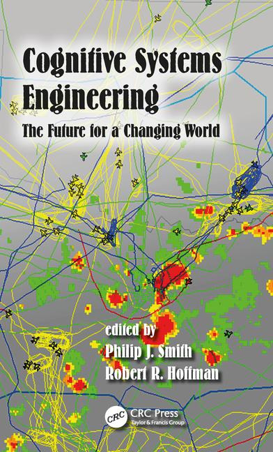
]

---
class: two-column
# Slides and Contact Information

.col[
Slides are at [xaprb.com/talks/](https://www.xaprb.com/talks/), or scan the QR
code. To export as PDF, print with Chrome.

Contact:

- @xaprb on Twitter
- baron@vividcortex.com
]

.col[

]
