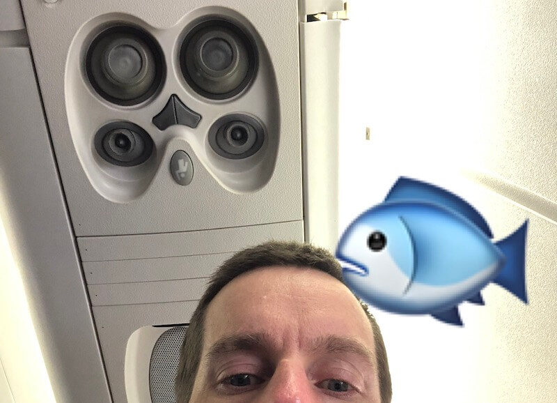
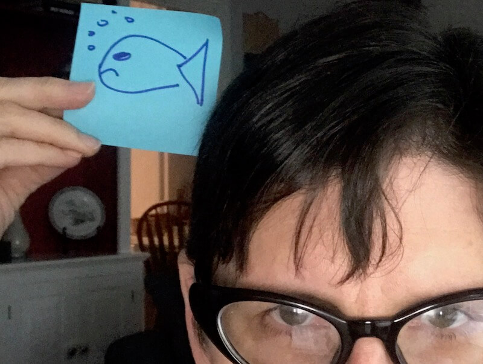

layout: true
class: no-footer

---
class: title, fogscreen
background-image: url(unsplash-photos-iFQE-aCAWPU.jpg)

# The Fish

???
* I’m at the airport and the incoming flight is late
* For the first time in my life I’m upgraded to first class. Big deal, it’s a puddle jumper, 3 seats wide, Charlottesville to Charlotte, most people can’t tell them apart. What does first class even mean on a flight like that?
* I see this guy walk off the prior flight with a giant fish. It’s as long as his arms. How the hell do you get a fish through security? Did the fish fly first class?

---
class: title
background-image: url(plane.jpg)

???
* While I’m wondering, they announce that our flight has just landed, and I look out the window and see this.
* You gotta be kidding me. There’s barely enough room for the fish in there.
* But on the bright side, I get to fly first class.

---
class: title
background-image: url(crj.jpg)

???
* Of course that’s not actually my flight. So I get on the flight. On the way in the door I see CRJ-800 NEXT GENERATION next to the door. I have to squint to read the paint, it’s so old and faded.
* Who labeled it next generation? What are they gonna call the next one? Is this Star Trek? CRJ-DeepSpaceNine?
* This is obviously an old generation.

---
class: title
background-image: url(unsplash-photos-8_tZ-eu32LA.jpg)

???
* I sit down and the flight attendant is asking me if I want wine. I guess this is the benefit of first class?

---
class: center

???

* It turns out that being in first class means I get two reading lights  all to myself! And two air vents too, which might come in handy if I’m sitting in the seat where the fish was.
* I send a picture to my spouse, with a fish.

---
class: center

???

She sends one back. It’s a competition of who can be more sophisticated with iPhone photo editing apps. She wins.

---
class: title
background-image: url(booklet.jpg)

???
* Then I notice. The safety booklet is for the CRJ900. Liars! The 800 is definitely not the next generation! What is the 900 called?
* But do you see what I see? The safety booklet is more than 4 years past its best-by date. I’m starting to think maybe I do want wine, but I’m worried about the best-by date on the wine, so I think better of that idea.

---
class: title
background-image: url(unsplash-photos-AGJQcn904qI.jpg)

???
* We push back from the gate and the flight attendant is saying something about carry-on items being placed in the overhead compartment, and suddenly it comes to me: the fish was dead! that’s how the guy got the fish through security! It was a carrion item!

