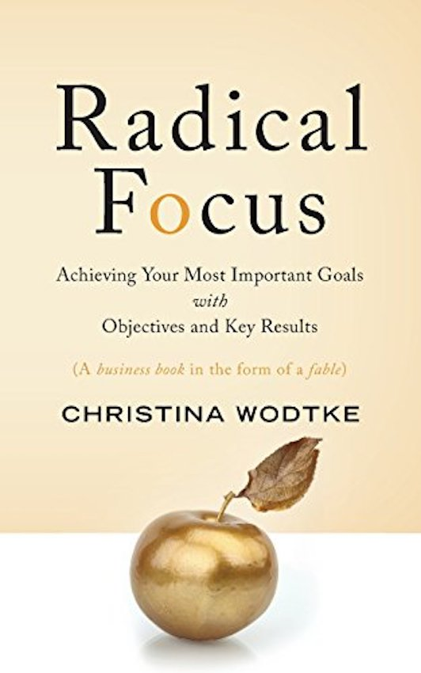
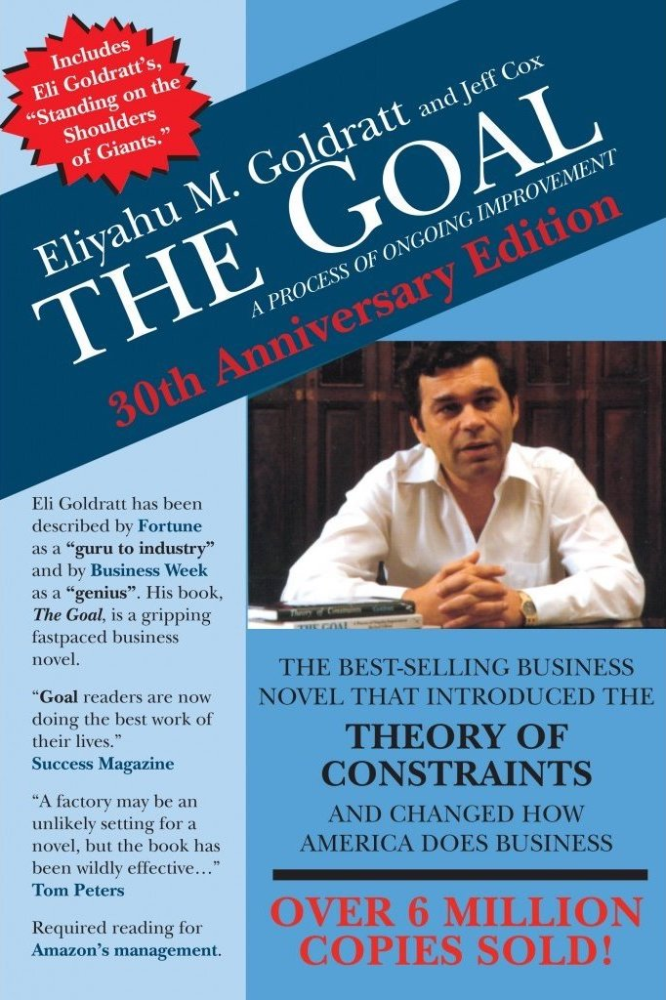
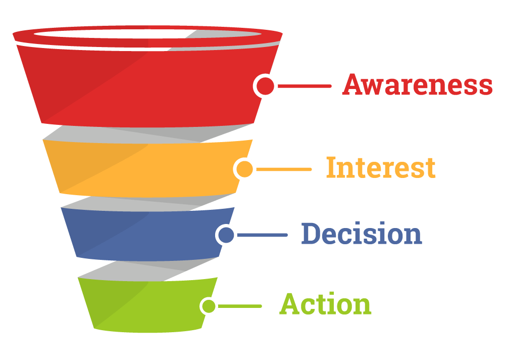
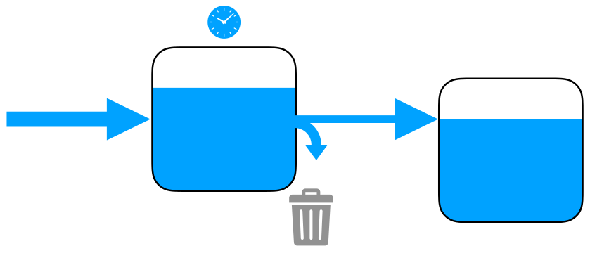

layout: true

@xaprb

---
class: title
background-image: url(money-2180330-1280.jpg)

.smokescreen[
# Observability in Business
## Baron Schwartz &bullet; March 2018
]

---
class: img-right
# Logistics & Stuff

.col[
Slides are at [xaprb.com/talks/](https://www.xaprb.com/talks/).

Ask questions anytime.

Please get in touch: [@xaprb](https://twitter.com/xaprb) or baron@vividcortex.com.
]

.rc[

]

---
# Introduction

* What does a well-managed business measure?
* How do they do it?
* How is it similar to systems observability?

---
class: center, middle
# Disclaimer

VividCortex is a startup, not a mature, well-managed business (yet).

I personally have more scars than successes.

---
class: img-right
# What Should You Measure?

.col[
What gets measured gets managed. 
&mdash; Peter Drucker
]

.rc[

]

---
class: center
# Therefore Be Damn Careful

Most of what you will want to measure is **not worth it**.

--

In fact, measuring too much is actively harmful.

---
# The High Cost Of Measuring

Some effects of measuring the wrong things:

- Cost of asking "what does this **mean**?"

--
- Cost of misaligning **priorities**.

--
- Cost of reaching **false conclusions**.

--
- Cost of **gathering data**.

--
- Cost of **missing vital signals**.

--
- Cost of integrations, dependencies, and other **lock-in**.

---
class: title
background-image: url(imnl\_tesla\_watch.jpg)

.smokescreen[
# This Sounds Oddly Familiar
]

---
class: img-right

.col[
# Measure What Matters

How do you know what matters?

We've been progressively adopting OKRs to create greater clarity.

Pro tip: 3 is the magic number. People can't prioritize too many things.
]

.rc[

]

---
class: img-right

.col[
# The Goal

I asked Cary Millsap about his favorite computer performance book and he turned
me into a fan of _The Goal_.

It's one of those "business novels with a moral."
]

.rc[

]

---
# A Key Lesson From The Goal

Optimize systems by:

- increasing **throughput**,
- while simultaneously reducing **inventory**,
- and simultaneously reducing **operating expense**.

???
Paraphrased: _get work product through systems as fast as you can, avoid buildup
in them, and plug the leaks_.

---
class: img-center, img-450h
# This Diagram Is Not Very Useful

???
- It's company centric, not customer centric
- It conflates buyer journey with sales process
- It typically incentivizes measuring conversion ratios and little more
- People rarely think about time in funnel, or velocity

---
class: img-center, img-450h
# This Is A Better Diagram

???
- What is arrival rate?
- What is residence time?
- What is concurrency?
- What is completion rate?
- What is conversion rate?
- What is value of inventory?
- Relate to finance: where is money lying around? Collections...

---
# Data-Driven Coaching

You have two sales reps. Both are **working equally hard** and one is closing a lot more deals. How can you help the other one?

--

Sit down and walk through all the **metrics** for each stage in their process.

- Are you doing *enough* activities at this stage?
- Are you doing the *right* activities? (Conversion ratios)
- Are your leads/prospects *moving* or stuck?
- What is your *pipeline value*?
- Etc.

---
# The Foundation

The foundation of business observability is the **event data**.

* Timestamped records of every **state change** and its dimensions.

--
* High-dimensional, rich data with **full context**.

--
* **Sampling** is sometimes appropriate (e.g. auditing the books).

---
background-image: url(wallet-2292428\_1280.jpg)
