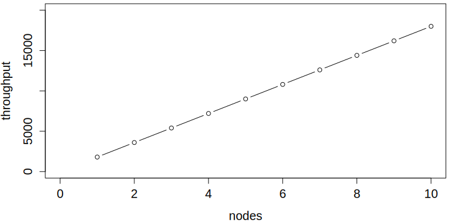
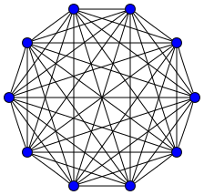
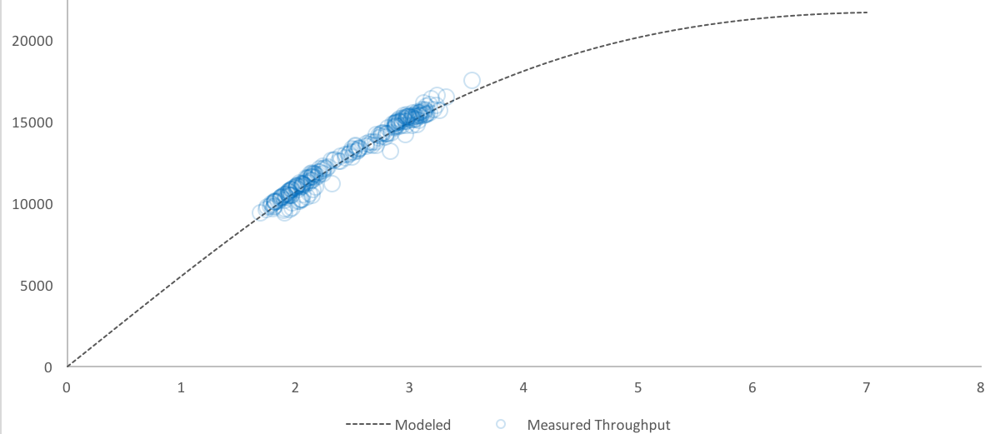

class: title
background-image: url(ThinkstockPhotos-480085336.jpg)

.smokescreen[
# Scalability is Quantifiable
## The Universal Scalability Law Baron Schwartz &bullet; November 2017
]

---
class: image-right
layout: true

---
# Logistics & Stuff

.col[
Slides will be posted. Ask questions anytime.

Founder of VividCortex. Author of High Performance MySQL.

Love to hear from you: [@xaprb](https://twitter.com/xaprb) and
baron@vividcortex.com

[xaprb.com](https://www.xaprb.com/)
]

.rc[

]

---
layout:false
# How Systems Fail Under Load

You’ve seen systems become sluggish under high load.

How can we describe and reason about what’s happening?

---
layout: true
class: two-column

---
# Failure Boundaries

.col[
Cook and Rasmussen describe failure boundaries around the operating domain

One such is the unacceptable workload boundary
]

.col[

]

---
# Workload Failure Isn’t Crisp

.col[
Unacceptable workload is not sharply defined, it’s a _gradient_

Cook lists 18 precepts of system failure in [How Complex Systems Fail](web.mit.edu/2.75/resources/random/How Complex Systems Fail.pdf)

\#5: **Complex systems run in degraded mode**
]

.rc[

]

--

Cook introduces _error margin_. What’s the _workload margin_?

What if you drift into it?

---
layout: true
class: center

---
# The Failure Boundary Is Nonlinear

This region is _highly_ nonlinear and unintuitive. It's analogous to post-elastic material behavior.

---
# Capacity

Systems can, and do, function beyond their capacity limits.

Capacity limits are scalability limits.

--

How can we define and reason about system capacity?

Ditto, for scalability?

---
# Queueing Theory

There’s a branch of operations research called queueing theory.

It analyzes what happens to customers when systems get busy.

It's difficult to apply in “the real world” of capacity & ops.

---
# The Hockey Stick Curve

The "hockey stick" queueing curve is hard to use in practice. And the sharpness
of the "knee" is very nonlinear and hard for humans to intuit.

---
# Scaling A System: Ideal

Suppose a clustered system can do X work per unit of time. Ideally, if you double the cluster size, it can do 2X work.

---
layout: false
class: two-column
# The Linear Scalability Equation

.col[
The equation that describes ideal scaling:

\\[
X(N) = \frac{\\lambda N}{1}
\\]

where \\(\\lambda\\) is the slope of the line.
]

.col[

]

---
class: center
# But Our Cluster Isn’t Perfect

Speedup comes from executing tasks in parallel, e.g. ~ scatter-gather.

What happens to performance if some portion isn’t parallelizable?

---
class: two-column
# Amdahl's Law

.col[
Amdahl’s Law describes the fraction \\(\\sigma\\) that can’t be done in parallel.

\\[
X(N) = \frac{\\lambda N}{1+\\sigma(N-1)}
\\]

Adding nodes provides some speedup, but there’s a ceiling.
]

.col[

]

---
class: center
# But What If Workers Coordinate?

Suppose the parallel workers have dependencies on each other?

---
class: two-column,center
# N Workers = N(N-1) Pairs

.col[

]

.col[

]

---
class: two-column
# Universal Scalability Law

.col[
Represent crosstalk (coherence) penalty by coefficient \\(\\kappa\\).

\\[
X(N) = \frac{\\lambda N}{1+\\sigma(N-1)+\\kappa N(N-1)}
\\]

The system does _less_ work as the load increases!
]

.col[

]

---
class: center
# Crosstalk Penalty Grows Fast

Coherence (red) grows slowly, but crosstalk (blue) grows rapidly. At saturation, \\(\\kappa\\) is creating nonlinear behavior.

---
# More About Crosstalk

Q: Isn’t crosstalk just a design flaw?

A: Yes and no. Real-life: consensus, 2-phase commit, NUMA, etc…

Q: Doesn’t it seem odd to assume that crosstalk is a constant?

A: It’s not, the amount of crosstalk-related work is a function of N

---
class: center
# How Do You Measure Parameters?

You don’t: use regression to estimate them.

