layout: true

@xaprb

---
class: title
background-image: url(action-balance-fun-305250.jpg)
background-size: cover

<h2>Approaching the Unacceptable Workload Boundary
<h3>Baron Schwartz &bullet; SREcon18 Americas

---
class: image-right
# Logistics & Stuff

.col[
Slides are at [xaprb.com/talks/](https://www.xaprb.com/talks/).

Ask questions anytime.

Please get in touch: [@xaprb](https://twitter.com/xaprb) or baron@vividcortex.com.
]

.rc[

]

---
class: bigger
# Introduction

What happens as systems get bigger and more heavily loaded?

--
* What is a system's operating domain?

--
* How is load defined?

--
* Where is the load limit? How can you see it coming?

--
* How does the system behave near this limit?

--
* Can you measure and model this behavior?

---
class: center, img-300h
# Failure Boundaries

Rasmussen's model describes an operating domain bounded by economic risk, effort, and
safety. The system's operating state is a point within the domain, always moving
around.

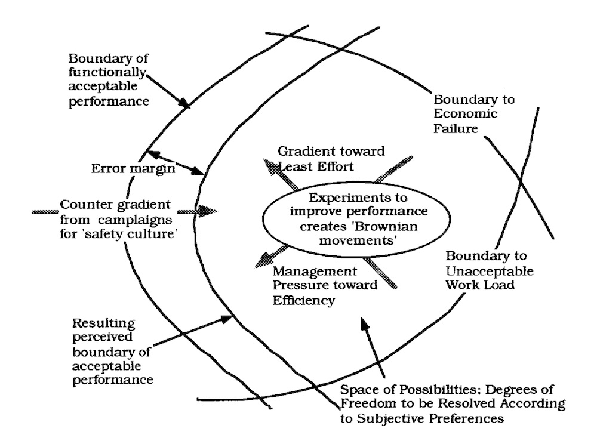

---

background-image: url(rasmussens-model.jpg)

---
class: img-450h, center
# The Actual Boundaries Are Unknown

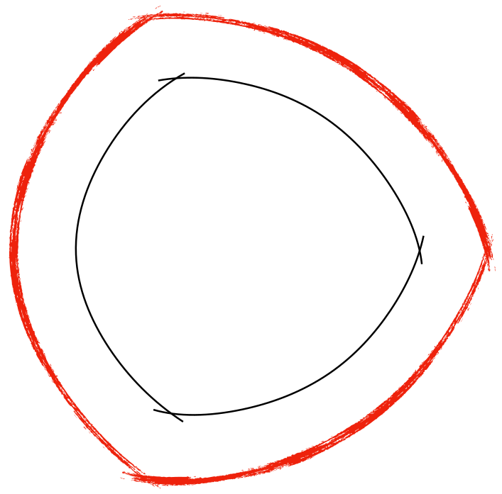

---
class: img-450h, center
# We Draw Limits Where We Think It's Safe

Margin of Error

Overdraft Limit

Overprovisioning

---
class: img-450h, center, two-column
# The Margins Are Nonlinear

.col[
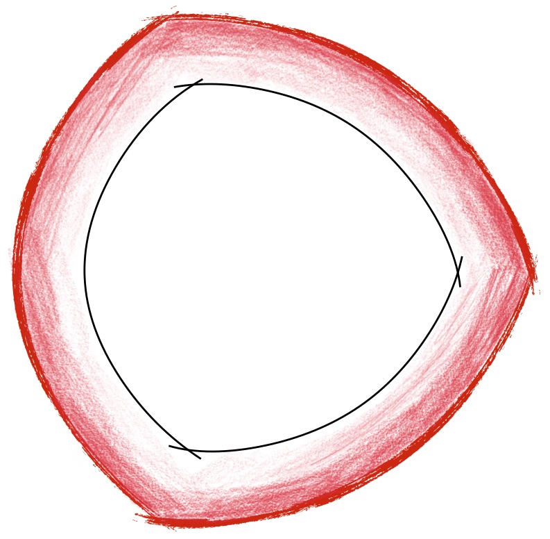
]

--

.col[
We think the gradient looks like this.

It really looks more like this.

]

---
Cook lists 18 precepts of system failure in [How Complex Systems Fail](web.mit.edu/2.75/resources/random/How Complex Systems Fail.pdf)

\#5: **Complex systems run in degraded mode**
]

.rc[

]

--

Cook introduces _error margin_. What’s the _workload margin_?

What if you drift into it?

---
class: center, bigger

---
# The Failure Boundary Is Nonlinear

This region is _highly_ nonlinear and unintuitive. It’s analogous to post-elastic material behavior.

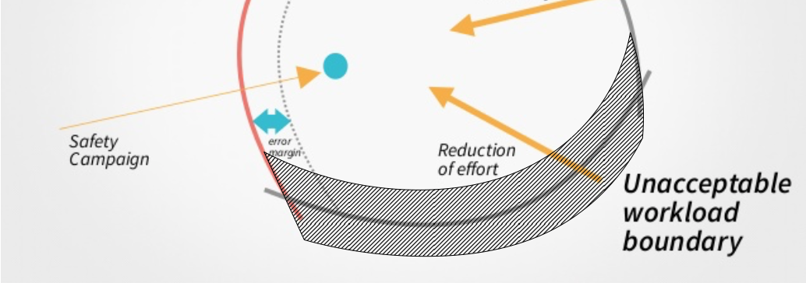

---
class: center, bigger
# Capacity

Systems can, and do, function beyond their capacity limits.

Capacity limits are scalability limits.

--

How can we define and reason about system capacity?

Ditto, for scalability?

---
# Queueing Theory

There’s a branch of operations research called queueing theory.

It analyzes what happens to customers when systems get busy.

It’s difficult to apply in “the real world” of capacity & ops.

---
# The Hockey Stick Curve

The “hockey stick” queueing curve is hard to use in practice. And the sharpness
of the “knee” is very nonlinear and hard for humans to intuit.

---
# Scaling A System: Ideal

Suppose a clustered system can do X work per unit of time. Ideally, if you double the cluster size, it can do 2X work.

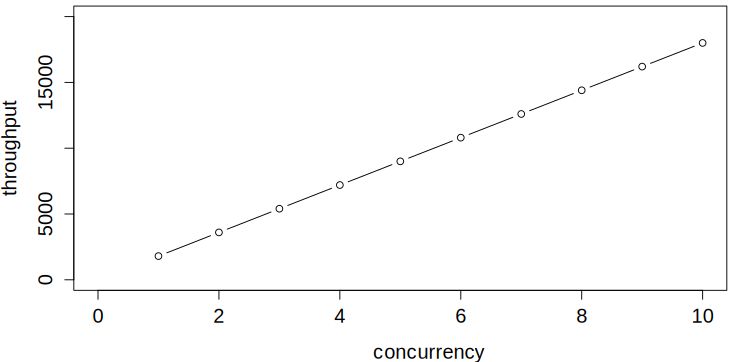

---
class: two-column
# The Linear Scalability Equation

.col[
The equation that describes ideal scaling:

\\[
X(N) = \frac{\\lambda N}{1}
\\]

where \\(\\lambda\\) is the slope of the line.
]

.col[

]

---
class: center
# But Our Cluster Isn’t Perfect

Speedup comes from executing tasks in parallel, e.g. ~ scatter-gather.

What happens to performance if some portion isn’t parallelizable?

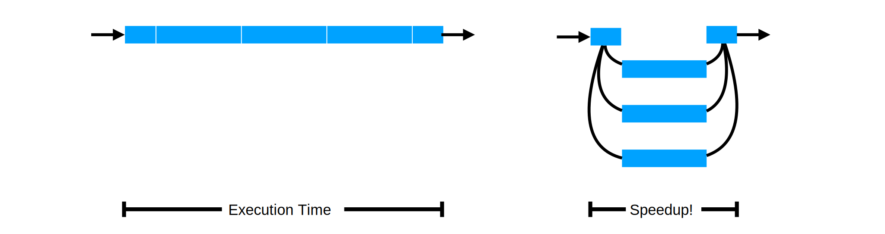

---
class: two-column,bigger
# Amdahl’s Law

\\[
X(N) = \frac{\\lambda N}{1+\\sigma(N-1)}
\\]

.col[
Amdahl’s Law describes the fraction \\(\\sigma\\) that can’t be done in parallel.
Adding nodes provides some speedup, but there’s a ceiling.
]

.col[
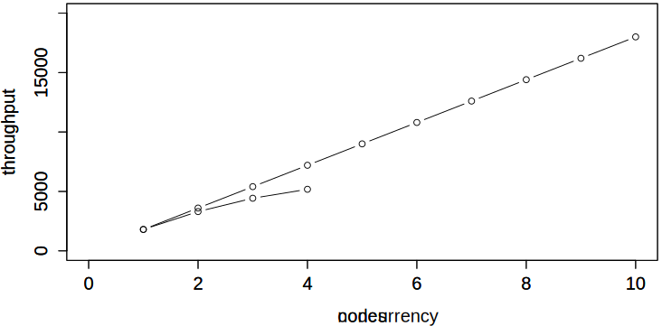
]

---
class: center
# But What If Workers Coordinate?

Suppose the parallel workers have dependencies on each other?

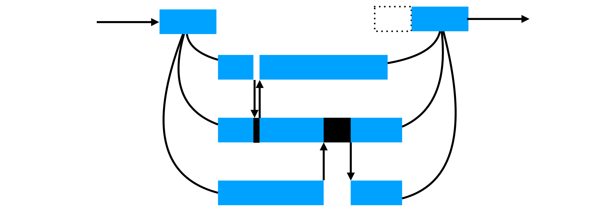

---
class: two-column,center, img-450h
# N Workers = N(N-1) Pairs

.col[

]

.col[

]

---
class: two-column, bigger
# Universal Scalability Law

\\[
X(N) = \frac{\\lambda N}{1+\\sigma(N-1)+\\kappa N(N-1)}
\\]

.col[
Represents crosstalk (coherence) penalty by coefficient \\(\\kappa\\).
The system completes _less_ work as the load increases!
]

.col[
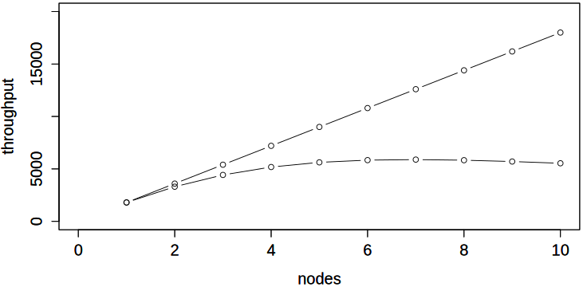
]

---
class: center, bigger, img-300h
# Crosstalk Penalty Grows Fast

Coherence (red) grows slowly, but crosstalk (blue) grows rapidly. At saturation, \\(\\kappa\\) is creating nonlinear behavior.

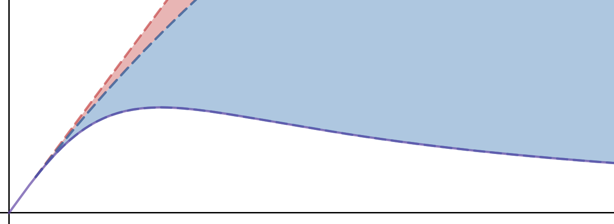

---
class: bigger
# More About Crosstalk

Q: Isn’t crosstalk just a design flaw?

A: Yes and no. Real-life: consensus, 2-phase commit, NUMA, etc…

Q: Doesn’t it seem odd to assume that crosstalk is a constant?

A: It’s not, the amount of crosstalk-related work is a function of N

---
class: center
# How Do You Measure Parameters?

You can’t measure serialization & crosstalk directly; use regression to estimate them.

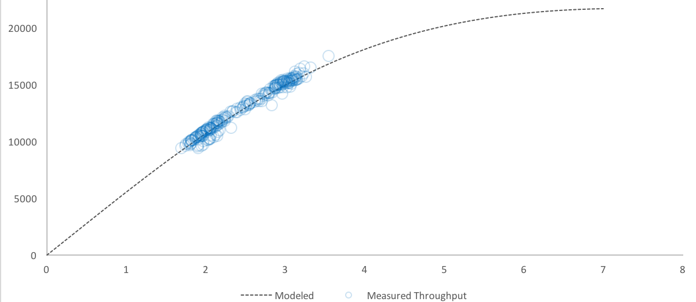

---
class: center, middle, bigger
# Experiment Interactively

[desmos.com/calculator/3cycsgdl0b](https://www.desmos.com/calculator/3cycsgdl0b)

---
class: center, bigger
# What is Scalability?

The USL is a mathematical definition of scalability.

It’s a function that turns workload into throughput.

It’s formally derived and has real physical meaning.

\\[
X(N) = \frac{\\lambda N}{1+\\sigma(N-1)+\\kappa N(N-1)}
\\]

---
class: bigger
# But What Is Load?

In most circumstances we care about, load is concurrency.

Concurrency is the number of requests in progress.

It’s surprisingly easy to measure: \\( N = \frac{\sum_{}^{}{R}}{T} \\)

Many systems emit it as telemetry:

- MySQL: `SHOW STATUS LIKE 'Threads_running'`
- Apache: active worker count

---
class: title
background-image: url(Matterhorn-mit-Morgennebel.jpg)
.smokescreen[
# Four Great Uses Of The USL
]

---
class: two-column, center
# 1. Forecast Workload Failure Boundary

The USL can reveal the workload failure boundary approaching. Use regression to
extract coefficients, then plot; or plot and eyeball to see if you’re
approaching the boundary.

.col[
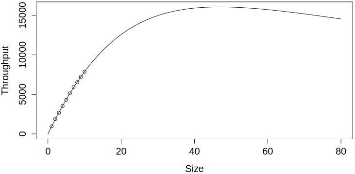
]

.col[
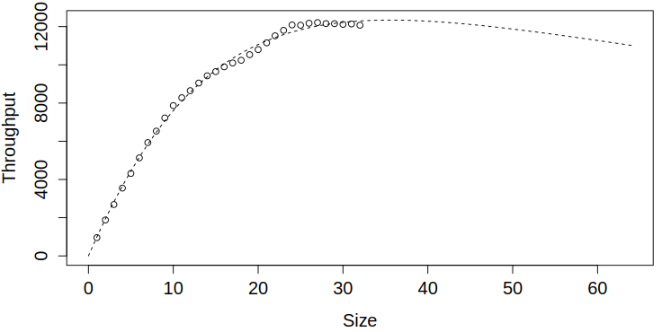
]

---
class: center, bigger
# 1. Forecast Workload Failure Boundary

Coda Hale wrote about the USL.
https://codahale.com/usl4j-and-you/

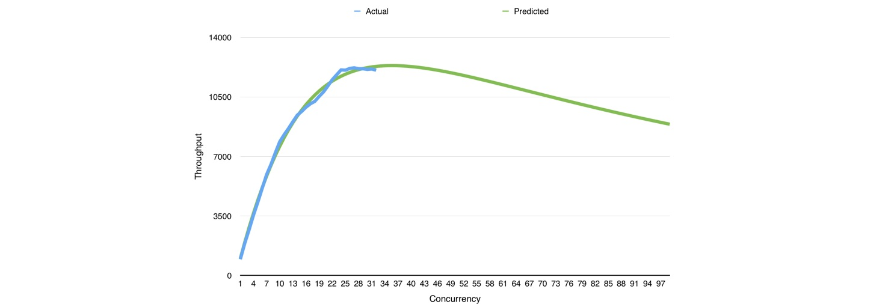

---
class: bigger
# 1. Forecast Workload Failure Boundary

- By estimating the parameters, you can forecast what you can’t see.
- This means you can “load test” under load you don’t yet experience.
- The USL is a pessimistic model.
--

  - Your systems _should_ scale better than the USL predicts.
  - But _you_ should be even more pessimistic than the USL.

---
class: bigger, center, img-300h
# 2. Characterize Non-Scalability 
Why doesn’t your system scale perfectly? 
The USL reveals the amount of serialization & crosstalk.

---
# 2. Characterize Non-Scalability

Paypal’s NodeJS vs Java benchmarks are a good example!
https://www.vividcortex.com/blog/2013/12/09/analysis-of-paypals-node-vs-java-benchmarks/

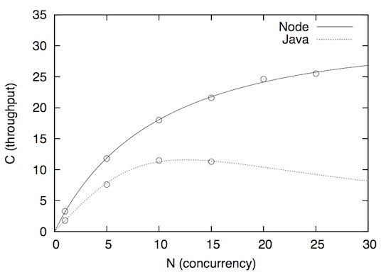

---
class: bigger
# 3. How Scalable Should It Be?

The USL is a framework for making systems look really bad.

Many 10+ node MPP databases barely do anything per-node.

Calculate per-node a) clients b) data size c) throughput.

One 18-node database: 4000 QPS ~220 QPS/node, 5ms latency.

---
class: bigger, img-300h
# 3. How Scalable Should It Be?

You should always measure databases; don’t simply use architectural
diagrams to intuit whether they will scale.


.footnote[
This diagram is from [CitusDB](https://www.citusdata.com/), and is
meant only to illustrate the point, not to imply anything about CitusDB.
]

---
class: img-450h, center
# 4. See Your Teams As Systems

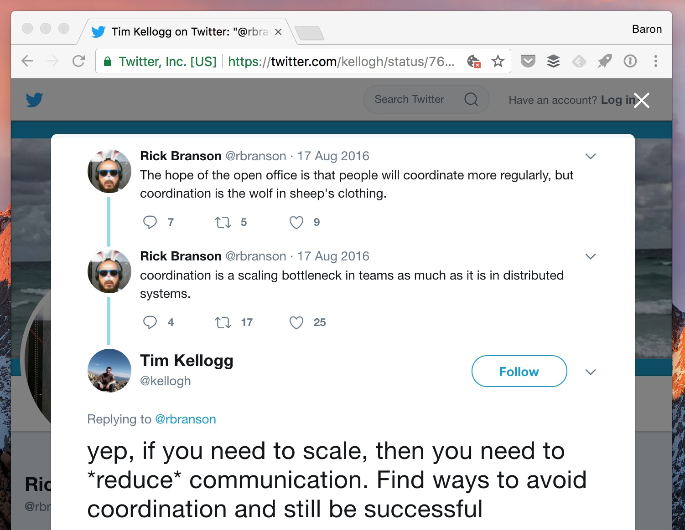

---
class: center, bigger
# 4. See Your Teams As Systems

## “To go fast, go alone. To go far, go together.”

Adrian Colyer wrote a good blog post about teams-as-systems and USL.
https://blog.acolyer.org/2015/04/29/applying-the-universal-scalability-law-to-organisations/

---
class: image-right, bigger

.col[
# 4. See Your Teams As Systems
The USL isn’t novel in that sense... “I gave my boss two copies of the Mythical
Man-Month so they can read it twice as fast.”
]

.rc[

]

---
class: bigger
# What Else Can The USL Illuminate?

Open-plan offices: My work takes more work when others are nearby.

Map-Reduce: That’s a whole lotta overhead, but it sure is scalable.

Mutexes: Theoretically just serialize, but those damn OS schedulers.

---
class: center, bigger, img-300h
# What’s NOT Scalability?

I commonly see throughput-vs-latency charts. This seems legit till you get systems under high load.

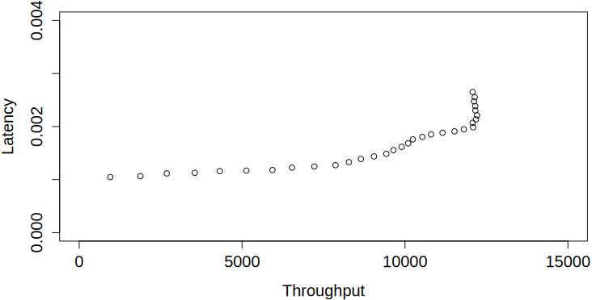

---
class: center, bigger, img-300h
# Scalability Isn’t Throughput-vs-Latency

The throughput-vs-latency equation has **two** solutions.

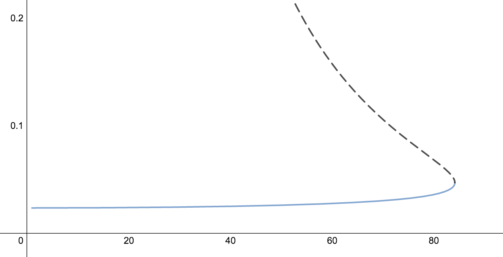

---
class: center, bigger, img-300h
# Concurrency-vs-Latency is OK

It’s a simple quadratic per Little’s Law, and is quite useful.

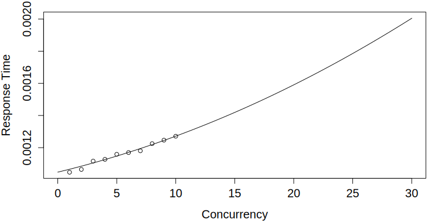

---
class: center, two-column, bigger

.col[
# Some Resources

I wrote a
[book](https://www.vividcortex.com/resources/universal-scalability-law/).

I created an [Excel
workbook](https://www.vividcortex.com/resources/usl-modeling-workbook).

These slides are at [xaprb.com/talks](https://www.xaprb.com/talks/).
]

.col[

]

---
class: center, bigger
# Conclusions

Scalability is formally definable, and black-box observable.

Scalability is nonlinear; this region is the failure boundary.

Scalability is a function with parameters you can estimate.

---
class: bigger
# Further Reading & References

- https://www.vividcortex.com/resources/ for ebook, Excel workbook.

- http://www.perfdynamics.com/Manifesto/USLscalability.html for the original source.
