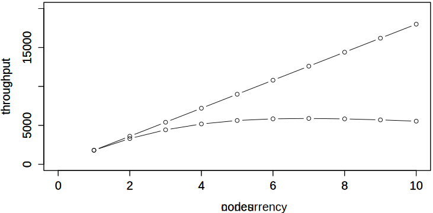
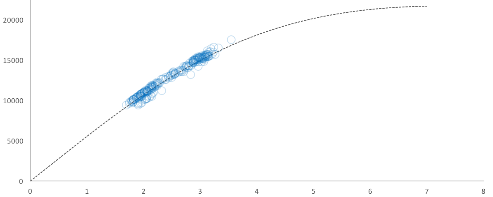

layout: true

@xaprb

---
class: title
background-image: url(action-balance-fun-305250.jpg)
background-size: cover

<h2>Approaching the Unacceptable Workload Boundary
<h3>Baron Schwartz &bullet; SREcon18 Americas

---
class: image-right
# Logistics & Stuff

.col[
Slides are at [xaprb.com/talks/](https://www.xaprb.com/talks/).

Ask questions anytime.

Please get in touch: [@xaprb](https://twitter.com/xaprb) or baron@vividcortex.com.
]

.rc[

]

---
class: bigger
# Introduction

What happens as systems get bigger and more heavily loaded?

--
* What is a system's operating domain?

--
* How is load defined?

--
* Where is the load limit? How can you see it coming?

--
* How does the system behave near this limit?

--
* Can you measure and model this behavior?

---
background-image: url(nature-3258924-1280.jpg)
class: title

.smokescreen[
# The Operating Domain
]

---
class: center, img-300h
# Operating Domain and Failure Boundaries

Rasmussen's model describes an **operating domain** bounded by economic risk, effort, and
safety. The system's **operating state** is a point within the domain, always moving
around.

---

background-image: url(rasmussens-model.jpg)

---
class: img-450h, center
# The Actual Boundaries Are Unknown

---
class: img-450h, center
# We Draw Limits Where We Think It's Safe

Margin of Error

Overdraft Protection

Overprovisioning

---
class: img-450h, center, two-column
# The Buffer Zone Is Nonlinear

.col[

]

--

.col[
We think the gradient looks like this.

It really looks more like this.

]

---
class: bigger
# Complex Systems Run In Degraded Mode

Richard Cook lists 18 precepts of system failure in [How Complex Systems
Fail](http://web.mit.edu/2.75/resources/random/How Complex Systems Fail.pdf).
Precepts 4) and 5) are especially relevant.

--

> **4) Complex systems contain changing mixtures of failures latent within them.**
> The complexity of these systems makes it impossible for them to run without
> multiple flaws being present.
> 
> **5) Complex systems run in degraded mode.**
> A corollary to the preceding point is that complex systems run as broken systems.

???

Systems can and do function beyond their load limits.

---
class: title
background-image: url(gears-1236578-1280.jpg)

.smokescreen[
# System Load
]

---
class: bigger
# What Is The Definition Of Load?

There's no one right answer to this question, but there's a **useful answer**
for this discussion.

--

Load is the **sum of task residence times** during an observation interval
\\(T\\).  This is equivalent to average **concurrency** of tasks queued or in
service:

\\[
N = \frac{\sum_{}^{}{R}}{T}
\\]

.footnote[
You can prove this with Little's Law.
]

---
class: bigger
# Load, Utilization, And Queueing

Load (concurrency) is related to **utilization and queue length**, but it's not
the same.

--
* Concurrency is the number of requests in process simultaneously.

--
* Average concurrency is an average over an observation interval \\(T\\).

--
* Utilization is the fraction of \\(T\\) that was busy.

--
* Queue length is the instantaneous or time-averaged number of tasks waiting
  to be serviced.

---
class: bigger
# Utilization, Queue Length, & Concurrency

By Little's Law, utilization and queue length are **types of concurrency**.

  * Utilization is the concurrency of in-service tasks.

--
  * Queue length is the concurrency of queued tasks.

---
class: two-column, bigger
# What Is The Load Limit?

If the load limit were defined in terms of utilization, queueing theory could
tell us where the **load limit** will be.

--
But it can't: load can be infinite, utilization ranges 0-1.

.col[
Plus it's impractical:
* The “hockey stick” queueing curve is hard to use
* The "knee" is unintuitive
]

.col[

]

???
This is appealing because utilization has a clear limit: it can't be more than
100%.

So we need to translate the problem to a different domain, where the units
match. Scalability is the answer.

---
class: title
background-image: url(snow-3260088-1280.jpg)

.smokescreen[
# Scalability
]

---
class: bigger
# What's the Definition of Scalability?

There's a mathematical definition of scalability **as a function of
concurrency**.

--

I'll illustrate it in terms of a **parallel processing system** that uses
concurrency to achieve speedup.

???
It's practical, easy to use, and matches the domain well.

I'll show how the equation is composed piece by piece, but don't sweat the math.

---
class: bigger, img-center
# Linear Scaling

Suppose a clustered system can complete **X tasks per second** with no
parallelism.

--

With parallelism, it divides tasks and executes subtasks
concurrently, **completing tasks faster**.

--

Faster completion also means **increased throughput.**

???
* Tasks per second is throughput.
* Throughput is a function of concurrency.

---
class: bigger, img-center
# Linear Scaling

Ideally, **throughput increases linearly with concurrency**.

???
* Linear scaling is the ideal.
* Another way to say this is that the system's output is a linear function of
  load.

---
class: two-column, bigger
# The Linear Scalability Equation

.col[
The equation that describes ideal scaling is

\\[
X(N) = \frac{\\lambda N}{1}
\\]

where the slope is \\(\\lambda=X(1)\\).
]

.col[

]

???
- X is throughput
- N is concurrency, which is the workload
- Lambda is the system's output when there's no parallelism
- Really important to note that N is the independent parameter, the driver

---
class: center, bigger
# But Our Cluster Isn’t Perfect

Linear scaling comes from subdividing tasks **perfectly**.

--

What if a portion isn’t subdividable?

---
class: two-column,bigger
# Amdahl’s Law Describes Serialization

\\[
X(N) = \frac{\\lambda N}{1+\\sigma(N-1)}
\\]

.col[
Amdahl's Law describes throughput when
**a fraction \\(\\sigma\\) can’t be
parallelized**.
]

.col[

]

---
class: bigger
# Amdahl's Law Has An Asymptote

\\[
X(N) = \frac{\\lambda N}{1+\\sigma(N-1)}
\\]

Parallelism delivers speedup, but there’s a limit:

\\[
\lim\_{N \to \infty}{X(N)} = \frac{1}{\sigma}
\\]

--

e.g. a 5% serialized task can't be sped up more than 20-fold.

???
If 5% of the work is serialized, infinite concurrency will still result in tasks
taking 5% as long as non-parallelized tasks.

---
class: img-center, bigger
# What If Workers Coordinate?

Suppose the parallel workers **also have dependencies** on each other?

--

---
class: two-column, bigger, img-center, img-300h
# How Bad Is Coordination?

\\(N\\) workers = \\(N(N-1)\\) pairs of interactions, which is
\\(\mathcal{O}(n^2)\\) in \\(N\\).

.col[

]

.col[

]

---
class: two-column, bigger
# The Universal Scalability Law

\\[
X(N) = \frac{\\lambda N}{1+\\sigma(N-1)+\\kappa N(N-1)}
\\]

.col[
The USL adds a term for crosstalk, multiplied by the \\(\\kappa\\)
coefficient.

Now there's a **point of diminishing returns**!
]

.col[

]

.footnote[
Crosstalk is also called coordination or coherence.
]

---
class: bigger, img-center
# This Behavior Isn't News To You

You've seen lots of benchmarks with diminishing returns.

.footnote[
Source: http://dimitrik.free.fr/blog/
]

???
By the way, pay attention to the axis scale, it's log-scaled by powers of two.
If you scale the X-axis linearly you'll get the shape of the curve on the
previous slide.

---
class: img-center, bigger, img-300h
# The USL Describes Behavior Under Load

The USL explains the **highly nonlinear behavior** we know systems exhibit near
their saturation point.
[desmos.com/calculator/3cycsgdl0b](https://www.desmos.com/calculator/3cycsgdl0b)

???
- Serialization (red) grows slowly, but crosstalk (blue) grows rapidly. 
- This is why systems get so unpredictable near their limits.
- Near and above the point of diminishing returns, systems exhibit high variance
  and get unpredictable.

---
class: bigger
# A Summary Of The USL

The Universal Scalability Law defines **throughput as a function of concurrency**.

It explains how and why **systems don't scale linearly with load**.

---
class: bigger
# What is the USL Good For?

Armed with the USL, you are ready to:

- Measure and model nonlinear behavior.
- Predict the onset of nonlinearity.
- Design better systems.

It's easy. Let's see how!

TODO

---
class: center
# How Do You Measure Parameters?

You can’t measure serialization & crosstalk directly; use regression to estimate them.

---
class: center, middle, bigger
# Experiment Interactively

---
class: center, bigger
# What is Scalability?

The USL is a mathematical definition of scalability.

It’s a function that turns workload into throughput.

It’s formally derived and has real physical meaning.

\\[
X(N) = \frac{\\lambda N}{1+\\sigma(N-1)+\\kappa N(N-1)}
\\]

---
class: bigger
# But What Is Load?

In most circumstances we care about, load is concurrency.

Concurrency is the number of requests in progress.

It’s surprisingly easy to measure: \\( N = \frac{\sum_{}^{}{R}}{T} \\)

Many systems emit it as telemetry:

- MySQL: `SHOW STATUS LIKE 'Threads_running'`
- Apache: active worker count

---
class: title
background-image: url(Matterhorn-mit-Morgennebel.jpg)
.smokescreen[
# Four Great Uses Of The USL
]

---
class: two-column, center
# 1. Forecast Workload Failure Boundary

The USL can reveal the workload failure boundary approaching. Use regression to
extract coefficients, then plot; or plot and eyeball to see if you’re
approaching the boundary.

.col[

]

.col[

]

---
class: center, bigger
# 1. Forecast Workload Failure Boundary

Coda Hale wrote about the USL.
https://codahale.com/usl4j-and-you/

---
class: bigger
# 1. Forecast Workload Failure Boundary

- By estimating the parameters, you can forecast what you can’t see.
- This means you can “load test” under load you don’t yet experience.
- The USL is a pessimistic model.
--

  - Your systems _should_ scale better than the USL predicts.
  - But _you_ should be even more pessimistic than the USL.

---
class: bigger, center, img-300h
# 2. Characterize Non-Scalability 
Why doesn’t your system scale perfectly? 
The USL reveals the amount of serialization & crosstalk.

---
# 2. Characterize Non-Scalability

Paypal’s NodeJS vs Java benchmarks are a good example!
https://www.vividcortex.com/blog/2013/12/09/analysis-of-paypals-node-vs-java-benchmarks/

---
class: bigger
# 3. How Scalable Should It Be?

The USL is a framework for making systems look really bad.

Many 10+ node MPP databases barely do anything per-node.

Calculate per-node a) clients b) data size c) throughput.

One 18-node database: 4000 QPS ~220 QPS/node, 5ms latency.

---
class: bigger, img-300h
# 3. How Scalable Should It Be?

You should always measure databases; don’t simply use architectural
diagrams to intuit whether they will scale.

.footnote[
This diagram is from [CitusDB](https://www.citusdata.com/), and is
meant only to illustrate the point, not to imply anything about CitusDB.
]

---
class: img-450h, center
# 4. See Your Teams As Systems

---
class: center, bigger
# 4. See Your Teams As Systems

## “To go fast, go alone. To go far, go together.”

Adrian Colyer wrote a good blog post about teams-as-systems and USL.
https://blog.acolyer.org/2015/04/29/applying-the-universal-scalability-law-to-organisations/

---
class: image-right, bigger

.col[
# 4. See Your Teams As Systems
The USL isn’t novel in that sense... “I gave my boss two copies of the Mythical
Man-Month so they can read it twice as fast.”
]

.rc[

]

---
class: bigger
# What Else Can The USL Illuminate?

Open-plan offices: My work takes more work when others are nearby.

Map-Reduce: That’s a whole lotta overhead, but it sure is scalable.

Mutexes: Theoretically just serialize, but those damn OS schedulers.

---
class: center, bigger, img-300h
# What’s NOT Scalability?

I commonly see throughput-vs-latency charts. This seems legit till you get systems under high load.

---
class: center, bigger, img-300h
# Scalability Isn’t Throughput-vs-Latency

The throughput-vs-latency equation has **two** solutions.

---
class: center, bigger, img-300h
# Concurrency-vs-Latency is OK

It’s a simple quadratic per Little’s Law, and is quite useful.

---
class: center, two-column, bigger

.col[
# Some Resources

I wrote a
[book](https://www.vividcortex.com/resources/universal-scalability-law/).

I created an [Excel
workbook](https://www.vividcortex.com/resources/usl-modeling-workbook).

These slides are at [xaprb.com/talks](https://www.xaprb.com/talks/).
]

.col[

]

---
class: center, bigger
# Conclusions

Scalability is formally definable, and black-box observable.

Scalability is nonlinear; this region is the failure boundary.

Scalability is a function with parameters you can estimate.

---
class: bigger
# Further Reading & References

- https://www.vividcortex.com/resources/ for ebook, Excel workbook.

- http://www.perfdynamics.com/Manifesto/USLscalability.html for the original source.
